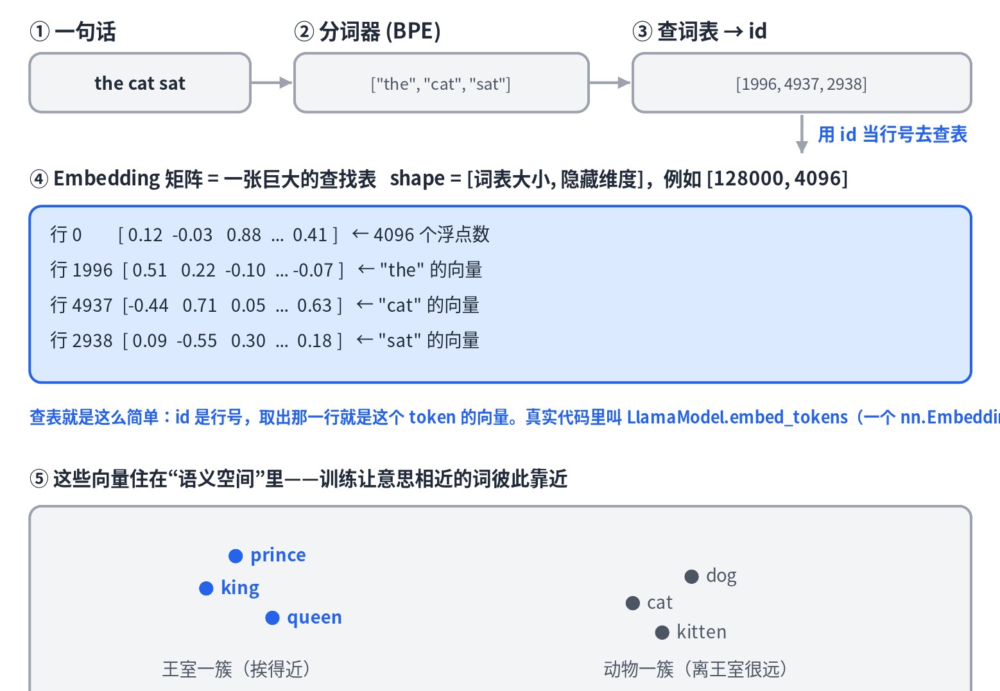

# 01 · Token 与 Embedding：文字如何变成数字

> 中文 · [English](en/01-tokens-and-embeddings.md)

> 系列《从零看懂大模型》第 1 篇。这一篇回答一个最基础、也最容易被跳过的问题：模型根本不认识文字，那它到底在处理什么？

## 先说结论

大语言模型从头到尾只对**向量**做数学运算。文字只是最外层的输入输出"皮肤"。一句话进入模型的第一步，就是被切成 token、变成数字、再变成向量。理解了这一步，后面的 attention、生成、训练才有落脚点。

## 第一步：分词（Tokenization）

模型不按"字"或"词"处理文本，而是按 **token**——一种介于两者之间的子词单位。以 BPE（Byte Pair Encoding）这类主流分词器为例：常见词整块保留（`the`），生僻词拆成子词片段（`tokenization` → `token` + `ization`）。

为什么要这样折中？用完整单词做词表会爆炸（几百万个词，还漏生词）；用单个字母则序列太长、每个符号信息太少。子词是两者之间的最优解：词表控制在几万到十几万，又能表达任意生僻词。

每个 token 在词表里对应一个整数 id。`"the cat sat"` 经过分词器后，变成的是一串数字，比如 `[1996, 4937, 2938]`。

## 第二步：查表（Embedding）

有了 id，下一步是**查一张表**。这张表叫 embedding 矩阵，形状是 `[词表大小, 隐藏维度]`——以 Llama 3 为例，大约是 `[128000, 4096]`。id 就是行号，取出对应那一行，就得到这个 token 的向量：4096 个浮点数。

就这么简单。真实代码里，这一步是 `LlamaModel.embed_tokens`，本质就是一个 `nn.Embedding` 查找表。

## 关键洞察：这张表是"学"出来的

Embedding 矩阵在训练开始时是随机数，每个词的向量都是乱的。训练过程中，模型为了"预测下一个词"这个目标反复调整这些数字，慢慢地，对预测有用的规律浮现出来：**语义相近的词，向量也相近**。

这是训练的副产品，不是人为设计的。但它有惊人的几何结构——经典例子 `king - man + woman ≈ queen`，向量做加减法竟然对应语义关系。图中"王室"一簇和"动物"一簇相距很远，而簇内的词彼此靠近，就是这个道理。

衡量"相近"用的是向量夹角（余弦相似度）。记住这个，因为它正是 RAG 检索在算的东西（见第 6 篇）。

## 两个容易混淆的点

**意义 ≠ 拼写。** `cat` 和 `kitten` 拼写差很多，向量却很近。因为向量来自"这个词在什么语境里出现"，而不是它由哪些字母组成。模型间接看得到拼写（通过子词），但"意思"完全来自那张学出来的表。

**Token 级 vs 文档级 embedding。** 本文讲的是 token 级——每个 token 一个向量，住在模型内部。而 RAG 检索用的是**文档级**——把一整段文字压成一个向量。粒度不同，内核一样。

## 一个悬念

`"the cat sat on the mat"` 里有两个 `the`。它们查表得到的向量**完全相同**——因为查表只认 id，既不知道这个词在第几位，也不知道它周围是什么。这带来两个问题：

- **位置丢了。** "狗咬人"和"人咬狗"用的词一样，语序不同意思天差地别，但纯查表分不出来。
- **上下文丢了。** "河岸"的 bank 和"银行"的 bank 是同一个 id、同一个向量。

所以查表给出的只是"词典义"，一个脱离上下文、脱离位置的原始向量。让它变成"语境义"的，是下一篇的主角：attention 和位置编码。

## 本篇要点

- 模型只处理向量；文字先切成 token，再查表变向量。
- Embedding 矩阵是训练学出来的查找表，语义相近的词向量相近，这是优化的副产品。
- 相似度用余弦（夹角）衡量，RAG 检索算的就是它。
- 查表得到的是上下文无关的向量，位置和语境要靠 attention 补上。

## 思考题

为什么 `cat` 和 `kitten` 明明拼写不同，向量却很接近？（提示：想想 embedding 是从什么信号里学出来的。）
