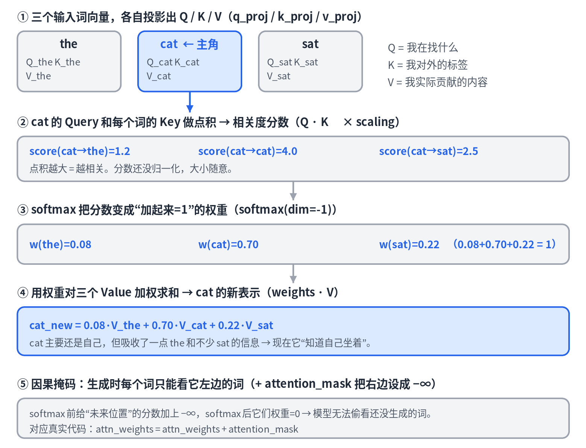
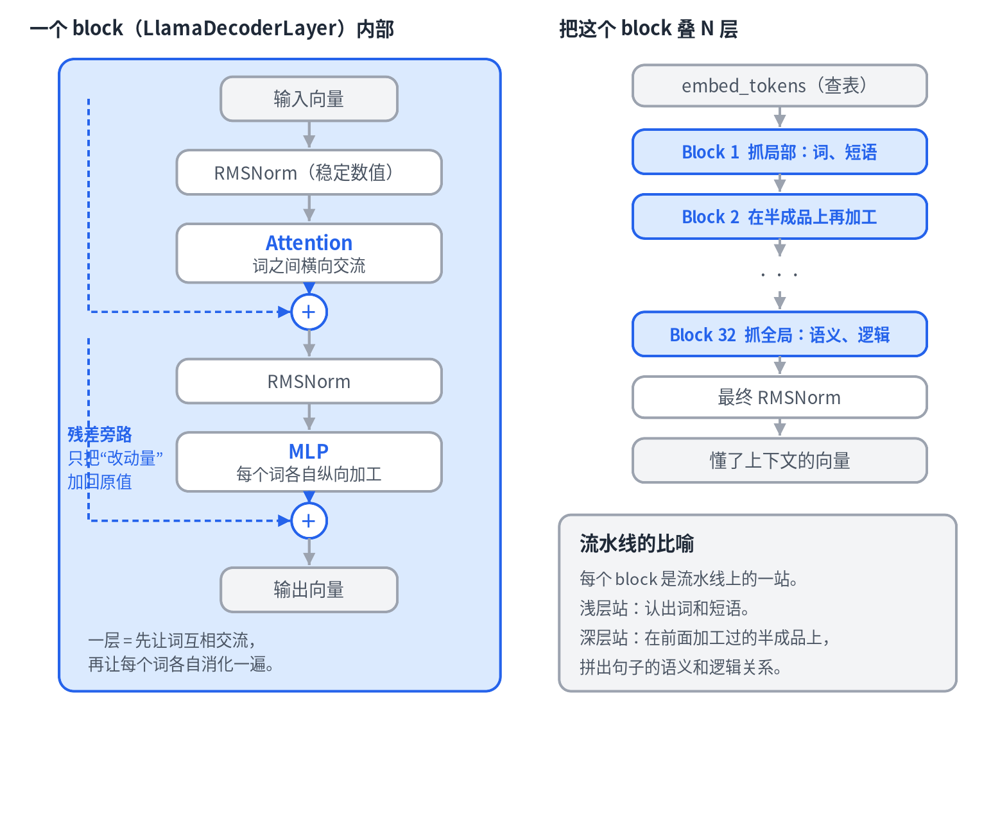

# 02 · Attention 与 Transformer：模型如何"理解"上下文

> 系列《从零看懂大模型》第 2 篇。上一篇留下的悬念——两个相同的 `the` 查表后向量一样，怎么办——本篇给出答案。用的课本是 HuggingFace transformers 里真实的 `modeling_llama.py`。

## 先看一件值得惊讶的事

一个跑在无数产品里的大模型（Llama），它的核心实现 `modeling_llama.py` 只有几百行，而 attention 的**全部数学**只有四行：

```python
attn_weights = torch.matmul(query, key_states.transpose(2, 3)) * scaling   # ① Q·Kᵀ 算分数
attn_weights = attn_weights + attention_mask                               # ② 因果掩码
attn_weights = nn.functional.softmax(attn_weights, dim=-1, ...)            # ③ 分数 → 权重
attn_output  = torch.matmul(attn_weights, value_states)                    # ④ 权重·V 加权融合
```

本篇就是把这四行讲透。

## Self-attention：每个词环顾四周



每个词的向量先经过三个线性层 `q_proj`、`k_proj`、`v_proj`，分别投影出三个角色：

- **Query（Q）**：我在找什么。
- **Key（K）**：我对外的标签。
- **Value（V）**：我实际能贡献的内容。

一个图书馆检索的比喻：你的搜索词是 Query，每本书的标签是 Key，两者的点积就是相关度；最后你按相关度把各本书的内容（Value）混合起来。

以 `cat` 为例，它的 Query 和句子里每个词的 Key 做点积，得到一组相关度分数；softmax 把分数压成加起来等于 1 的权重；再用权重对所有词的 Value 加权求和，就得到 `cat` 的新向量。这个新向量里，`cat` 主要还是自己，但吸收了一点 `the`、不少 `sat` 的信息——它现在"知道自己坐着"。

这三个投影矩阵都是训练学出来的。模型自己学会了该把什么信息放进 Q、K、V。

### 因果掩码

生成文本时，每个词只能看它左边的词，不能偷看还没生成的未来。做法是在 softmax 之前，把"未来位置"的分数加上负无穷，softmax 后这些位置的权重就是 0。这就是代码第②行 `attention_mask` 在做的事。

## 位置编码：上一篇悬念的答案

回到两个 `the` 的问题。看 `LlamaAttention.forward` 里这一行：

```python
query_states, key_states = apply_rotary_pos_emb(query_states, key_states, cos, sin)
```

这是 **RoPE（旋转位置编码）**。它按 token 的位置把 Q 和 K 向量"旋转"一个角度——第 1 位和第 5 位旋转的角度不同。于是两个原本相同的 `the`，在算 attention 时就带上了各自的位置信息。再加上 attention 让每个词融合了**不同的邻居**，两个 `the` 的输出就彻底不一样了。

一句话总结三者的分工：**查表给词典义，RoPE 给位置，attention 给语境义。**

## 多头：多个视角同时看

`q_proj` 的输出会被 reshape 成 `num_heads × head_dim`——同样的 attention 机制并行跑很多份，每一份（一个"头"）在自己的子空间里算。训练后不同的头会自发分工：有的盯语法关系，有的盯代词指代，有的盯长距离依赖。最后 `o_proj` 把所有头的结果拼合。**一个头是一个视角，多头就是多个视角同时看。**

## 放大到 block 和整个模型



### 一个 block 干两件事：交流，然后消化

`LlamaDecoderLayer` 把 attention 包进一个标准结构：

- **Attention = 词之间横向交流。** 每个词看别的词，吸收上下文。
- **MLP = 每个词纵向各自加工。** 交流完，每个词拿着自己更新后的向量，单独过一个前馈网络"消化"一下。这一步词与词之间不再交流。

一层 = 一轮"先互相看，再各自想"。整个 transformer 就是这两个动作反复交替。

### 残差：一条旁路高速公路

代码里的 `hidden_states = residual + hidden_states` 意味着：一层的输出不是推倒重来，而是 `原值 + 这一层算出的改动量`。这样设计有两个原因。一是**信息不丢**：哪怕某层没算出有用的东西，原值也原封不动传下去。二是**训得动**：几十层深的网络，没有这条旁路，梯度传到底层就消失了；残差给梯度留了一条直通车。

每层只需要学"在现有基础上补充什么"，而不是"从零重建一切"。

### 为什么要叠几十层

关键在于：**每层的输入是上一层加工过的半成品。** 第 1 层的 `bank` 只能看到原始的邻居词；第 2 层的 `bank` 看到的邻居已经被第 1 层揉进上下文了。越往上，每个词的向量里浓缩的上下文越丰富、越抽象。像流水线：浅层站认出词和短语，深层站在半成品上拼出语义和逻辑。Llama-3-8B 叠 32 层，更大的模型上百层。

`LlamaModel` 做的事一句话：查表 → 叠 N 个 block → 最终归一化。

## 本篇要点

- Attention 的核心是 Q/K/V：用 Query 匹配 Key 算相关度，按权重融合 Value。
- RoPE 注入位置，attention 注入语境，两者合起来让相同的词在不同位置有不同表示。
- 多头 = 多视角并行；block = attention（交流）+ MLP（消化）+ 残差（旁路）。
- 堆叠多层是为了在半成品上层层加工，从"认字"升到"理解"。

## 思考题

如果去掉残差连接，只保留 attention 和 MLP，深层网络会出什么问题？（提示：从"信息传递"和"梯度传递"两个角度想。）
