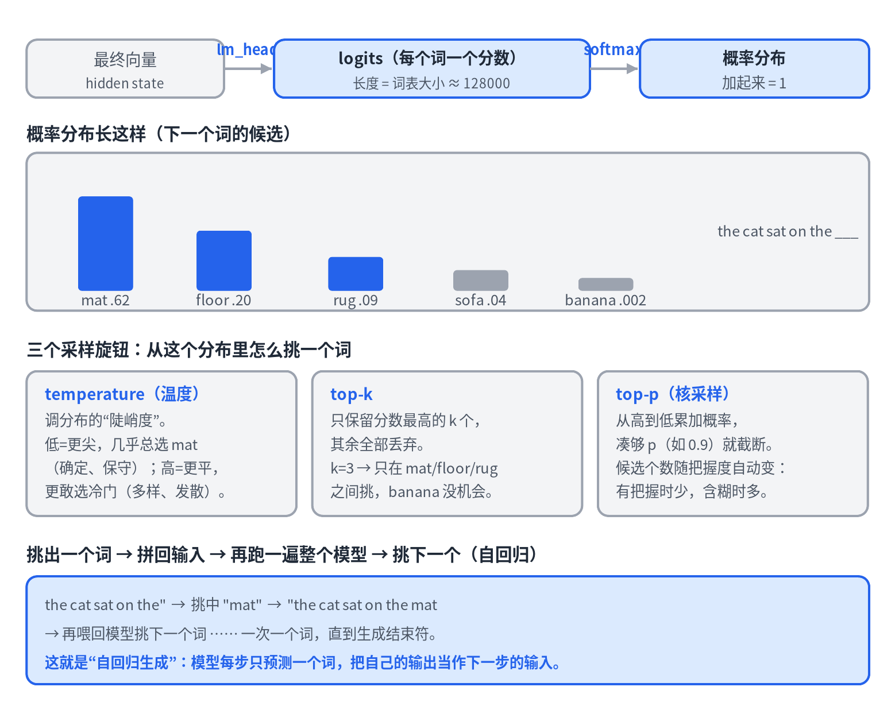
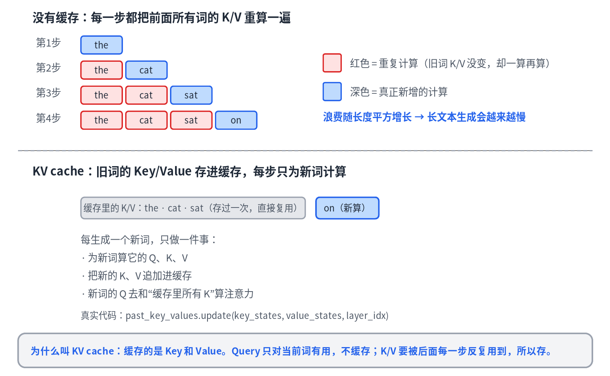

# 03 · 生成：从 logits 到文字

> 系列《从零看懂大模型》第 3 篇。前两篇讲了文字如何变成向量、向量如何被 attention 反复加工。这一篇讲最后一环：模型怎么"吐出下一个词"，以及为什么需要 KV cache。

## 从向量到概率



经过几十层 block 之后，每个位置都有一个"懂了上下文"的向量。要把它变成一个词，需要两步。

**lm_head：向量 → 词表分数。** 看 `LlamaForCausalLM` 里这一行：

```python
self.lm_head = nn.Linear(config.hidden_size, config.vocab_size, bias=False)
```

它把最后一层输出的向量（比如 4096 维）投影成**词表那么长的一串分数**——约 128000 个，每个词一个。这串分数叫 **logits**。

一个优雅的细节：代码里 `_tied_weights_keys` 把 `lm_head.weight` 和 `embed_tokens.weight` 绑成同一个矩阵。也就是说，第 1 篇那张"文字 → 向量"的查找表，反过来又用来做"向量 → 文字"。同一张表干两头的活。

**softmax：分数 → 概率。** logits 只是大小随意的分数，softmax 把它们压成和为 1 的概率分布——"下一个词是 mat 的概率 62%，floor 20%……"。

## 三个采样旋钮

有了概率分布，怎么挑一个词？这里有三个常见旋钮：

- **temperature（温度）** 调分布的陡峭度。低温让分布更尖，几乎总挑概率最高的那个（确定、保守、容易重复）；高温让分布更平，更敢挑冷门词（多样、有创意，也更容易跑飞）。`temperature=0` 退化为永远挑最大的（贪心）。
- **top-k** 只在分数最高的 k 个词里挑，其余直接扔掉，挡住长尾里的荒唐词。
- **top-p（核采样）** 从高到低累加概率，凑够 p（比如 0.9）就截断。候选词的数量随模型的把握度自动变：很确定时只留几个，含糊时自动放宽。

一个重要区分：**这些采样逻辑不在模型文件里。** 模型只负责吐 logits；挑词是 `.generate()`（GenerationMixin）干的。模型给概率，采样策略做决定——两件事是解耦的。

## 自回归：一次一个词

挑出一个词 → 拼回输入 → 再跑一遍整个模型 → 挑下一个。一次一个词，直到生成结束符。这就是"自回归生成"：模型每步只预测一个词，把自己的输出当作下一步的输入。

## KV cache：别重算不变的东西



自回归有个天然的浪费。每加一个新词就要跑一遍模型；天真的做法是每步都把前面所有词的 K、V 重算一遍——可这些旧词的 K/V **根本没变**。纯浪费，而且浪费随长度平方增长，长文本会越来越慢。

KV cache 的解法：把每个词的 K、V **算一次存起来**。之后每步只做三件事——为新词算 Q/K/V，把新的 K/V 追加进缓存，让新词的 Q 去和缓存里所有 K 算注意力。真实代码就是 attention 里的 `past_key_values.update(key_states, value_states, layer_idx)`。

为什么缓存 K/V 而不缓存 Q？因为 **Q 只在"当前词环顾四周"这一下有用**，用完就没意义了；而 K/V 是每个词"对外提供的信息"，会被后面每一步反复取用。

## 一条伏笔

KV cache 让长文本生成变得可行，但它会不断变大、吃掉大量显存。怎么高效管理这块缓存，是推理引擎（如 vLLM）的核心问题，第 5 篇会讲 PagedAttention 怎么解决它。

## 三篇串起来

到这里，一条完整主线已经走通：**文字 → 向量（第 1 篇）→ attention 反复加工（第 2 篇）→ 投成概率、采样、循环生成（第 3 篇）**。一个大模型从输入到输出，你现在能从头讲到尾了。

## 本篇要点

- lm_head 把向量投成词表分数（logits），softmax 变概率；输出矩阵和输入 embedding 常常共享同一张表。
- temperature 调陡峭度，top-k 截个数，top-p 按累计概率截断；采样在模型之外。
- 自回归一次一个词；KV cache 缓存旧词的 K/V，避免平方级重算。

## 思考题

如果你要模型输出尽量可复现、稳定的事实性回答，temperature / top-k / top-p 该怎么调？这样调有什么代价？
