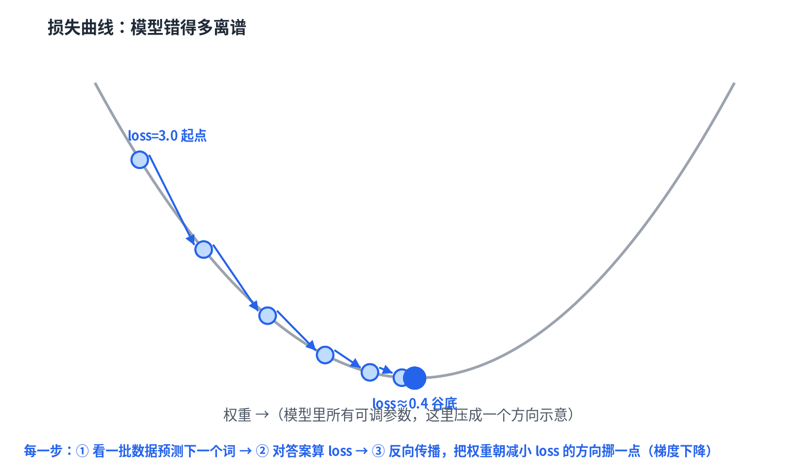
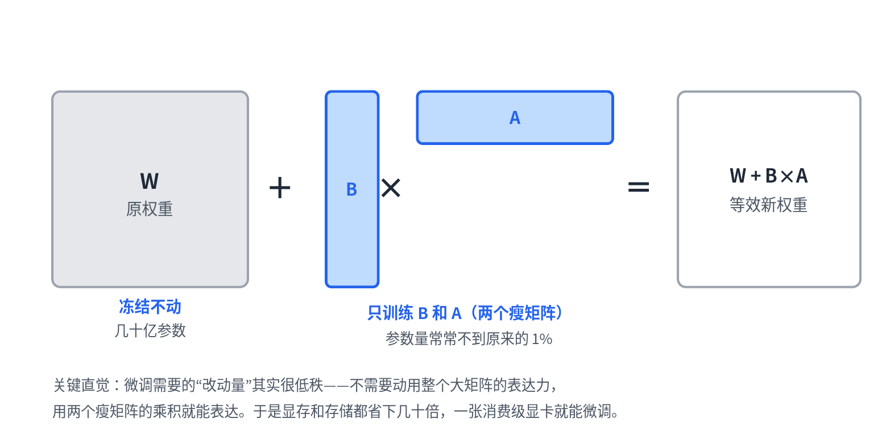

# 04 · 训练与微调：模型的权重从哪来

> 中文 · [English](en/04-training-and-finetuning.md)

> 系列《从零看懂大模型》第 4 篇。前三篇讲了模型"怎么算"，这一篇讲那些权重"怎么来"——预训练、微调、LoRA、对齐，全是同一个动作的变体。

## "学习"到底在学什么

前几篇出现过很多矩阵：embedding 查找表、每层的 `q_proj`/`k_proj`/`v_proj`、MLP……它们里面全是数字，加起来几十亿个，统称**权重**。刚开始这些数字是随机的，模型什么都不会。训练做的事就一句话循环：

1. **看一批文本，预测下一个词**（前三篇那条主线）；
2. **对答案，算 loss**——loss 衡量模型"有多惊讶"：真实的下一个词，模型给的概率越高，loss 越低；
3. **反向传播，把每个权重朝"能让 loss 变小"的方向挪一丁点。**

图中那条曲线是"损失地形"，训练就是在这个地形里找低谷。每一步顺着坡往下挪，这就是**梯度下降**（梯度 = 当前位置的坡度方向，告诉你往哪挪）。在万亿级 token 上把这个循环重复亿万次，权重就从随机数被一点点"雕"成了能预测语言的样子。第 1 篇说的"语义相近的词向量也相近"，正是这个过程的副产品。

## 微调：站在别人练好的地基上

从零预训练要烧几百万美元。**微调（fine-tuning）**是：拿一个已经预训练好的模型（它已经在低谷附近了），用你自己的小数据集继续跑几步梯度下降，把它往你的专属任务上再挪一点。便宜得多。

但全量微调要更新**全部**几十亿权重，显存扛不住。于是有了 LoRA。

## LoRA：冻结大矩阵，只训两个小的

原权重 `W` 锁死不动，旁边挂一条旁路：两个瘦长矩阵 `B × A` 相乘，当作"改动量"加上去。等效权重变成 `W + B×A`，而训练时只更新 `B` 和 `A`——参数量常常不到原来的 1%。

为什么行得通？因为微调需要的调整其实是"低秩"的——不需要动用整个大矩阵的表达力，用两个瘦矩阵的乘积就能表达。

那到底省下了什么？全量微调要为**每一个**权重存梯度和优化器状态（Adam 还要两个动量），这才是显存大头；LoRA 把这部分砍到只剩旁路那点参数。但冻结的基座权重仍要常驻显存，反向传播需要的激活值也照样得存——所以省的是**几倍，不是几十倍**：LoRA 论文在 GPT-3 175B 上报的数字是 1.2TB → 350GB，约 3 倍。真正把大模型微调塞进消费级显卡的，是在 LoRA 之上再叠一层基座量化（QLoRA 把冻结权重压到 4 bit）。

倒是 **checkpoint 小得惊人**：只需存 B 和 A，从几百 GB 降到几十 MB，一个基座可以挂无数个几十兆的适配器随时切换。真实代码课本是 HuggingFace 的 `peft` 库。

## 对齐：让模型给出人类想要的回答

预训练 + 微调教会模型"预测像样的文本"，但"像样的文本"不等于"好的回答"——网上的文本什么都有。**对齐（alignment）**这一步教模型产出人类更想要的回答：有用、无害、诚实。

主流做法之一是 **DPO**：喂给模型成对的例子（一个更好的回答、一个更差的回答），直接优化让它更偏向"更好"那个。日常使用的聊天模型之所以听话、不乱来，靠的就是这一步。代码课本是 `trl` 库。

## 模型的一生

把四步串起来：

> 随机权重 →（预训练：万亿 token 上梯度下降）→ 会预测语言的基座模型 →（微调 / LoRA：小数据上继续练）→ 专精某任务 →（对齐 / DPO：按人类偏好调）→ 你用的聊天助手。

四步都是同一个动作：**算 loss，梯度下降，挪权重。** 变的只是"用什么数据、调哪些权重、loss 怎么定义"。

## 本篇要点

- 训练 = 预测下一个词 → 算 loss → 梯度下降挪权重，重复亿万次。
- 微调是在预训练基础上继续训练；LoRA 冻结原权重、只训两个低秩小矩阵，省下的是梯度和优化器状态的显存（约几倍；基座权重和激活值省不掉，要进消费级显卡还得叠基座量化），checkpoint 则小到几十 MB。
- 对齐（如 DPO）用人类偏好数据让模型给出更好的回答。
- 预训练、微调、对齐本质是同一个动作的不同配置。

## 思考题

LoRA 冻结了原权重 W，只训练小矩阵 B 和 A。为什么它几乎不损失效果？训练时它省下的显存具体是哪一部分，又有哪一部分省不掉？（提示："低秩改动量"；以及"梯度和优化器状态"与"激活值"的区别。）
