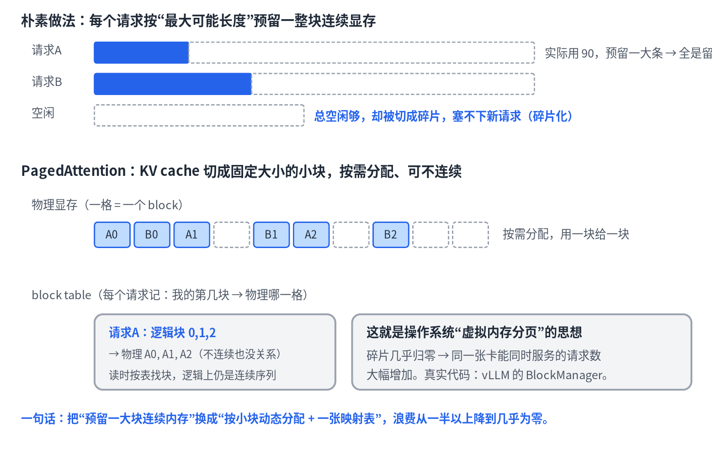
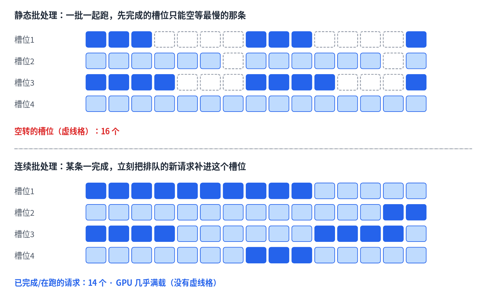

# 05 · 推理系统：大模型怎么被高效服务

> 系列《从零看懂大模型》第 5 篇。第 3 篇留下的伏笔——KV cache 会吃掉大量显存——本篇给出工业界的解法。课本是推理引擎事实标准 vLLM 的三大杠杆：PagedAttention、continuous batching、量化。

## 一个"能跑"的模型离"能服务"还很远

一个模型在你的显卡上能跑，和它能同时给成百上千人低成本地服务，是两回事。中间隔着三个问题：显存怎么不浪费、GPU 怎么不空转、精度怎么换吞吐。vLLM 这类推理引擎的价值，就是把这三件事做好。

## 杠杆一：PagedAttention —— 管显存

KV cache 的朴素做法是：每个请求按"最大可能长度"预留一大块**连续**显存。问题是实际用得少、留白多，还会碎片化——总空闲够，却因为被切成碎片塞不下新请求。

PagedAttention 借用操作系统"虚拟内存分页"的思想：把 KV cache 切成固定大小的小块（block），按需分配、可以不连续，再用一张 **block table** 记录"逻辑第几块 → 物理哪一格"。读的时候按表找块，逻辑上仍是连续序列。碎片几乎归零，同一张显卡能同时服务的请求数成倍增加。真实代码是 vLLM 的 `BlockManager`。

一句话：把"预留一大块连续内存"换成"按小块动态分配 + 一张映射表"，浪费从一半以上降到几乎为零。

## 杠杆二：Continuous batching —— 管调度

**静态批处理**把请求凑成一批一起跑。但每条输出长度不同，先写完的槽位只能空等最慢那条结束——GPU 大量空转（图中上半部分的虚线格）。

**连续批处理**把调度粒度从"一整批"细到"每一步"：每生成一步，就把完成的序列踢出去、把等待的请求塞进来，让 GPU 永远有活干。吞吐量因此能翻好几倍。真实代码是 vLLM 的 `Scheduler`。

这两个创新是天生一对：正因为 KV cache 是分页的，动态地"塞进来 / 踢出去"才变得廉价——只是分配或释放几个 block，否则连续的大块内存换进换出会非常昂贵。

## 杠杆三：量化 —— 管精度

模型权重通常是 fp16（每个数 2 字节）。量化把它压成 int8（1 字节）甚至 int4（半字节）——显存占用降 2～4 倍，推理也更快（大模型推理大多卡在"搬数据"上），代价是一点点精度损失。KV cache 本身也能量化。常见方法有 GPTQ、AWQ 等。这是**用一点质量换吞吐和成本**的取舍。

## 三个杠杆合起来

PagedAttention 管**显存**、continuous batching 管**调度**、量化管**精度**——合起来，把一个"能跑"的模型变成一个"能高并发、低成本对外服务"的系统。这也是工业界最缺人的方向之一。

## 本篇要点

- 朴素 KV cache 预留连续大块显存，浪费和碎片严重；PagedAttention 用分页 + block table 解决。
- 静态批处理让 GPU 空转；连续批处理按步调度，完成即补。
- 量化用低精度换显存和速度。
- 分页让动态调度廉价，两者相辅相成。

## 思考题

为什么说 PagedAttention 让连续批处理变得更容易？（提示：想想"动态塞进 / 踢出请求"需要什么样的内存管理。）
