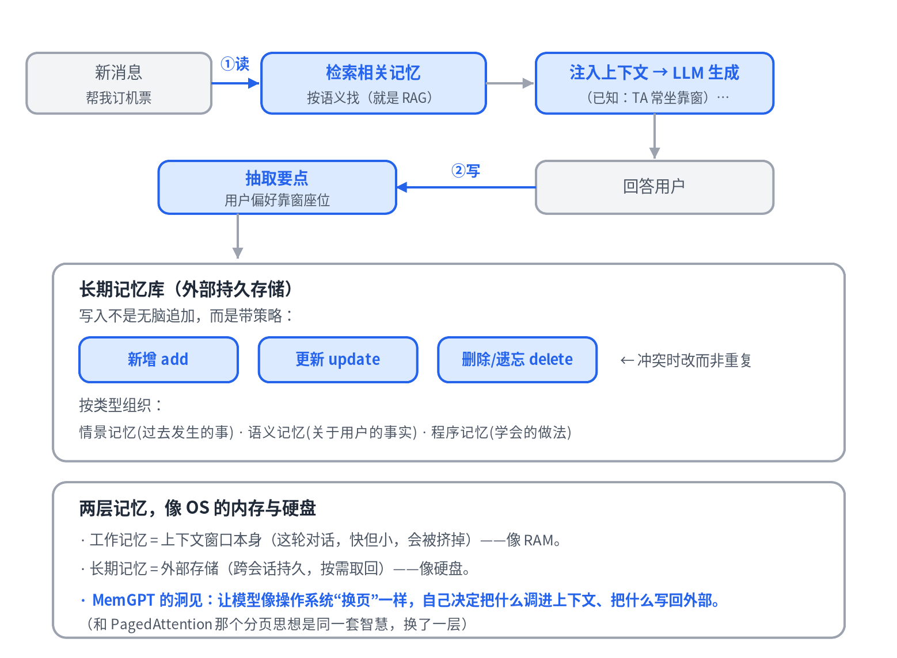
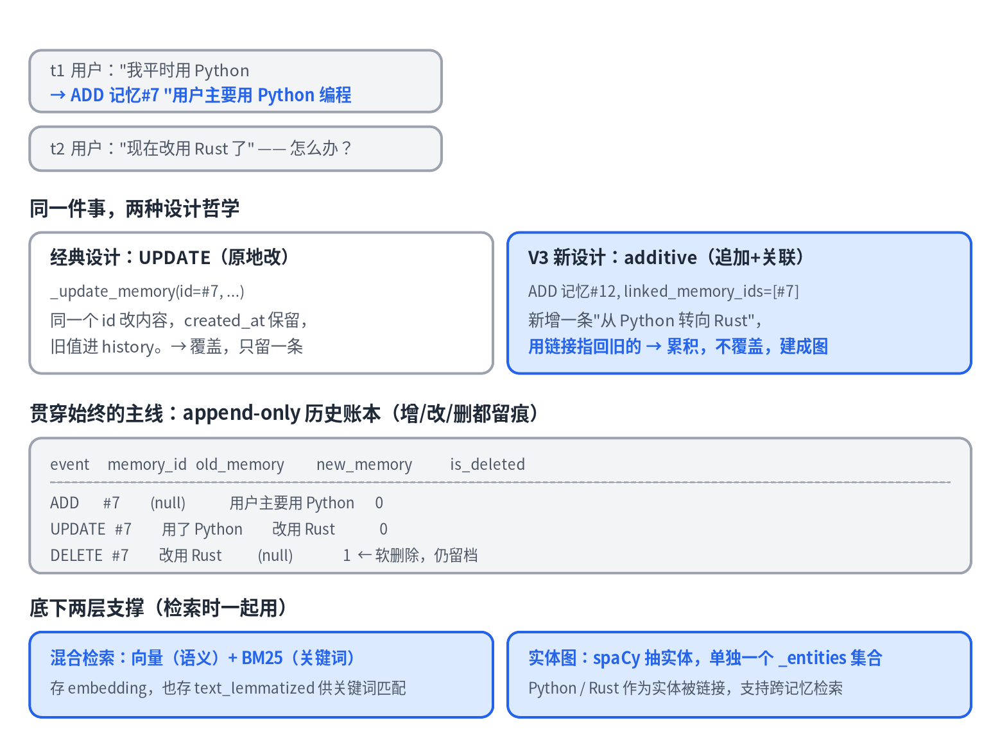

# 07 · AI 记忆系统：让 Agent 跨会话不失忆

> 系列《从零看懂大模型》第 7 篇。RAG 给模型外部知识，Agent 给模型行动能力，记忆给模型跨会话的持久记性。本篇以当红开源记忆层 mem0 的真实源码为课本。

## 为什么需要记忆

模型是无状态的：权重冻结、上下文窗口有限、每次对话重置。它"记不住"上一次对话里你说过的偏好，长对话里早期的内容也会被挤出窗口。记忆系统就是外挂在模型之外的持久记性。

## 记忆系统怎么运作：RAG + 写入策略



**读的一侧就是 RAG。** 新消息进来，先从长期记忆库按语义检索相关记忆，注入上下文，再让模型生成。

**写的一侧才是新东西。** 每轮交互后，用一个 LLM 把对话里值得记的要点抽出来（"用户偏好靠窗座位"），再写回库。而且不是无脑追加，而是带**增 / 改 / 删**策略——用户改了主意要更新，过时的要删除。这套"抽取 + 冲突消解"是记忆系统的核心难点。

### 记忆的分类

- **工作记忆**：上下文窗口本身（这轮对话，快但小，会被挤掉）。
- **情景记忆**：过去发生过的事。
- **语义记忆**：关于用户或世界的稳定事实（名字、偏好、公司）。
- **程序记忆**：学会的做法与技能。

### 两层记忆，像 OS 的内存与硬盘

工作记忆像 RAM，长期记忆像硬盘。MemGPT 的洞见是让模型像操作系统"换页"一样，自己决定把什么调进上下文、把什么写回外部——和第 5 篇 PagedAttention 的分页思想是同一套智慧，用在不同层。

### 为什么它还是活跃研究

难点全在判断：该记什么（记全了是噪声，记少了会漏）、冲突怎么消解（新旧偏好打架）、怎么遗忘（旧记忆随时间衰减）、检索质量（语义 vs 精确）。这些没有标准答案。

## mem0 的写入管线（真实源码）

mem0 的 `_add_to_vector_store` 是个分阶段流水线，把上面的概念落到了代码：

**先读，再决定怎么写。** 写之前先做一次向量检索，把已有的相关记忆捞出来：

```python
query_embedding = self.embedding_model.embed(parsed_messages, "search")
existing_results = self.vector_store.search(query=..., vectors=query_embedding, top_k=10, ...)
```

写入是"上下文感知"的——得先知道已经记过什么，才能判断新消息里哪些值得记、哪些重复。

**让 LLM 决定什么值得记。** 把"已有记忆 + 新消息 + 最近对话"一起喂给 LLM，用一份抽取提示词让它吐出该记的要点。"记什么"这个判断交给模型做，不是写死的规则。

几个值得学的工程细节：

- **防幻觉的 id 映射**：记忆的真实 id 是 UUID，直接给 LLM 看容易记错编乱。代码把 UUID 临时映射成 `"0" "1" "2"` 给模型，拿到结果再映射回去。
- **哈希去重**：对每条要记的文本算 md5，之前存过就跳过——用最便宜的方式挡掉完全重复。
- **审计历史**：每次记忆操作写一条 history，带 `event: ADD/UPDATE/DELETE` 和新旧值。"更新"不丢老信息，"删除"是软删除，仍留档。
- **快慢两档**：不想花 LLM 的钱做智能抽取，可以走"笨"路径直接存原始消息。

## 一条记忆的一生：两种设计哲学



用户先说"我平时用 Python"，之后说"现在改用 Rust 了"。怎么处理？

- **经典设计（UPDATE，原地改）**：用同一个 memory_id 改内容，`created_at` 保留、旧值进 history。覆盖，只留一条。
- **mem0 V3 新设计（additive，追加 + 关联）**：新增一条"从 Python 转向 Rust"，用 `linked_memory_ids` 指回旧的。累积、不覆盖，逐渐建成一张记忆图。

这两种哲学各有取舍，也说明记忆系统的设计仍在演进。贯穿两者的主线是 **append-only 的历史账本**——增改删都留痕，你永远能追溯一条记忆怎么演变、为什么消失。

底下还有两层支撑：**混合检索**（向量 + BM25 关键词，存 embedding 也存词形还原文本）和**实体图**（用 spaCy 抽实体、单独一个 `_entities` 集合，支持跨记忆检索）。

## 记忆系统的"大脑"是一份提示词

mem0 判断"该记什么"的全部智能，不是算法，而是一份几千字的自然语言提示词，喂给一个普通 LLM。这是一个反直觉但重要的认知：**现代 AI 系统里，复杂判断常常是用"写清楚的话"编码的，而不是代码。** 记忆质量约等于提示词质量。

这份提示词本质是一本"失败教训手册"，每条规则都是踩过的坑：

- **拿不准就记**：宁可多记（下游去重会处理），也别漏。专门警告"第一主题主导"——模型把第一个话题记得很细，后面的当废话跳过。
- **死守具体细节，别泛化**：`Ferrari 488 GTB` 不许写成"跑车"，因为一概括用户就搜不到了。
- **别曲解原意**："没到 2 点没睡"不等于"睡到 2 点"。记错比不记还糟。
- **时间要落地**："上周"必须换算成绝对日期，因为"上周去了巴黎"半年后就没用了。
- **不许编、不许猜**：不能从名字推断性别年龄；每个细节都要有出处。
- **示例胜于说教**：大半篇幅是"输入 → 标准输出"的示例（few-shot）。

记忆系统里 AI 含量最高的部分，恰恰是这份提示词和抽取、去重、链接逻辑。

## 本篇要点

- 记忆 = 读（RAG 检索）+ 写（LLM 抽取 + 去重 + 增改删 + 历史留痕）。
- 工作记忆是上下文窗口，长期记忆是外部存储；MemGPT 用 OS 换页的思路管理两者。
- mem0 用先读后写、id 映射防幻觉、哈希去重、append-only 账本；V3 从"原地更新"转向"追加 + 关联"。
- "记什么"的判断由一份提示词编码，它是模型失败模式的逐条封堵。

## 思考题

为什么 mem0 在把已有记忆交给 LLM 判断时，要把 UUID 换成 `"0" "1" "2"` 这样的小整数？

---

*相关代码：`mem0/memory/main.py`（写入管线与增改删）、`mem0/configs/prompts.py`（抽取提示词）。*
