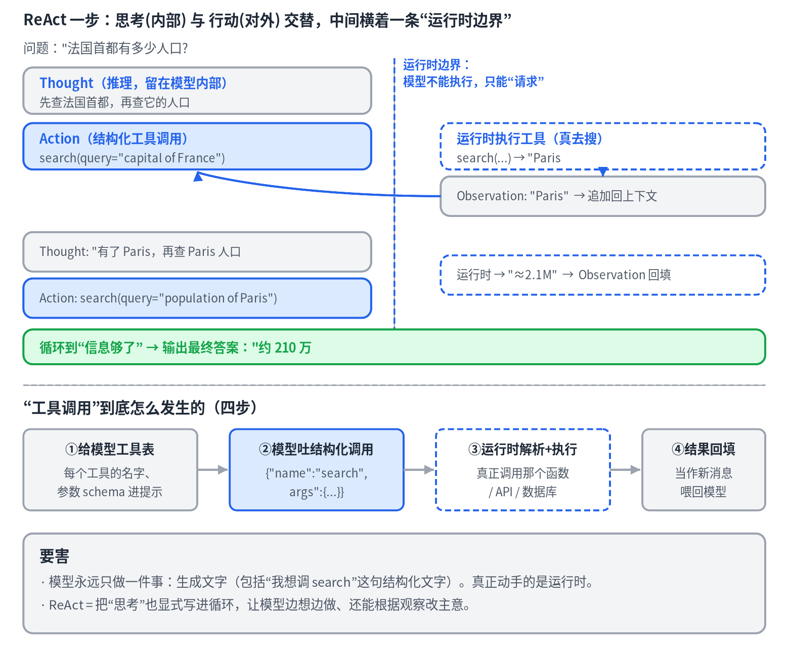
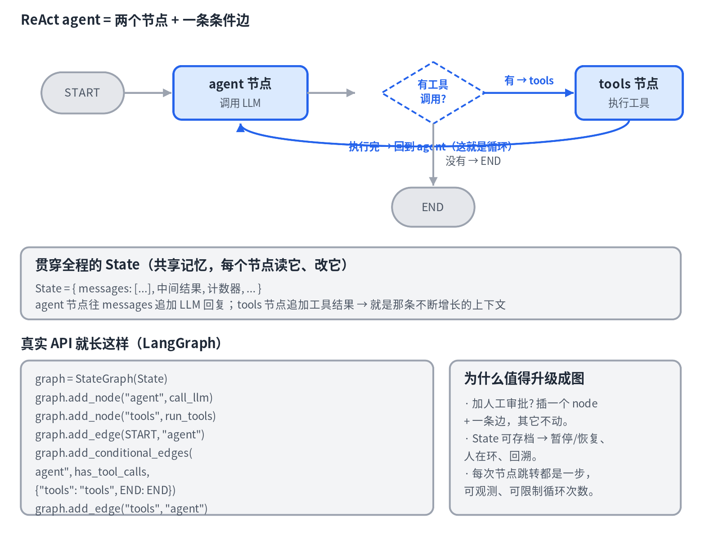
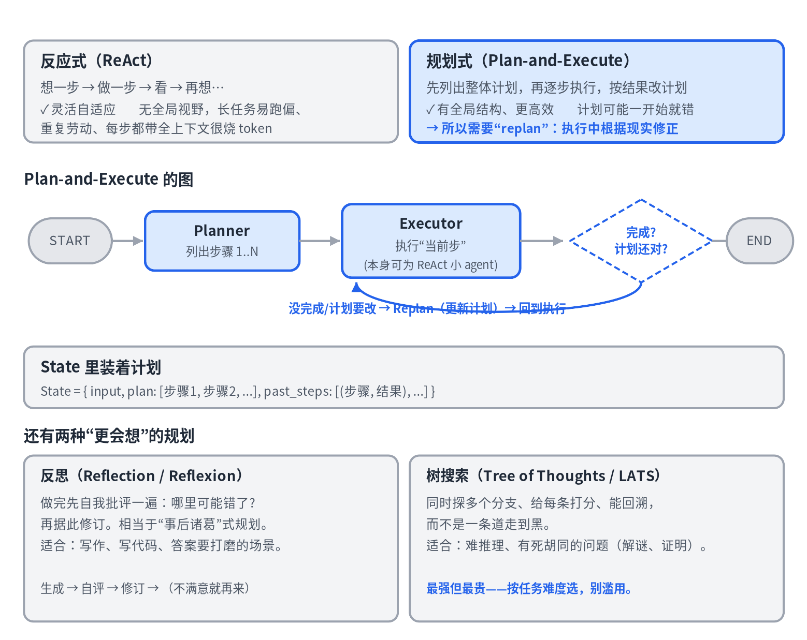
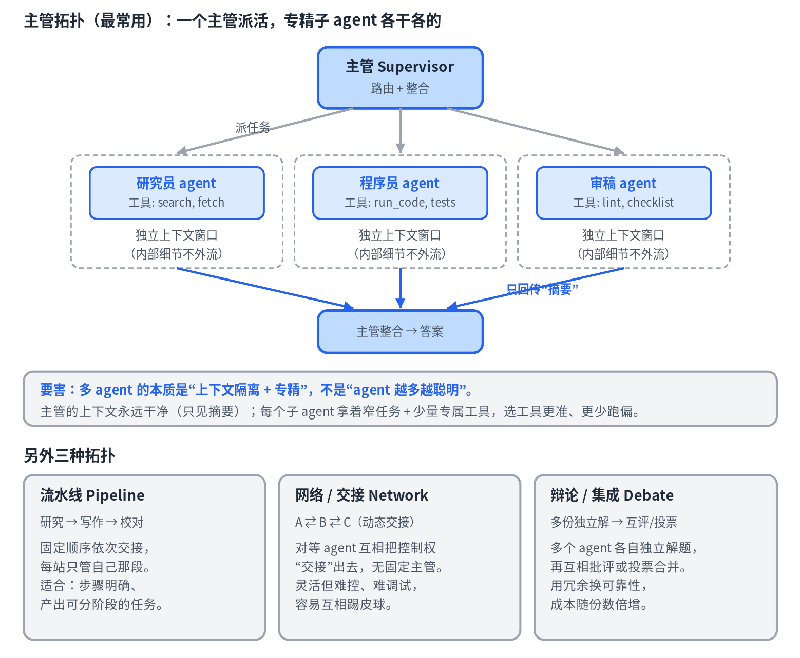
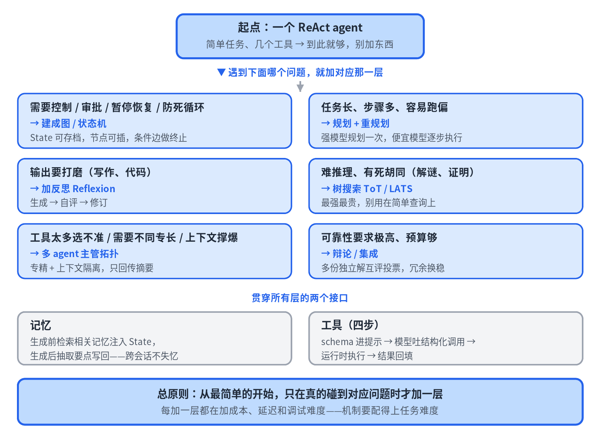

# 08 · Agent 架构深入：从 ReAct 到多 Agent

> 中文 · [English](en/08-agent-architectures.md)

> 系列《从零看懂大模型》第 8 篇，也是最后一篇。第 6 篇见过 agent 的基础循环，本篇把它拆到骨头里：ReAct 范式、工具调用机制、图/状态机模型、规划、多 agent，最后给出一张"什么时候用什么"的决策图。

## 第一层：ReAct 与工具调用的真相

**ReAct = Reasoning + Acting。** 在它之前，agent 要么只"想"（思维链，不动手），要么只"做"（直接调工具，不解释）。ReAct 把两者交织进一个循环：写一句 **Thought**（推理）→ 发一个 **Action**（工具调用）→ 收到 **Observation**（结果）→ 再写下一句 Thought。每一步的思考都建立在上一步观察到的新信息上，所以 agent 能边走边调整——搜出来的东西不对，下一句 Thought 就能改主意。

**工具调用的四步：**

1. **给模型工具表**：每个工具的名字、说明、参数 schema 被塞进提示，模型这才"知道"有哪些工具。
2. **模型吐结构化调用**：现代模型被专门微调过，会按固定格式输出"我要调 search，参数是……"。
3. **运行时解析并执行**：agent 框架（不是模型）真正去调那个函数、API 或数据库。
4. **结果回填**：执行结果当作一条新消息喂回模型，进入下一轮。

最该刻进脑子的一句：**模型永远只会生成文字。** 连"我想调 search"都只是一句结构化的文字请求，它自己碰不到外面的世界。一个 agent = LLM + 一个循环 + 一堆工具 + 一个负责执行的运行时。

顺带一提，"推理模型"是把 Thought 折进了模型内部的思考里，而不是显式写成文本。两种风格目的一样：让 Action 建立在充分的推理之上。

## 第二层：把 agent 建成图（状态机）

基础循环是一根写死的直线。真实 agent 需要分支、条件循环、人工审批、暂停恢复——这些用 while 循环表达不清。现代框架（LangGraph 等）把 agent 建成一张**图**，三个抽象：

- **State（状态）**：流动的共享记忆，最重要的就是 `messages` 列表——那条不断增长的上下文。每个节点读它、往里追加。
- **Node（节点）**：一步操作，本质是个函数：吃当前 State，吐出更新。"调 LLM"是一个节点，"执行工具"是一个节点，节点里可以塞任意代码。
- **Edge（边）**：控制流。普通边一定走；**条件边**在节点跑完后由一个路由函数看一眼 State，决定下一步去哪。

ReAct 的核心就一条条件边：`agent` 节点跑完，看最后那条消息有没有 tool_calls——有就去 `tools` 节点，没有就到 `END`。这顺手解决了"什么时候停"的问题：那条条件边就是终止条件。

为什么值得升级成图？因为**控制流从"写死的代码"变成了"可检查、可修改的数据"**：想在危险工具前加人工审批，插一个节点加一条边；想防无限循环，State 里加个计数器；State 是一等对象，可以存档（checkpoint），于是能暂停、恢复、人在环、甚至回溯到某一步重来；多 agent 也顺理成章——每个 agent 就是图里的一个节点或子图。

## 第三层：规划

ReAct 是反应式的：眼里只有下一步，没有全局。任务一长（十几二十步、有依赖），它就容易跑偏、重复劳动、钻死胡同；而且每一步都要把全部上下文塞给大模型再算一次，又慢又贵。规划式的思路是**先想清楚整体怎么打，再动手**。

**Plan-and-Execute 的三个节点：**

- **Planner**：让 LLM 先吐出一个显式的分步计划。通常用最强的模型，因为"拆解"是最难的部分。
- **Executor**：执行当前这一步。每一步本身可以是一个 ReAct 小 agent，而且因为任务窄，可以用更便宜的小模型。**贵的规划只做一次，便宜的执行按步跑**——这是个大效率红利。
- **Replan**（条件边）：执行完一步看结果——完成了吗？计划还成立吗？现实给了惊喜就更新计划再继续。正是这个"改计划"的能力，救了"一开始就可能错"的死板计划。

两种"更会想"的规划：**反思（Reflexion）**——做完先自我批评再修订，适合写作、代码这类要打磨的输出；**树搜索（Tree of Thoughts / LATS）**——同时探多个分支、打分、回溯，适合有死胡同的难推理，最强也最贵。

实操心法：按任务难度配武器。简单工具调用用 ReAct；长的结构化任务用 Plan-and-Execute + replan；输出要打磨加反思；难搜索用树搜索。拿树搜索做一次简单查询，就是白烧钱。

## 第四层：多 agent

一个 agent 挂 30 个工具、塞一个巨型提示，表现会变差：选工具选错、上下文臃肿、一个"人格"什么都干。拆成多个 agent 的道理和代码拆模块一样：**专精 + 隔离**。

**主管拓扑（最常用）**：主管是一个路由节点，带条件边把任务派给专精子 agent；每个子 agent 是一张子图，有自己的循环和工具。关键设计是**子 agent 的上下文是隔离的**——它内部翻过的长篇原文、跑过的 20 次测试日志，都不会流进主管的上下文。主管永远只看摘要，保持干净。

多 agent 的本质是**上下文隔离 + 专精**，不是"agent 越多越聪明"。

代价与坑：摘要会丢细节（通信带宽是真实损耗）；错误会传染（子 agent 给错结果，主管照单全收）；协调开销大、延迟高、难调试。铁律：**一个 agent 能干好的，就别拆。** 拆的信号是工具太多选不准、需要不同专长、上下文撑爆。

其他拓扑：**流水线**（固定顺序依次交接，适合分段产出）、**网络交接**（对等 agent 动态交接，灵活但难控）、**辩论集成**（多份独立解互评投票，拿冗余换可靠性，成本倍增）。

## 总图：什么时候用什么

从一个最简单的 ReAct agent 出发，只在真的碰到对应问题时才加一层：

- 需要控制、审批、暂停恢复、防死循环 → 建成图 / 状态机
- 任务长、步骤多、容易跑偏 → 规划 + 重规划
- 输出要打磨 → 加反思
- 难推理、有死胡同 → 树搜索
- 工具太多、需要不同专长、上下文撑爆 → 多 agent 主管拓扑
- 可靠性要求极高、预算够 → 辩论 / 集成

贯穿所有层的两个接口：**记忆**（第 7 篇）接入 State，**工具**（本篇第一层）通过 schema 接入。

总原则：每加一层都在加成本、延迟和调试难度，机制要配得上任务难度。**会判断"该不该加"，比会搭更重要。**

## 本篇要点

- ReAct 交织推理与行动；工具调用四步；模型只生成文字，运行时负责执行。
- 图模型用 State/Node/Edge 把控制流变成数据，条件边即终止条件，State 可存档。
- 规划式先拆解再执行，配 replan 修正；反思和树搜索是更贵的升级。
- 多 agent 的本质是上下文隔离与专精；能用一个 agent 就别拆。
- 从最简单的开始，遇到具体问题才加层。

## 思考题

Plan-and-Execute 里"Planner 用最强大模型、Executor 用便宜小模型"为什么通常很划算？"State 可以存档"为什么能同时实现人工审批和从中间某步重跑？

---

*全系列到此结束。从 token 到向量、从 attention 到生成、从训练到推理系统、从 RAG 到记忆与 Agent 架构——一条从底到顶的完整链路，现在你可以从任何一个真实 AI 产品的"用户提问"，一路追到底层的矩阵乘法，再回到答案。*
