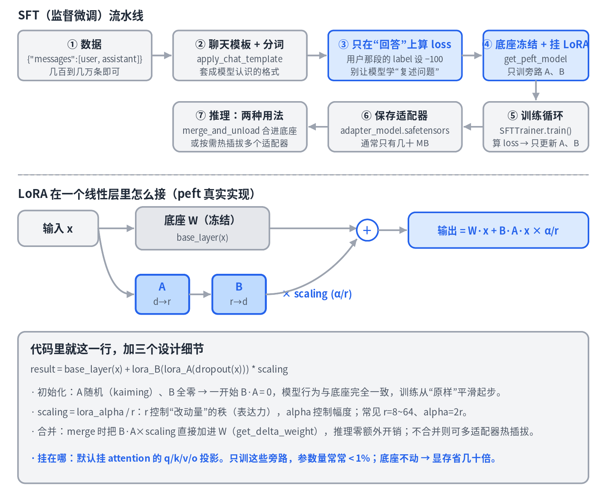
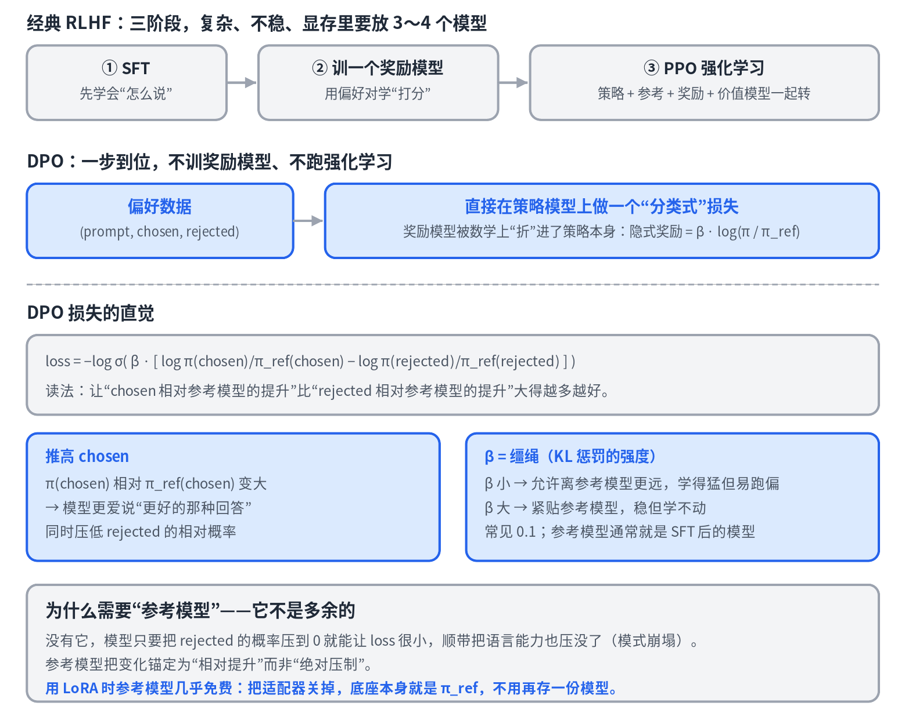

# 10 · 微调实战：LoRA 与 DPO

> 系列《从零看懂大模型》第 10 篇。第 4 篇讲了训练的原理，这一篇把它落到能跑的代码：用 peft 做 LoRA 监督微调（SFT），再用 trl 做 DPO 偏好对齐。课本是 peft 的 `tuners/lora/layer.py` 与 trl 的 `SFTTrainer` / `DPOTrainer`。

## 微调能做什么、不能做什么

先纠正一个常见误解：**微调不是"教模型新知识"的好手段。** 权重里几十亿参数承载的知识，几千条数据改不动多少；要注入新知识，第 6 篇的 RAG 更靠谱。微调擅长的是教**格式、风格、行为**——怎么回答、用什么口吻、遵守什么规则。

微调分两步：SFT 教模型"怎么说"，DPO 教模型"哪种说法更好"。

## 第一步：SFT 流水线



七步里三个最容易被忽略、也最决定成败的点：

**数据格式是对话。** SFT 的数据不是"输入→输出"两列，而是一条条 `messages` 对话 `[{"role":"user",...},{"role":"assistant",...}]`。几百到几万条**高质量**数据就够，质量远比数量重要。

**聊天模板。** 每个模型有自己的对话格式（特殊 token 标记谁在说话），`apply_chat_template` 负责套格式。用错模板，模型学到的是错的分隔符，推理时就答非所问。

**只在"回答"上算 loss。** 一条对话里，用户那段是题目，助手那段才是该学的答案。若对整条序列算 loss，模型会浪费算力去学"复述用户的问题"。做法是把 prompt 部分的 label 设为 `-100`（交叉熵会忽略），只让助手 token 贡献梯度。trl 里一个开关 `assistant_only_loss=True`。

## LoRA 在 peft 里的真相

peft 把每个目标线性层换成"底座 + 旁路"，核心就一行：

```python
result = base_layer(x) + lora_B(lora_A(dropout(x))) * scaling   # peft/tuners/lora/layer.py
```

三个设计细节：

- **初始化**：`A` 随机（kaiming），`B` **全零**。训练开始时 `B·A = 0`，模型行为与底座完全一致——从"原样"平滑起步，而不是一上来就把模型搅乱。
- **scaling = lora_alpha / r**：`r` 是旁路的秩（改动量的表达力），`alpha` 控制幅度。经验值 r=8～64、alpha 取 2r。
- **合并**：`get_delta_weight` 算出 `B @ A × scaling`，merge 时直接加进 `W`，推理零额外开销；不合并则能给同一个底座热插拔多个适配器。

挂在哪：默认挂 attention 的 `q/k/v/o` 投影（第 2 篇的那些 `q_proj`），有时也挂 MLP。底座不动，显存里只需底座前向 + 旁路梯度，这就是省几十倍显存的来源。

### 能跑的最小代码

```python
from datasets import load_dataset
from peft import LoraConfig, get_peft_model
from transformers import AutoModelForCausalLM, AutoTokenizer
from trl import SFTTrainer, SFTConfig

model_id = "Qwen/Qwen2.5-0.5B-Instruct"          # 小模型，笔记本也能跑
tok   = AutoTokenizer.from_pretrained(model_id)
model = AutoModelForCausalLM.from_pretrained(model_id, torch_dtype="auto")

lora = LoraConfig(r=16, lora_alpha=32, lora_dropout=0.05,
                  target_modules=["q_proj", "k_proj", "v_proj", "o_proj"],
                  task_type="CAUSAL_LM")
model = get_peft_model(model, lora)
model.print_trainable_parameters()               # trainable < 1%

ds = load_dataset("json", data_files="train.jsonl")   # 每行 {"messages": [...]}

cfg = SFTConfig(output_dir="out", num_train_epochs=2, per_device_train_batch_size=4,
                learning_rate=2e-4, assistant_only_loss=True, logging_steps=10)
trainer = SFTTrainer(model=model, args=cfg, train_dataset=ds["train"], processing_class=tok)
trainer.train()

model.save_pretrained("out/adapter")             # 只存适配器，几十 MB
merged = model.merge_and_unload()                # 需要时合并进底座
merged.save_pretrained("out/merged")
```

三十行不到就是一次完整的 LoRA 微调。`SFTTrainer` 替你做了聊天模板、分词、loss 掩码；`get_peft_model` 替你把每个 `q_proj` 换成上面那个"底座 + 旁路"的层。

## 第二步：DPO 偏好对齐



SFT 只有"标准答案"，没有"对比"——两种都通顺的回答里哪种更好（更有帮助、更诚实、更不啰嗦），它教不了。这是对齐要解决的事。

**经典 RLHF 为什么难。** 三阶段：SFT → 用偏好数据训一个奖励模型学"打分" → 用 PPO 强化学习让策略追高分、同时用 KL 惩罚不许离参考模型太远。有效，但很重：策略、参考、奖励、价值四个模型同时在显存里，PPO 又出了名地不稳。

**DPO 的洞见。** 数学上可以证明 RLHF 目标的最优策略有闭式解，于是"奖励"可以反过来用策略本身表示——隐式奖励 = `β·log(π/π_ref)`。把它代回偏好学习的损失，奖励模型就被折进了策略，剩下一个直接在偏好对上做的分类式损失。不训奖励模型，不跑强化学习。

**损失怎么读。** 对每个 `(prompt, chosen, rejected)`：让 **chosen 相对参考模型的提升**，比 **rejected 相对参考模型的提升**大得越多越好。两个细节最关键：

- **参考模型不是多余的。** 没有它，模型只要把 rejected 的概率压到 0 就能让 loss 很小，顺带把语言能力也压没（模式崩塌）。参考模型把变化锚定为"相对提升"。用 LoRA 时它几乎免费：关掉适配器，底座就是 π_ref。
- **β 是缰绳。** 小 β 允许离参考模型更远（学得猛、易跑偏），大 β 紧贴参考（稳、学不动）。常见 0.1。

### 能跑的最小代码

```python
from datasets import load_dataset
from peft import LoraConfig
from transformers import AutoModelForCausalLM, AutoTokenizer
from trl import DPOTrainer, DPOConfig

model_id = "out/merged"                       # 上一步 SFT 后合并的模型，作为起点（也是参考模型）
tok   = AutoTokenizer.from_pretrained(model_id)
model = AutoModelForCausalLM.from_pretrained(model_id, torch_dtype="auto")

ds = load_dataset("json", data_files="prefs.jsonl")   # 每行 {"prompt": ..., "chosen": ..., "rejected": ...}

lora = LoraConfig(r=16, lora_alpha=32, target_modules=["q_proj","k_proj","v_proj","o_proj"],
                  task_type="CAUSAL_LM")
cfg = DPOConfig(output_dir="out_dpo", beta=0.1, learning_rate=5e-6,
                num_train_epochs=1, per_device_train_batch_size=2, logging_steps=10)
trainer = DPOTrainer(model=model, ref_model=None,      # ref_model=None + LoRA → 自动用关掉适配器的底座当参考
                     args=cfg, train_dataset=ds["train"],
                     processing_class=tok, peft_config=lora)
trainer.train()
trainer.save_model("out_dpo/adapter")
```

## 实操避坑

1. **偏好数据质量决定一切。** chosen/rejected 的差别必须是你真想教的那个维度（比如"简洁 vs 啰嗦"），否则模型学到的是噪声里的伪相关。
2. **DPO 学习率要比 SFT 小一个数量级**（全量 5e-7～5e-6，LoRA 可稍大）。DPO 很容易过优化——训练 loss 漂亮、模型却开始输出怪东西。盯 trl 打出的 `rewards/margins`，稳步上升即可，飙太快多半是过拟合。
3. **顺序别反：先 SFT 再 DPO。** DPO 假设模型已经会像样地说话，在此基础上调偏好。直接在基座上 DPO 效果差得多。
4. **显存不够用 QLoRA。** 把底座以 4-bit 加载（`BitsAndBytesConfig(load_in_4bit=True)`），LoRA 旁路仍用 16-bit 训练。一张 24GB 的消费级显卡就能微调 7B 级模型。

## 本篇要点

- 微调教格式、风格、行为，不擅长注入知识；SFT 教"怎么说"，DPO 教"哪种更好"。
- SFT 的三个关键：对话格式、聊天模板、只在回答上算 loss。
- LoRA 核心一行 `base(x) + B(A(x))·α/r`；B 零初始化、scaling=α/r、可合并可热插拔。
- DPO 把奖励模型折进策略，参考模型防崩塌，β 是缰绳；先 SFT 再 DPO。

## 思考题

为什么 LoRA 要把 B 初始化为零、而不是 A 和 B 都随机？DPO 里 rejected 回答的绝对概率下降，为什么并不等于模型"学坏了"，什么情况下才是真出问题？
