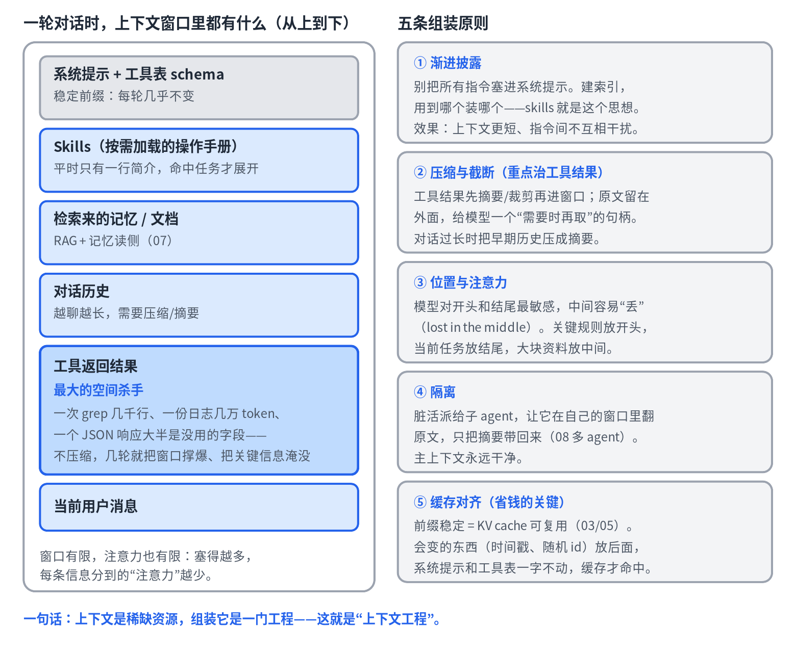
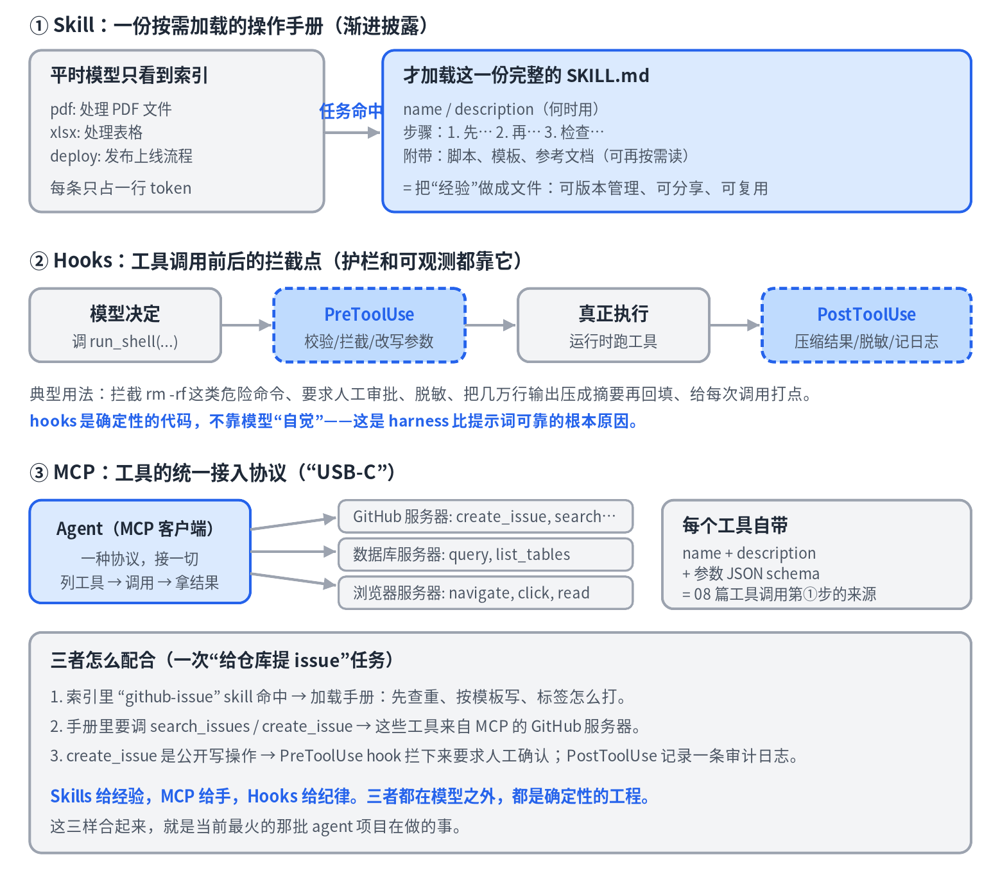
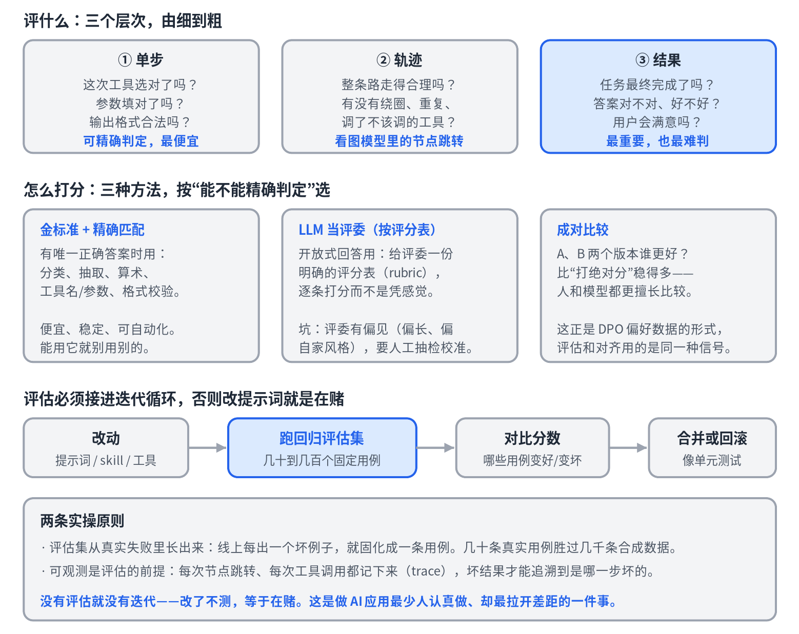

# 11 · 上下文工程与 Agent Harness：Skills、Hooks、MCP 与评估

> 系列《从零看懂大模型》第 11 篇。"harness""skills""MCP"是当下最热的词，本篇把它们放回一个统一框架：**Agent = 模型 + Harness**。模型是引擎，harness 是整辆车；上下文工程是这辆车的操作系统，评估是它的仪表盘。

## 先立框架：Agent = 模型 + Harness

模型只会做一件事：读上下文、生成文字。让它变成能干活的 agent，靠的是外面那一整套——循环、工具执行、每轮往上下文里塞什么、记忆读写、工具调用前后的检查、权限护栏、子 agent 派生、出错处理、日志。这一整套叫 **harness**。

它突然火，是因为业界发现：**同一个模型，换个 harness，能力天差地别。** 模型本身的提升放缓了，harness 的提升空间反而大。前几篇讲过的循环与状态机（08）、工具调用（08）、记忆（07）、规划与多 agent（08），都是 harness 的部件。本篇补上剩下的：上下文组装、skills、hooks、MCP、评估。

## 一、上下文工程：窗口是稀缺资源

### 为什么"提示工程"变成了"上下文工程"

单轮对话时代，精心写一段提示就够了。到了 agent，上下文是**每一轮由程序动态组装**的：系统提示、工具表、检索结果、记忆、历史、工具返回……七八个来源在抢一个有限窗口。手艺从"措辞一段话"变成了"设计一条组装流水线"。

### 最大的敌人是工具返回

用户消息通常几十 token，但一次 grep 几千行、一份日志几万 token、一个 API 响应大半是无用字段。不压缩，几轮就把窗口撑爆；更糟的是把关键信息**淹没**——模型的注意力有限，塞得越多，每条分到的越少。所以压缩的主战场是工具结果：先摘要或裁剪再进窗口，原文留在外面，给模型一个"需要时再取"的句柄。对话过长时，把早期历史压成摘要（compaction）。

### 五条组装原则

1. **渐进披露。** 别把所有指令塞进系统提示。建索引，用到哪个装哪个——skills 就是这个思想。
2. **压缩与截断。** 重点治工具结果和过长历史。
3. **位置与注意力。** 模型对开头和结尾最敏感，中间容易"丢"（lost in the middle）。关键规则放开头，当前任务放结尾，大块资料放中间。
4. **隔离。** 脏活派给子 agent，让它在自己的窗口里翻原文，只把摘要带回来。主上下文永远干净。
5. **缓存对齐。** 回忆第 3、5 篇：KV cache 缓存的是前缀。API 层的 prompt caching 就是**跨请求复用前缀的 KV cache**，条件是前缀一字不差。所以系统提示和工具表放最前面且保持稳定，时间戳、随机 id 放后面。前缀一变，缓存全失效，长对话成本翻几倍。这是把底层原理直接用到工程上的典型例子。

## 二、Harness 的三个可编程点

### Skills：把"经验"做成文件

一个 skill 就是一个文件夹：`SKILL.md`（名字、一句话说明"何时用"、正文是一步步怎么做）+ 可选的脚本、模板、参考文档。运行机制是渐进披露：harness 把所有 skill 的一句话说明当索引放进上下文，任务命中才加载那一份全文。

它为什么火？因为**经验以前锁在提示词里、锁在人脑里，现在变成了可版本管理、可分享、可复用的文件**——这直接催生了一个技能生态。和第 7 篇的关系：skills 就是显式化、可分发的**程序记忆**。

和 tools 最容易混：**tools 给手（能调用的函数），skills 给经验（怎么做事的手册）**。手册里可以调用工具。

### Hooks：确定性的纪律

一次工具调用前后各有一个拦截点。`PreToolUse` 可以校验参数、拦截危险命令、要求人工审批、改写参数；`PostToolUse` 可以把大段输出压成摘要再回填、脱敏、打日志。

关键在于：**hooks 是代码，不是提示词。** 在系统提示里写"请不要删文件"，模型可能忘、可能被诱导；一个 hook 是百分百执行的。这就是 harness 比提示词可靠的根本原因——**该用代码保证的事，不要指望模型自觉。**

### MCP：工具的统一接口

没有标准时，每个 agent 框架要为每个工具单独写适配（N 个框架 × M 个工具）；有了 MCP（Model Context Protocol），工具方只写一个"服务器"，agent 方只实现一个"客户端"（N + M）。一个 MCP 服务器暴露一组带 `name / description / 参数 schema` 的工具——正是第 8 篇工具调用第①步"工具表"的来源。它还能暴露资源（可读数据）和提示模板。它火是因为解决的是生态问题，而不是技术难题。

### 三者怎么配合

以"给仓库提 issue"为例：索引里的 `github-issue` skill 命中，加载手册（先查重、按模板写、怎么打标签）；手册要调的 `search_issues` / `create_issue` 来自 MCP 的 GitHub 服务器；`create_issue` 是公开写操作，`PreToolUse` hook 拦下来要求人工确认，`PostToolUse` 记一条审计日志。**Skills 给经验，MCP 给手，Hooks 给纪律。** 三者都在模型之外，都是确定性的工程。

## 三、评估：怎么知道 agent 变好了还是变坏了

### 评什么：三个层次

- **单步**：这次工具选对了吗、参数填对了吗、输出格式合法吗。可精确判定，最便宜。
- **轨迹**：整条路走得合理吗，有没有绕圈、重复、调了不该调的工具。看图模型里的节点跳转。
- **结果**：任务最终完成了吗，答案对不对、好不好。最重要，也最难判。

### 怎么打分：按"能不能精确判定"选

**能精确判定的，绝不用 LLM 评委。** 工具选择、参数、格式、分类抽取算术——有唯一答案就用金标准精确匹配，便宜稳定可自动化。很多团队一上来就用 LLM 打分，结果评委自己不稳定，评估比被评的还不可靠。LLM 评委只留给真正开放式的回答，而且要给它一份**明确的评分表**逐条打分，再用人工抽检校准它的偏见（评委普遍偏爱更长、更像自家风格的回答）。

**比较比打分稳得多。** 给一个回答打 7 分还是 8 分波动很大，但"A 和 B 哪个更好"一致性高得多。版本对比优先用成对比较——这正是第 10 篇 DPO 偏好数据的形式：评估和对齐用的是同一种信号，一个拿来量，一个拿来训。

### 接进迭代循环

改提示词、换 skill、加工具 → 跑回归评估集 → 看哪些用例变好变坏 → 合并或回滚。像单元测试一样。两条实操原则：

- **评估集从真实失败里长。** 不要一开始造几千条合成用例。每出一个坏例子，就固化成一条回归用例；几十条真实用例胜过几千条合成的。
- **可观测是前提。** 把每次节点跳转、每次工具调用记成 trace，坏结果才能追溯到坏在哪一步。

**改了不测，等于在赌。** 这是做 AI 应用最少人认真做、却最拉开差距的一件事。

## 本篇要点

- Agent = 模型 + Harness；同一模型换 harness 能力天差地别，harness 工程因此成为焦点。
- 上下文是稀缺资源：渐进披露、压缩工具结果、注意位置、隔离脏活、保持前缀稳定以命中缓存。
- Skills 是可分发的程序记忆，Hooks 是确定性护栏，MCP 是工具的统一接口。
- 评估分单步/轨迹/结果三层；能精确判定的不用 LLM 评委；比较比打分稳；评估集从真实失败里长，接进迭代循环。

## 思考题

为什么"把时间戳放在系统提示开头"会让长对话的 API 成本翻几倍？（提示：回忆第 3 篇的 KV cache 缓存的是什么。）

---

*本篇有意略去了一些当下热度高但尚无稳定定义的新词，以及"用特定语气省 token"之类的技巧——它们没有可迁移的原理，写进教程只会过时。*
