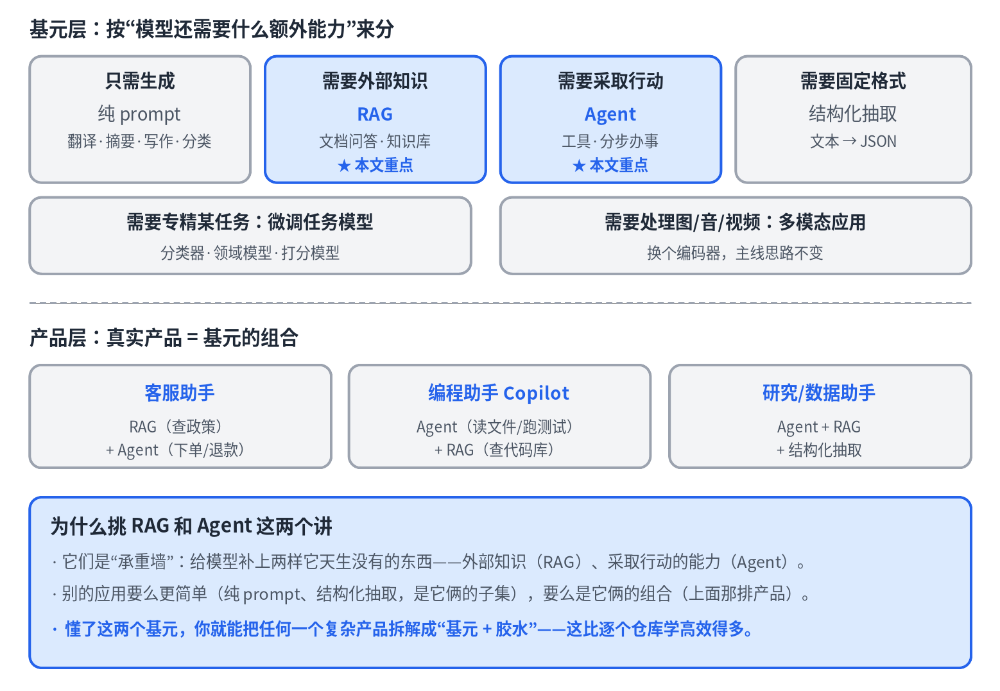
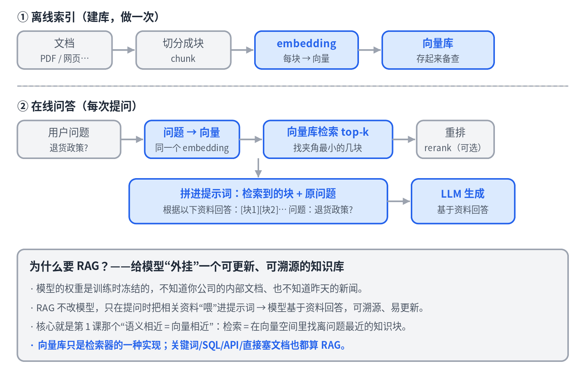
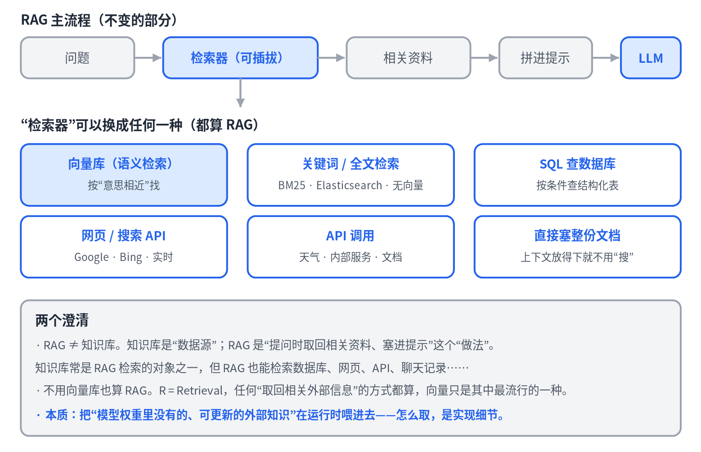
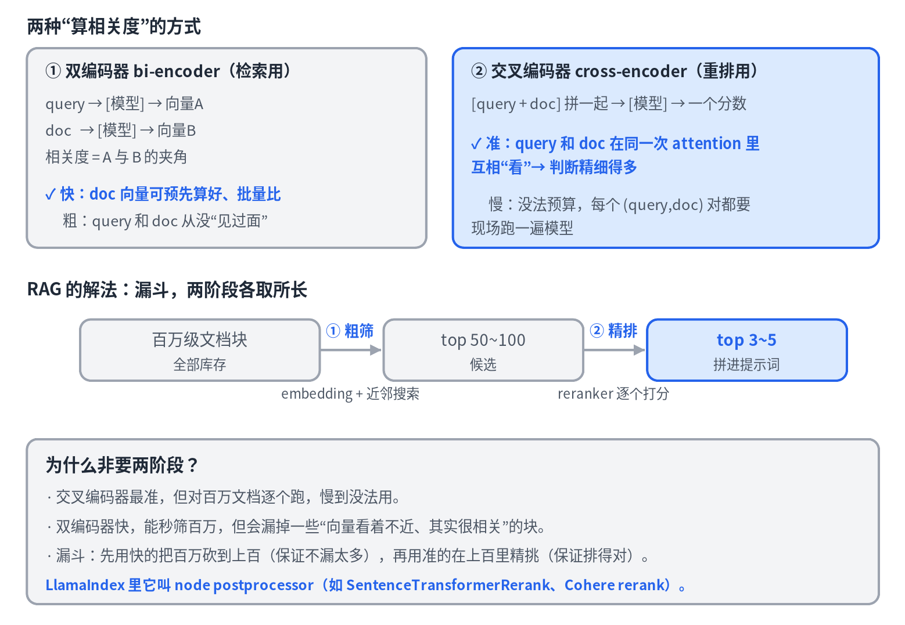
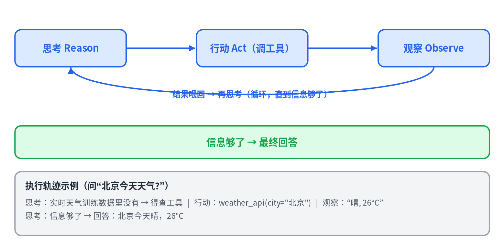

# 06 · The Application Layer: RAG and Agents

> [中文版](../06-rag-and-agents.md) · English

> Part 6 of the series *LLMs from the Ground Up*. The first five chapters were about the model; this one connects the model to real products. The application layer has many varieties, but this chapter covers only the two load-bearing primitives, RAG and agents, because the vast majority of LLM applications are one of them or a combination of the two.

## The application map: the big picture first

Grouped by "what extra capability does the model still need", applications fall into a few primitives: generation only (pure prompting: translation, summarization, classification), external knowledge needed (RAG), actions needed (agents), fixed output format needed (structured extraction), specialization needed (fine-tuned task models), images and audio needed (multimodal).

Real products are combinations of these primitives: a customer-support assistant = RAG (look up policy) + agent (place orders, issue refunds); a coding Copilot = agent (read files, run tests) + RAG (search the codebase). RAG and agents are the two load-bearing walls, each supplying something the model does not have natively: **external knowledge** and **the ability to act**. Once you understand these two primitives, you can decompose any complex product into "primitives plus glue".

## RAG: bolting an updatable knowledge base onto the model

The model's weights are frozen at training time. It doesn't know your company's internal documents, and it doesn't know yesterday's news. RAG (retrieval-augmented generation) doesn't change the model; it just feeds relevant material into the prompt at question time so the model answers based on that material, which makes answers traceable and easy to update.

The pipeline has two halves:

- **Offline indexing** (build the store, done once): documents → split into chunks → each chunk embedded into a vector → stored in a vector database.
- **Online question answering** (every question): question → embedded by the same model into a vector → find the few chunks with the smallest angle in the vector store → optionally rerank → assemble into the prompt → the LLM generates.

The core is the "similar meaning = similar vectors" idea from Part 1: retrieval is finding the knowledge chunks nearest to the question in vector space.

### Two common misconceptions

**RAG is not the same as a knowledge base.** A knowledge base is a data source; RAG is the practice of "fetch relevant material at question time and stuff it into the prompt". Knowledge-base Q&A is just RAG's most common instance. What RAG retrieves can be a database, a web page, an API, or a chat history.

**You can do RAG without a vector store.** The R in RAG is retrieval, and any way of "fetching relevant external information" counts: keyword full-text search (BM25), SQL queries, web search, API calls, even stuffing the whole document in when the context window allows. A vector store is just the most popular implementation of **semantic** retrieval. Choose by scenario: fuzzy, semantic, unstructured text calls for vectors; exact terms, IDs, and structured data call for keywords or SQL; when you need both, use hybrid retrieval.

A more fundamental model: the model's knowledge is either **parametric** (baked into the weights, frozen, not traceable) or **non-parametric** (fetched at runtime, updatable, traceable). RAG uses the latter to make up for the shortcomings of the former; how you fetch is an implementation detail.

### Reranking: a second, finer sieve

Vector retrieval uses a **bi-encoder**: the query and the documents are encoded into vectors separately and then compared by angle. Fast, because document vectors can be computed in advance and a nearest-neighbor search over millions of documents takes milliseconds. But coarse, because the query and the document have never "met" inside the same model.

A **cross-encoder** concatenates the query and one document and feeds them into the model together, so the two look at each other within the same attention pass, and the model outputs a relevance score. Far more accurate, but nothing can be precomputed: every (query, document) pair has to be run on the spot.

Neither works alone, so use a funnel: the fast one narrows millions down to hundreds (responsible for "don't miss anything"), then the accurate one ranks those hundreds down to the best three to five (responsible for "get the order right"). This is a lovely payoff of the two primitives from Parts 1 and 2.

## Agents: wrapping the model in a think-act-observe loop

The model itself can only predict text. It cannot check the weather, run code, or query a database. An agent is a loop wrapped around the model that turns "predicting text" into "actions that affect the world":

1. Feed the model the list of available tools together with the user's question.
2. The model outputs a **structured tool call** ("I want to call weather_api with city=Beijing").
3. The **runtime** (not the model) actually executes it and gets the result.
4. The result is appended back and the model is asked again.
5. Loop until the model says "I have enough" and produces the final answer.

The key insight: **both "thinking" and "deciding which tool to call" are just the model generating text.** It is the surrounding loop that turns text generation into an agent that uses tools and gets multi-step work done. The model decides, the runtime executes, the result is fed back.

When "whether to retrieve, and what to retrieve" is also left to the model, RAG and agents merge: retrieval becomes one of the tools the agent can call, which the industry calls **agentic RAG**.

## Key takeaways

- The two load-bearing primitives of the application layer: RAG supplies external knowledge, agents supply the ability to act; real products combine them.
- RAG is the practice of "retrieve then generate"; it is not a knowledge base, and it is not limited to vector stores. At heart it supplements parametric knowledge with non-parametric knowledge.
- Reranking uses a cross-encoder to refine coarse retrieval results; the two-stage funnel gets both speed and accuracy.
- Agent = model + loop + tools + an executing runtime; the model only ever generates text.

## Question to think about

Why can't vector retrieval (the bi-encoder) simply be replaced by the more accurate cross-encoder in a single step? (Hint: think about what can and cannot be precomputed.)

---

*The next chapters go deeper in two directions: AI memory systems (Part 7) and agent architectures (Part 8).*
