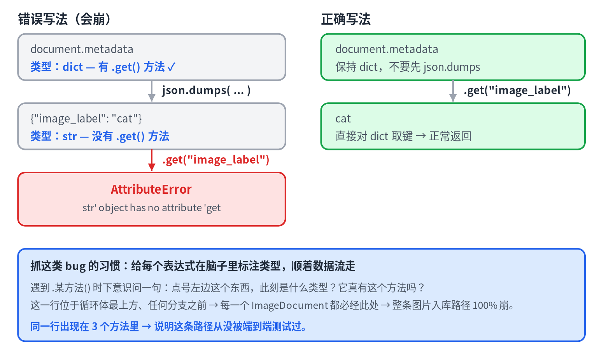
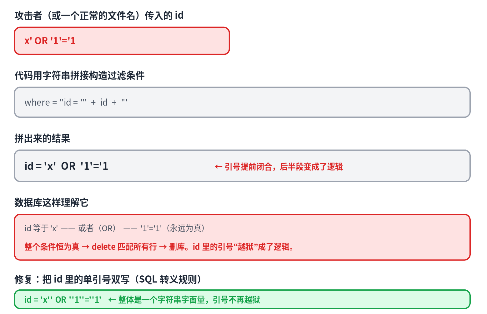
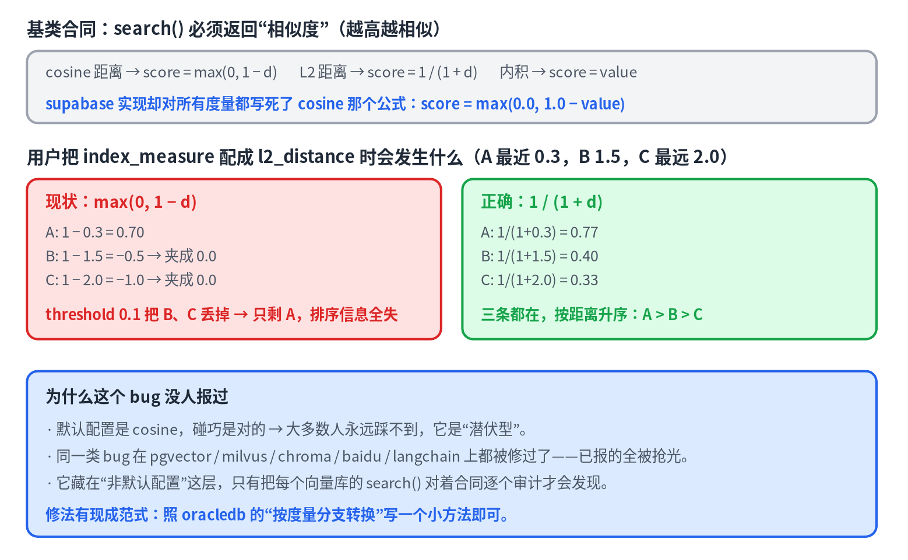

# 09 · In Practice: From Reading Code to Landing PRs in Top Projects

> [中文版](../09-contributing-in-practice.md) · English

> A bonus chapter of the series *LLMs from the Ground Up*. The first eight chapters covered theory; this one covers method: how to find real bugs, file issues, and open PRs yourself in AI projects with tens of thousands of stars, like LlamaIndex and mem0. Two complete case studies, plus a reusable methodology and a "bug pattern library".

## A counterintuitive conclusion first

Many people's first instinct when learning AI is "go grab a good first issue in a top open-source project". I actually tried it, and the conclusion is: **in popular AI repos, you almost never get to claim an existing issue.**

Real numbers: I picked 5 clean-looking issues in LlamaIndex, and every single one already had 1–3 competing PRs attached; one issue went from posted to having a submitted PR in **57 minutes**. Of the 3 candidates I picked in mem0, two had closed PRs sitting behind them, and the third one's reporter explicitly said "I'll fix it myself". On top of that, a large number of issues share identical formatting, complete with detailed reproductions and ready-made PRs, which is the fingerprint of AI-assisted issue farming.

A clearly written, attractive issue is an answer posted on the wall, and AI-assisted contributors all over the world are farming it. **What's scarce isn't people who fix bugs, it's people who find them.**

So the methodology is one sentence: **don't chase bugs other people reported; become the reporter.**

## The methodology: pattern hunting

Being the reporter doesn't rely on luck, it relies on **patterns**. Every class of bug has a searchable code fingerprint. Scan a codebase with those fingerprints, then triage the hits by hand. Three core disciplines:

1. **An anti-pattern is not a bug.** Getting dozens of hits is normal; the real bugs are usually one or two. Your criterion has to be precise enough to require "two conditions holding at once", or you'll file false positives and burn maintainer trust.
2. **No reproduction, no report.** Your name is on the report, so prove first that it actually happens. If it can be simulated with a small dependency-free script, simulate it.
3. **Check for duplicates among closed PRs too.** Looking only at open PRs misses the competition: many issues that look untouched actually have several closed attempts. Check "closed by pull requests" on the issue page.

## Case one: three bugs in a single file (LlamaIndex)

It started with a pattern: `kwargs.pop("x", None) or self.x`. In Python, `or` tests truthiness, and `False`, `0`, `""`, `[]` are all falsy, so an explicitly passed `False` gets silently swallowed and falls back to the default. Scanning LlamaIndex with GitHub code search gave 14 hits.

The yardstick for triage: `X or Y` is a bug if and only if "X's falsy value is a legitimate input in this context". `api_key or environment variable` is benign, because an empty string was never valid anyway; `think=False` is a real bug, because False is a documented legitimate value. Of the 14 hits: 3 real, 2 suspicious, 9 benign.

The jackpot wasn't in the `or` pattern, but in an obscure integration the scan surfaced, `indices-managed-lancedb`, where a single file yielded three bugs:

**Bug A (fatal, appears 3 times)**

`json.dumps(document.metadata).get("image_label")`: `json.dumps` returns a **string**, strings have no `.get`, so this line raises `AttributeError` the moment it runs. It appears in three ingestion methods, meaning the entire image-ingestion path fails 100% of the time. The fix is to drop `json.dumps` and index the dict directly.

**Bug B (fatal, found by "twin function comparison")**

The synchronous `create_index` in the same file says `embedding_modxel`, with an extra x. The async `acreate_index` spells it correctly. When a codebase contains two copies of something that should be identical (sync/async, old/new implementations), they validate each other: whichever copy differs from the rest is probably the wrong one.

**Bug C (security)**

All the delete methods build filter conditions by string concatenation: `"id = '" + ref_doc_id + "'"`. An id containing a single quote breaks the query, and a maliciously crafted one can wipe the store. This belongs to the same family as SQL injection, XSS, and command injection: **data and code travelling down the same channel**. There are only two schools of defense: parameterized binding (best) or escaping according to the target syntax (second best; here, doubling the single quotes).

All three bugs point to the same conclusion: this integration's main path was never tested end to end. **A peripheral new integration = an untested path = a bug goldmine.** That's the trick to picking your hunting ground, far better than competing with the whole world inside core.

Outcome: Issue #22542 (crashes A+B), Issue #22543 (injection C), PR #22544 (8 lines added, 8 removed, all fixed at once), all submitted within one day.

## Case two: auditing 26 vector stores to find an unreported bug (mem0)

After studying AI memory systems I wanted to contribute to mem0, so I looked at the issues first: all farmed out. So I switched approach: **audit the code myself.**

The target bug class came from a known problem: the contract of `VectorStoreBase.search` requires every implementation to return a "similarity" (higher = more similar), so backends using a distance metric must convert first. This class of bug had been fixed in pgvector, milvus, and chroma, but mem0 has 26 vector store implementations, so there were probably some the sweep had missed.

I read the 15 unfixed implementations one by one to see where the score in `search()` came from. Under default configuration they were all correct; the farmers are efficient. But the scan turned up a deeper layer: several stores hard-code the "distance → similarity" conversion **as cosine**, so it breaks the moment a user configures a different metric. Supabase was the most solid case, because its `index_measure` is configurable from mem0's own config and has **four options**, cosine / L2 / L1 / inner product, while `max(0.0, 1.0 - value)` is correct for cosine only.

Configured with L2, every result with distance ≥ 1 is clamped to 0.0 and then dropped by the default threshold of 0.1: the closest matches are silently discarded and all ranking information is lost. Three of the four options are wrong; only the default happens to be right.

The discipline for verification and submission:

- **Dependency-free reproduction**: write a 20-line pure Python script simulating the distances vecs returns, apply the current formula and the threshold gate, and print `current: ['A']` vs `correct: ['A','B','C']`. No real database needed.
- **Duplicate check**: search issues and PRs to confirm nobody had reported or fixed this supabase problem.
- **Honest disclosure**: mem0's bug template has a required "AI Assistance" field, with options including "AI helped me find it, and I reproduced it myself afterwards". That field exists to gauge the report's credibility, and you must not tick it on the user's behalf. The right thing to do is to actually run the reproduction script yourself and then answer truthfully.
- **A precedent for the fix**: following oracledb's existing "branch the conversion by metric" approach, write a small method so the reviewer has nothing to disagree with.

Outcome: Issue #7130, PR #7131 (10 lines added, 1 removed, auto-mergeable).

## A lesson at the tooling level

The GitHub web editor is only suitable for single-line find-and-replace. When inserting a new multi-line method, the new editor's auto-indent stacks up layer by layer and wrecks Python indentation. A workable approach: first press Enter on a blank line so the code below moves down on its own, then for each line "press Enter → select the auto-indent → type the whole line", letting your input overwrite the auto-indent. Or just use git locally. Before submitting, always check the diff line by line on the compare page.

## A reusable bug pattern library

| Pattern | Code fingerprint | Criterion |
|---|---|---|
| `or` swallowing falsy values | `x or default` | Is x's falsy value (False/0/""/[]) a legitimate input? |
| Inconsistent twin functions | sync/async, old/new implementations | Only one differs from the rest; that one is probably wrong |
| Type-flow error | `f(x).method()` | What type is on the left of the dot at that moment, and does it really have this method? |
| String-concatenation injection | `"... '" + var + "'"` into SQL/shell/query | Can the data contain the delimiter and escape into code? |
| Contract violation | Base class documents the return semantics | Does every implementation honor it under all configurations? |
| Blocking I/O inside async | Synchronous `requests/httpx.get` inside `async def` | It stalls the entire event loop |
| Mutable default argument | `def f(x={})` | Both conditions must hold: in the signature *and* actually mutated in the body, otherwise it's just a lint smell |

The last row is worth remembering on its own: the mutable-default scan produced 48 hits and 0 real bugs. Nearly all of them were local variables in the body, or parameters that are never mutated. **False positives are part of hunting; quickly filtering out noise is the actual skill.**

## Key takeaways

- The issue trackers of popular AI repos are a red ocean; becoming the reporter is the only lane that isn't saturated.
- Pattern hunting: scan with code fingerprints, filter with precise criteria, never report without reproducing, and check closed PRs for duplicates.
- Obscure integrations and non-default configurations are bug goldmines; once you find one bug, comb the whole file again.
- Disclose AI assistance honestly, especially the "did you reproduce it yourself" part.

---

*The issues and PRs from the two cases: LlamaIndex #22542, #22543, #22544; mem0 #7130, #7131. All are public records you can check yourself.*
