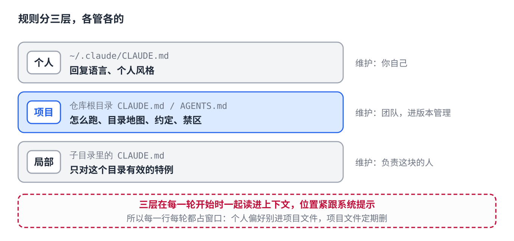
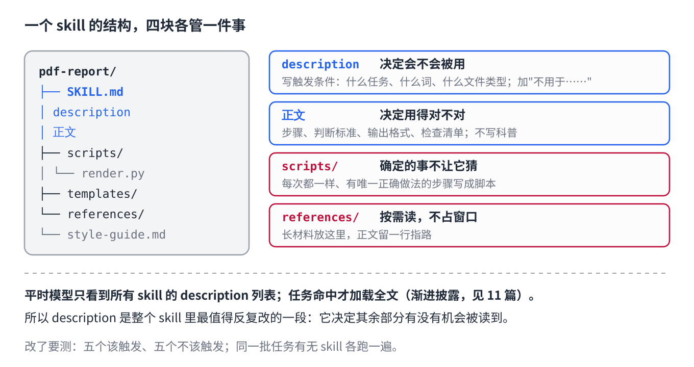

# 12 · Documents Written for Agents: Rules Files and How to Write a Skill

> [中文版](../12-docs-for-agents.md) · English

> Part 12 of the series *LLMs from the Ground Up*. Part 11 put skills, hooks, and MCP back into the frame Agent = Model + Harness; this part covers one thing only: **how to actually write a rules file and a skill**. There is a single principle, the reader of these files is a model, not a person, and everything else follows from it.

## First principle: the reader is a model

Documentation for people assumes a reader with memory, common sense, and the ability to ask follow-ups. A model has none of the three. The mechanisms from earlier parts dictate the writing directly:

| Property of the model | Where | What it demands of the writing |
|---|---|---|
| Reads the whole context from scratch every turn, then forgets | 03, 05 | Every line costs money every turn; write only what every turn needs |
| The window is finite; the more you cram in, the less attention each item gets | 03, 11 | Short; what need not be in the window goes outside, fetched on demand |
| Remembers the beginning and the end, loses the middle | 11 | The most important rules go first or last |
| A prohibition in the prompt gets forgotten or talked around | 11 | Anything that must be guaranteed goes into code (a hook), not into its good behaviour |


Keep this table in mind and nothing below needs memorizing.

## One: the project rules file

### What it is and when it is read

`CLAUDE.md`, `AGENTS.md`, `.cursorrules`, `.github/copilot-instructions.md` are one thing under different tools' names: a note kept in the repository that the harness reads into the context at the start of **every** turn, usually right after the system prompt. It is not written for one task; it is written for **every** task in this repository.

That gives it two properties: every line occupies the window on every turn, and it sits at the very front of the context, one of the places the model remembers best. The first demands brevity, the second demands that only the most important things go in.

### What to write

Only four kinds, all "things the model cannot discover on its own yet needs every time":

1. **How to run it.** The exact commands to install dependencies, run tests, start the service, build. The model's most common mistake is guessing commands; one line saves a round of trial and error.
2. **A map of the tree.** Where the code is, where the tests are, where the config is, where generated files are (do not hand-edit). Five to ten lines.
3. **Conventions.** Only the places that **differ** from common practice: naming, commit message format, which package manager, which library not to use. Whatever matches common practice need not be written.
4. **Off-limits.** Files not to touch, operations not to perform, actions that need a human's confirmation.

### What not to write

- **What the model already knows.** "Use four-space indentation in Python", "write clear variable names": it has seen these billions of times in pre-training; writing them only takes up space.
- **What goes stale as soon as it is written.** Version numbers, the current branch, the feature in progress. A stale rule is worse than no rule: the model will follow the wrong one.
- **Backstory.** The project's history, why that framework was chosen back then. The model does not need to understand, only to comply.
- **One-off requests.** Those belong in this turn's conversation, not in the rules.

### Put them in layers

Rules naturally fall into three layers, in three places, each minding its own business:

| Layer | Location | Contents | Maintained by |
|---|---|---|---|
| Personal | Your home directory (e.g. `~/.claude/CLAUDE.md`) | Your own preferences: reply language, style | You |
| Project | Repository root | Team conventions: how to run, the tree, off-limits | The team, under version control |
| Local | A subdirectory | Only valid for that directory: special build, special format | Whoever owns that area |



Personal preferences leaking into the project file is the most common mistake: everyone on the team then reads "please reply in Chinese". The reverse, team conventions in a personal file, means nobody else knows them.

### Keep it short

A rules file grows on its own: every incident adds a line. Nobody deletes, and six months later it is two hundred lines, the model's attention on each line is diluted, and the few rules that matter stop working.

Two remedies. **Prune regularly**: every time a line is added, ask "is this needed on every turn?". **Progressive disclosure**: move long detail into a separate file and leave one line in the rules, "deployment steps are in `docs/deploy.md`"; the model reads it when it needs it.

### An example that is enough

```markdown
# Project rules

## Running
- Install: `uv sync`; tests: `uv run pytest -q`; serve: `uv run uvicorn app.main:app`
- Run `uv run ruff check .` before committing; do not commit on red

## Layout
- `app/` business code, `app/api/` routes, `app/core/` domain logic
- `tests/` mirrors `app/`; `migrations/` is generated by alembic, do not hand-edit

## Conventions
- Package management is uv only, not pip / poetry
- Commit messages are `type(scope): one line`, in English
- New external calls go through `app/core/clients/`, never directly from a route

## Off-limits
- Do not modify existing files in `migrations/`; do not delete cases in `tests/`
- Changes touching `.env`, secrets, or production config: ask a human first
```

About twenty lines, four sections. Every line is something the model cannot guess and uses every time.

## Two: skills

### Structure

A skill is a folder:

```
pdf-report/
├── SKILL.md          # required: metadata + how to do it
├── scripts/          # optional: deterministic work goes to scripts
│   └── render.py
├── templates/        # optional: templates
│   └── report.md
└── references/       # optional: detail documents, read on demand
    └── style-guide.md
```

`SKILL.md` opens with a block of metadata, at minimum `name` and `description`. The body is the steps.

### The description decides whether it gets used

Part 11 covered progressive disclosure: normally the model sees only the list of every skill's description, and loads the full text only when a task matches. So the description is not a blurb about "what this skill is"; it is the **trigger condition**: which tasks, which keywords, which file types mean this skill should be used.

```yaml
# Bad: reads like a product pitch
description: A powerful PDF report generation tool

# Good: states the trigger
description: Use when the user wants data, tables, or analysis results turned into a PDF report;
  mentions of "report", "PDF", "export", "briefing material" all count. Not for reading or parsing existing PDFs.
```

The "not for..." half matters just as much: it stops the skill from firing wrongly. The description is the one passage in the whole skill most worth revising repeatedly, because it decides whether the rest ever gets read.

### The body decides whether it is used correctly

The body is written for a model that has already decided to use this skill, so it says only **how**:

- **Steps**, in order, one action each.
- **Decision criteria**: which branch under which condition; what counts as done.
- **Output format**: what the deliverable looks like and where it goes.
- **A checklist**: what to verify before handing over.

Not included: background knowledge of the domain (the model has it), why it was designed this way (the model does not need it), pleasantries.

### What can be determined, do not let it guess

Models are good at judgment and poor at precise execution. Any step that is "the same every time, with one correct way to do it", rendering, format conversion, naming, validation, becomes a script in `scripts/`, and the body says "run `scripts/render.py`". This is the same logic as Part 11's hooks: **what code should guarantee is not left to the model's good behaviour.**

Likewise, long reference material goes in `references/`, and the body keeps one line, "colour and font rules are in `references/style-guide.md`". The model reads it when needed and it stays out of the window otherwise.



### An example that is enough

```markdown
---
name: pdf-report
description: Use when the user wants data, tables, or analysis results turned into a PDF report; mentions of "report", "PDF", "export", "briefing material" all count. Not for reading existing PDFs.
---

## Steps
1. Confirm three things: who the report is for, how many pages, whether a template is specified. If any is missing, ask; do not guess.
2. Draft from `templates/report.md`, section order: conclusions → data → method → appendix.
3. Every number comes from the files the user provided; do not fill in or estimate. Write "missing data" where none exists.
4. Run `python scripts/render.py draft.md out.pdf` to produce the PDF. Never hand-write a PDF.

## Done means
- The conclusion is clear from page one within 30 seconds
- Every chart has a title and a data source
- File name: `{topic}-{date}.pdf`

## Check before delivery
- [ ] Numbers match the source files
- [ ] No "to be filled" placeholders
- [ ] Colours follow `references/style-guide.md`
```

## Three: how to know it is good

Rules files and skills are prompts; changing them without testing is gambling (Part 11). Two cheap tests:

**Trigger test** (skills only): prepare five tasks that should trigger it and five that should not, and see whether the description separates them. False triggers are more common than misses, because people always want to write the description a little wider.

**With/without comparison**: run the same set of real tasks once with the rules or skill and once without, and compare. If the difference is not obvious, the file is occupying the window without doing work: delete it.

### Common pitfalls

| Pitfall | Symptom | Fix |
|---|---|---|
| Ever-growing | Two hundred lines of rules, the few that matter stop working | Prune regularly; move detail to separate files read on demand |
| Description written as a blurb | Skill not used when it should be, used when it should not | Rewrite as a trigger condition, add "not for" |
| Skills piled up like a prompt library | Twenty skills overlapping each other | One skill per task; merge the overlaps |
| Writing what the model already knows | Rules full of general programming common sense | Keep only what differs from common practice |
| Personal preferences in the team file | Colleagues told to reply in your language | Layer them |
| Safety by prohibition | "Do not delete files" was written, files got deleted anyway | Make it a hook |
| Stale on arrival | Branch names and version numbers in the rules changed long ago | Do not write things that change |

## Key takeaways

- The reader is a model: it re-reads every turn, forgets, has a finite window, is biased by position, and prohibitions get talked around. Every rule of writing follows from these five.
- A rules file holds four kinds of thing: how to run, a map of the tree, conventions that differ from common practice, off-limits. Layer as personal / project / local. Prune regularly.
- A skill's description is a trigger condition, not a blurb; the body holds only steps, decision criteria, output format, checklist.
- Deterministic work goes to scripts; long material goes to reference files read on demand.
- Test after changing: trigger test plus with/without comparison.

## Question to think about

Why is a skill's description worth revising more often than its body? Under what circumstances would "please do not delete any files" behave differently written in the rules file versus written as a hook? (Hint: Part 11's "what code should guarantee".)

---

*File names, locations, and metadata fields vary across tools and versions; this part uses the currently common forms as examples. What does not change is the table: the reader is a model.*
