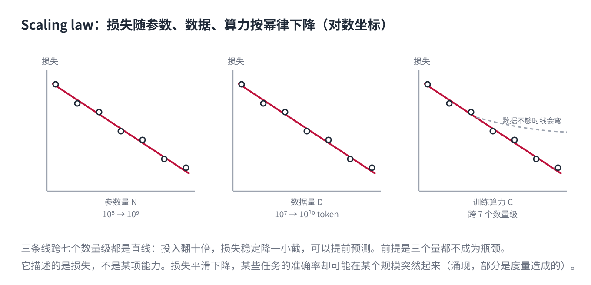
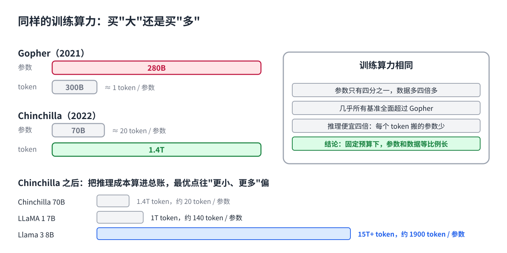
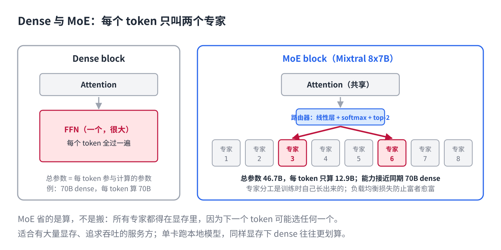

# 13 · Scale and Architecture: Scaling Laws, Data, and MoE

> [中文版](../13-scaling-and-moe.md) · English

> Part 13 of the series *LLMs from the Ground Up*. Earlier parts covered how a model computes, trains, is served, and is used. This part answers the question asked most often and answered most vaguely: **are bigger models smarter?** The answer has three layers: parameters, data, and compute must grow in proportion (scaling laws); how a fixed budget should be split between "bigger" and "more" has shifted (Chinchilla and after); and why today's largest models can be "big but not expensive" (MoE). The textbook is the Mixtral MoE layer in transformers.

## 1. Scaling laws: three quantities, one power law



In 2020 Kaplan et al. at OpenAI did something plain: train models from hundreds of thousands to billions of parameters, on datasets from millions to tens of billions of tokens, and record the final loss for each configuration (the loss from Part 4, "how badly it guesses the next word"). Plotted on log axes, the result is three nearly straight lines:

- loss falls as a power law in **parameter count N**;
- loss falls as a power law in **data size D**;
- loss falls as a power law in **training compute C**.

Straight across seven orders of magnitude. That is a scaling law: **as long as none of the three is the bottleneck, multiplying investment by ten lowers loss by a steady, predictable increment.** No luck involved.

Two direct consequences shaped the following years. First, **a large model can be forecast in advance**: train a small one, measure the slope, predict the loss at a hundred times the compute. The GPT-4 technical report's "predicting final loss from a thousandth of the compute" plot comes from exactly this. Second, **all three must grow together**. Pile on parameters without data and the line bends (overfitting); pile on data with too few parameters and it bends too (underfitting). The bottleneck is always the shortest plank.

One misunderstanding to clear up: scaling laws describe **loss**, not any particular ability. Loss falls smoothly while accuracy on a given task may sit near zero for a long time, then jump at some scale. This is "emergence." In 2023 Schaeffer et al. showed that much of it is an artifact of **the metric**: under all-or-nothing scoring it looks like a jump; under a continuous metric it is a smooth rise. The safer statement: underlying capability grows smoothly, but some tasks have step-shaped thresholds.

## 2. Chinchilla: with the same budget, buy "bigger" or "more"?



One of Kaplan's original conclusions was that as compute grows, most of the increase should go into parameters, with data growing only slightly. The industry followed for two years: models reached 175B and 280B parameters while training data stalled around 300B tokens.

In 2022 Hoffmann et al. at DeepMind redid the experiment with tighter controls (in particular, the learning-rate schedule must be matched to the training length, which Kaplan had not done) and reached the opposite conclusion: **as compute grows, parameters and data should grow in equal proportion.** The rule of thumb is about 20 tokens per parameter. By that rule, every large model of the time was "too many parameters, too little data."

With the same compute budget they trained a 70B-parameter model on 1.4T tokens (Chinchilla) and compared it with their own 280B-parameter Gopher trained on 300B tokens. **A quarter of the parameters, four-plus times the data, and it beat Gopher on almost every benchmark.** It was also four times cheaper to serve, because as Part 5 explained, inference cost is dominated by how many parameters must be moved per token.

This was the first public refutation of "bigger is smarter": not that models should not be big, but that **at a fixed budget, too big is simply waste.**

## 3. After Chinchilla: deliberately "overtraining" for cheap inference

Chinchilla optimizes **training** compute. But a model is trained once and served hundreds of millions of times. Fold inference cost into the total and the optimum shifts toward "smaller model, more data": spend more on training to make every inference cheaper.

So from 2023 the industry moved collectively to "overtraining":

| Model | Parameters | Training tokens | Tokens / parameter |
|---|---|---|---|
| Chinchilla (2022) | 70B | 1.4T | 20 |
| LLaMA 1 (2023) | 7B | 1T | ~140 |
| Llama 3 (2024) | 8B | 15T+ | ~1900 |

By the Chinchilla rule, Llama 3's 8B model "should" have seen 160B tokens; it saw nearly a hundred times that. Loss keeps falling, ever more slowly (log-linear); but per-inference cost, which scales with parameters, did not rise at all. **This is the first reason small models are now good enough: they have eaten tens of times more data than the big models of a few years ago.**

Data became the new bottleneck. Three responses:

- **Deduplication and filtering.** The same web corpus, deduplicated and quality-filtered, trains a clearly better model at the same token count. The main contribution of open datasets like FineWeb is the filtering pipeline, not more crawling.
- **Reuse.** Muennighoff et al. (2023) measured that high-quality data can be repeated for about 4 epochs with returns close to fresh data; beyond that, returns decay fast.
- **Synthetic data.** Generate with a strong model, filter, train the small one. This is the other face of distillation, next section.

## 4. Distillation: the second source of small models

Besides more data, the other route to a strong small model is **learning from a big one**.

Pretraining in Part 4 uses real text as the teacher: "what is the next word." Distillation uses a large model as the teacher: have it produce outputs (or full probability distributions) for a batch of inputs, and fit the small model to them. The large model's outputs are cleaner, more consistent, and less noisy than raw web pages, so at equal parameter count a distilled small model usually beats one trained only on raw data. The reasoning-model wave made this especially visible: the small DeepSeek-R1 variants were made by fine-tuning Qwen and Llama on reasoning traces generated by R1.

Put the two sections together: **an 8B model today has eaten a hundred times the Chinchilla-rule data, part of it the output of stronger models. That it beats an 80B model from three years ago is no surprise.**

## 5. MoE: big but not expensive



Everything so far has been about "small." But the top models are still growing; they just grow differently.

Recall the Transformer block from Part 2: after attention comes a feed-forward network (FFN), two linear layers, roughly two thirds of each layer's parameters. In a **dense** model, every token passes through the whole FFN.

**MoE (Mixture of Experts)** replaces that one FFN with E parallel FFNs (experts) plus a tiny **router**. For each incoming token the router scores the experts and sends the token only to the top k; the other experts do no work for that token.

Take Mixtral 8x7B: 8 experts, 2 used per token. **Total parameters 46.7B; parameters actually computing for any given token, 12.9B.** Training and inference compute are billed at 12.9B, while capability approaches a contemporaneous 70B dense model. DeepSeek-V3 stretches the ratio further: 671B total, 37B active per token.

### The implementation in transformers

`MixtralSparseMoeBlock` in `modeling_mixtral.py` is just these steps (tensor reshaping omitted):

```python
router_logits = self.gate(hidden_states)                       # (tokens, n_experts), one linear layer
routing_weights = F.softmax(router_logits, dim=1, dtype=torch.float)
routing_weights, selected_experts = torch.topk(routing_weights, self.top_k, dim=-1)
routing_weights /= routing_weights.sum(dim=-1, keepdim=True)   # renormalize over the chosen k

expert_mask = F.one_hot(selected_experts, num_classes=self.num_experts).permute(2, 1, 0)
for expert_idx in range(self.num_experts):
    idx, top_x = torch.where(expert_mask[expert_idx])         # which tokens chose this expert
    current_state = hidden_states[None, top_x].reshape(-1, hidden_dim)
    current_hidden_states = self.experts[expert_idx](current_state) * routing_weights[top_x, idx, None]
    final_hidden_states.index_add_(0, top_x, current_hidden_states)
```

Three things to watch:

1. **The router is a linear layer, a softmax, and a top-k.** There is no prior about what each expert is good at; the division of labor emerges in training. Post-hoc analyses find experts specializing by token type (punctuation, digits, code keywords) rather than by the human-imagined "math expert" or "law expert."
2. **Each expert processes only the tokens that chose it.** `torch.where` picks the indices; the expert runs forward on that small subset. That is where the compute saving comes from.
3. **Chosen weights are renormalized and summed.** A token's output is the weighted sum of k expert outputs, with router scores as weights.

### Load balancing: no expert may be worked to death

Left alone, the router quickly learns to send everything to the one or two experts that happened to do slightly better early on (rich get richer); the rest receive no gradient and never learn. So nearly all MoE training carries an **auxiliary loss**:

```python
# core of load_balancing_loss_func
tokens_per_expert = expert_mask.float().mean(dim=0)     # fraction of tokens each expert actually received
router_prob_per_expert = routing_weights.mean(dim=0)    # mean router probability per expert
loss = torch.sum(tokens_per_expert * router_prob_per_expert) * num_experts
```

The product is minimized when both vectors are uniform. It writes "assignment must be balanced" directly into the loss. DeepSeek-V3 takes a different route: no loss term, but a tunable bias per expert, raised for whichever expert is under-receiving, to keep the auxiliary objective from interfering with the main one. The method changes; the problem does not.

### MoE saves compute, not memory

Part 5's conclusion applies again. MoE computes only k experts per token, but **all experts' parameters must sit in GPU memory**, because the next token might choose any of them. Serving Mixtral 8x7B means loading 46.7B parameters, the same memory as a 47B dense model, while computing like a 13B one.

So the MoE ledger reads: **training and inference compute fall sharply, memory does not, and communication rises** (with experts spread across GPUs, tokens shuttle between cards: expert parallelism). It suits providers with plenty of memory chasing throughput; for someone running a local model on one GPU, a dense model of the same memory footprint is often the better deal.

## 6. Scale at inference time: the fourth quantity

The scaling in the first three sections happens at training time. The reasoning models of Part 4 introduced a fourth place to spend compute: **thinking longer at answer time**. For the same model, generating a longer chain of thought, or sampling several times and taking a majority, raises accuracy on math and code tasks along a similar power law in inference compute.

This changes what "big" means. A small model thinking ten times longer can, on some tasks, catch a large model answering in one shot. Training compute and inference compute are exchangeable.

## 7. Back to the question

Are bigger models smarter? Taken apart:

- **Same generation, same recipe: bigger is stronger.** Scaling laws have not failed.
- **Same budget: too big is waste.** Chinchilla: parameters and data in proportion.
- **Counting inference cost: small and overtrained wins.** Llama 3 8B ate a hundred times the data.
- **Distillation lets small models inherit part of large ones.**
- **MoE decouples "total parameters" from "how much is computed per token."** Read a MoE model by its active parameters.
- **Inference-time compute is a new lever.**

So when judging a model, do not read one number. Read at least four: total parameters, active parameters, training tokens, and how much of the training data was distilled.

## Key points

- Scaling laws: loss falls as a power law in parameters, data, and compute, and the three must grow together; they describe loss, not a specific ability.
- Chinchilla: at a fixed training budget, parameters and data should grow in equal proportion (about 20 tokens per parameter); earlier large models were data-starved.
- Once inference cost is counted, the industry moved to overtraining small models (Llama 3 8B at about 1900 tokens per parameter); deduplication, filtering, and synthesis of data became the new battleground.
- MoE routes each token through k experts: saves training and inference compute, not memory; needs load balancing.
- Inference-time compute is the fourth scalable quantity; training and inference compute trade against each other.

## Exercise

Mixtral 8x7B has 46.7B total parameters, not 8 × 7 = 56B. What accounts for the difference? (Hint: which part of the Transformer block does MoE replace?) Why does the load-balancing loss use the product "actual assignment fraction × router probability" rather than directly penalizing the variance of the assignment fraction? (Hint: which term is differentiable?)

---

*Related code: `src/transformers/models/mixtral/modeling_mixtral.py` (`MixtralSparseMoeBlock`, `load_balancing_loss_func`). Parameter and token counts are from the respective technical reports; exact numbers change with versions, the ratios are the point.*
