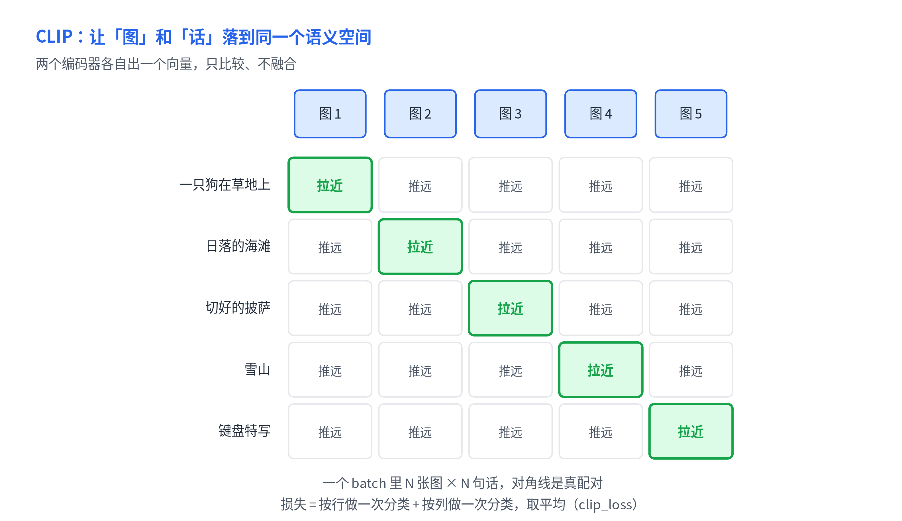
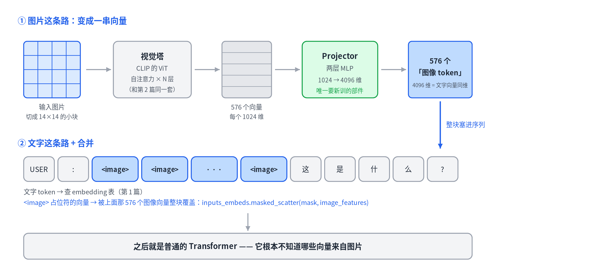
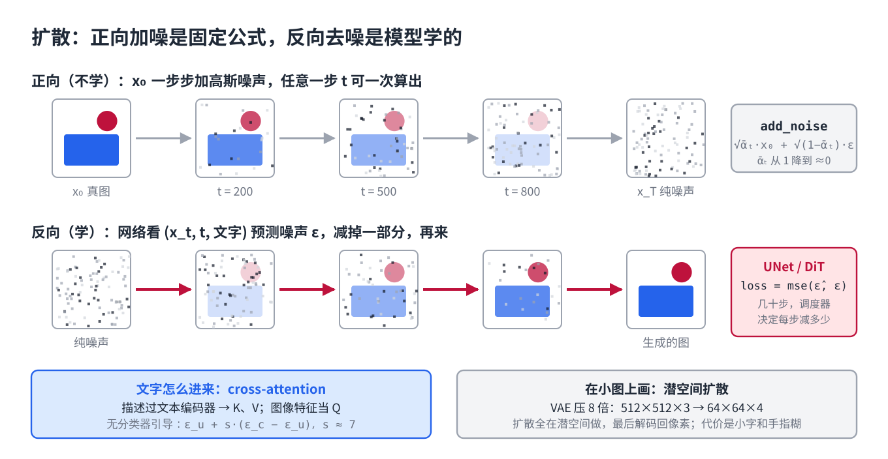

# 14 · Multimodal and Diffusion: How Images Enter an LLM, and How a Model Paints One

> [中文版](../14-multimodal-and-diffusion.md) · English

> Part 14 of the series *LLMs from the Ground Up*. The first 13 parts handled text only. This part brings images in, along two directions: **seeing** (how an image becomes tokens an LLM can read) and **painting** (how a diffusion model grows an image out of noise). The two use different mechanisms, but both rest on parts covered earlier: ViT is the Transformer of Part 2, CLIP's contrastive learning is Part 1's "similar meaning = nearby vectors," and a diffusion model's conditioning is Part 2's cross-attention. The textbooks are the CLIP and LLaVA sources in transformers and the scheduler source in diffusers.

## 1. Turning an image into a sequence of vectors: ViT

Part 1 explained that text enters a model by tokenization and a table lookup, one vector per token. Images have no "words." The Vision Transformer (ViT) takes an almost brutally direct approach: **cut the image into small squares and treat each square as a token.**

A 336×336 image cut into 14×14-pixel patches gives 24×24 = 576 squares. Each square is 14×14×3 = 588 numbers, passed through a linear layer into one vector, plus a position encoding (Part 2), lined up as a sequence of 576 tokens. After that it is a standard Transformer: self-attention times N layers. The "context" inside an image is the patches looking at each other.

From this point on, images and text are **not fundamentally different** inside the model: both are sequences of vectors with positions. Every multimodal trick builds on that fact.

## 2. CLIP: putting images and words in one space



A ViT trained on its own can classify images, but its vector space and a text model's space are unrelated: nobody ever cared how far the vector for the word "dog" is from the vector of a photo of a dog.

CLIP (2021) fixed exactly that, via **contrastive learning**:

- Two encoders, an image tower (ViT) and a text tower (Transformer), each compress their input into one vector, projected to the same dimension.
- A batch holds N images paired with N captions; compute the N×N similarity matrix. The diagonal holds the true pairs.
- Objective: push the diagonal up, everything else down.

In transformers' `modeling_clip.py`, that objective is a few lines:

```python
logits_per_text = torch.matmul(text_embeds, image_embeds.t()) * logit_scale.exp()   # N×N

def contrastive_loss(logits):
    return nn.functional.cross_entropy(logits, torch.arange(len(logits), device=logits.device))

def clip_loss(similarity):
    caption_loss = contrastive_loss(similarity)        # each caption picks its own image among N
    image_loss = contrastive_loss(similarity.t())      # each image picks its own caption among N
    return (caption_loss + image_loss) / 2.0
```

`torch.arange(N)` is the label: row i's correct answer is column i. **One N-way classification per row, one per column, averaged.** No hand-labeled classes; four hundred million image-text pairs scraped from the web are the entire supervision.

Once trained, two things become possible:

- **Zero-shot classification.** To decide whether an image is a cat, no classifier is trained: encode "a photo of a cat" and compare cosine similarity with the image vector. Any category works, because the text tower can read.
- **Cross-modal search.** Part 6's vector retrieval applies directly: search images with text, or images with images.

Note that CLIP's two encoders **never fuse**: image and text go their separate ways and only one number is compared at the end. That is enough for retrieval but not for "answer a question about this image," which needs image and question inside the same attention. That is the next section.

## 3. Images into an LLM: LLaVA's three parts



The cheapest way to let a text-only LLM see is not to retrain it but to **turn the image into something it already understands: a sequence of vectors with the same dimension as text embeddings, inserted straight into the sequence.** LLaVA is the cleanest implementation, with three parts:

1. **Vision tower**: an off-the-shelf CLIP ViT-L/14 (336-pixel version), frozen. Outputs 576 vectors of 1024 dimensions.
2. **Projector**: a two-layer MLP mapping 1024 dimensions to the LLM's hidden size (4096 for Vicuna-7B). **This is the only part trained from scratch.**
3. **LLM**: an existing language model. In the sequence it receives, the `<image>` placeholder positions are replaced by those 576 vectors.

transformers' `modeling_llava.py` is those three steps:

```python
# 1. vision tower: take the second-to-last layer, drop CLS
image_outputs = self.vision_tower(pixel_values, output_hidden_states=True)
selected_image_feature = image_outputs.hidden_states[vision_feature_layer]   # default -2
selected_image_feature = selected_image_feature[:, 1:]                        # drop the CLS token

# 2. projector: 1024 → 4096
image_features = self.multi_modal_projector(selected_image_feature)

# 3. substitute: wherever input_ids equals <image>, put the image vectors
inputs_embeds = self.get_input_embeddings()(input_ids)
special_image_mask = (input_ids == self.config.image_token_index).unsqueeze(-1).expand_as(inputs_embeds)
inputs_embeds = inputs_embeds.masked_scatter(special_image_mask, image_features)
```

Watch the `masked_scatter` in step 3: **after the substitution, the LLM's forward pass is identical to pure text.** It does not know which vectors came from an image. An image is 576 "words," and the question's text tokens look at them in the same attention, which is why it can answer "what is the person on the left holding."

Two details explain why this works:

- **The second-to-last layer, not the last.** CLIP's final layer is optimized for "align with text and compare one number," discarding local detail; the penultimate layer keeps more spatial information. This is an empirical finding, not a derivation.
- **Two-stage training.** First freeze both the vision tower and the LLM and train only the projector on a few hundred thousand image-caption pairs, so it learns to "translate"; then unfreeze the LLM and fine-tune on image-grounded instruction data (Part 4's SFT). Stage one is cheap because only a few million parameters move.

### What came after

LLaVA's fixed 576 tokens have two problems: small images waste them, large or tall images lose detail. Later models (LLaVA-NeXT's AnyRes, Qwen-VL's dynamic resolution) cut a large image into several 336-pixel sub-images, encode each, and concatenate; the token count follows resolution. The cost is that one high-resolution image can occupy thousands of tokens, which Part 5's window budget must absorb.

Video is a sequence of frames, each walking the same path, token count multiplied by frame count, so video models all subsample or compress along time. Audio likewise, with an audio encoder. **Architecturally, "multimodal" means something plain: swap the encoder, attach a projector, insert into the same sequence.**

## 4. Diffusion: growing an image out of noise



Seeing turns pixels into vectors. Painting goes the other way, from "no image" to "image." The LLM's token-by-token generation fits pixels poorly: a 512×512 image has 780,000 pixels, emitting them one at a time is too slow, and pixel dependencies are not left-to-right.

Diffusion models take a different route, in two directions:

**Forward (noising, fixed formula, not learned).** Take a real image x₀ and add Gaussian noise step by step; after T steps it is pure noise. The result at any step t can be computed in one shot, no need to walk t steps. diffusers' `DDPMScheduler.add_noise` is that formula:

```python
sqrt_alpha_prod = alphas_cumprod[timesteps] ** 0.5
sqrt_one_minus_alpha_prod = (1 - alphas_cumprod[timesteps]) ** 0.5
noisy_samples = sqrt_alpha_prod * original_samples + sqrt_one_minus_alpha_prod * noise
```

`alphas_cumprod[t]` decreases monotonically from 1 toward 0: small t is mostly the original, large t is mostly noise.

**Reverse (denoising, learned).** Train a network that takes "the image after t steps of noise" and t, and **predicts the noise that was added**. The training loop is three lines:

```python
noise = torch.randn_like(latents)
timesteps = torch.randint(0, num_train_timesteps, (batch,))
noisy_latents = noise_scheduler.add_noise(latents, noise, timesteps)

noise_pred = unet(noisy_latents, timesteps, encoder_hidden_states=text_embeds).sample
loss = F.mse_loss(noise_pred, noise)
```

Predicting the noise is equivalent to predicting "which direction this image should move to look more real." At generation time, start from pure noise, let the network predict the noise, subtract part of it, predict again, subtract again, for a few dozen steps, and an image gradually emerges. How much to subtract at each step is the scheduler's decision, which is the difference between the names DDPM, DDIM, DPM-Solver: same network, different walks, step count reduced from a thousand to twenty.

### How text steers the picture

The network above generates without text too, just "a random image from the training set." To paint from a description, inject the text:

- The description first passes through a text encoder, originally **CLIP's text tower** (the one trained in section 2), yielding a sequence of vectors.
- Each layer of the denoising network gains **cross-attention** (Part 2): image features as Q, text vectors as K and V. Each region of the image "looks at" each word of the description to decide what to paint there.

One more trick nearly every text-to-image model uses, **classifier-free guidance**: during training, randomly blank out the description so the network learns both "with description" and "without" predictions; at generation, compute both and amplify the difference:

```python
noise_pred = noise_uncond + guidance_scale * (noise_cond - noise_uncond)
```

`guidance_scale` is typically around 7. It amplifies "the part of the change caused by the description" sevenfold, so images follow the prompt more closely and look sharper, but also oversaturate more easily. The "prompt adherence" slider in image tools is this number.

### Paint small, upscale last: latent diffusion

Running a UNet for dozens of steps on 512×512×3 pixels is too expensive. Stable Diffusion's key change was to first train a **VAE** that compresses the image 8×: 512×512×3 becomes a 64×64×4 "latent." All diffusion happens in that small space, and the final step uses the VAE decoder to expand back to pixels. Compute drops by tens of times, which is why it runs on consumer GPUs.

The cost is that the VAE is lossy: small text, fine textures, and fingers, all high-frequency detail, blur easily. Early text-to-image models' trouble with hands partly comes from here.

### What came after

The denoising network moved from UNet to Transformer (DiT), letting Part 13's scaling laws hold for images too; "predict the noise" became "predict the straight-line velocity from noise to image" (flow matching, used by SD3 and Flux), which trains more stably with fewer steps. **The skeleton did not change: a fixed noising formula, a learned denoising network, text entering through cross-attention.**

## 5. Why seeing and painting are two systems

Understanding uses "encoder + LLM," generation uses diffusion, because the outputs differ. Understanding outputs text, cheapest to hand to an LLM that already writes well; generation outputs pixels, where autoregression pixel by pixel is too slow and pixels have no natural order, so parallel denoising fits better.

The last two years brought attempts to merge them: turning images into discrete tokens the LLM generates directly (visual tokenizers), or running an autoregressive head and a diffusion head inside one Transformer. Which path wins is undecided; this part covers only the two that are settled.

## Key points

- ViT cuts an image into patches as tokens, then runs the same Transformer as text; inside the model, images and text are both positioned vector sequences.
- CLIP aligns images and words into one space with contrastive learning; the loss is "one N-way classification per row and per column"; the two encoders never fuse, which suits retrieval and zero-shot classification.
- LLaVA uses a frozen CLIP vision tower plus a newly trained projector to turn an image into 576 text-dimension vectors inserted into the sequence; the LLM does not know which tokens came from the image.
- Diffusion: noising is a fixed formula, the denoising network learns to predict noise; text enters via cross-attention, classifier-free guidance amplifies the prompt's effect; latent diffusion trades an 8× VAE compression for speed.
- Understanding goes encoder plus LLM, generation goes diffusion, because one outputs text and the other pixels.

## Exercise

Why can LLaVA make an LLM "see" by training only the projector, without touching any LLM parameter? (Hint: what is Part 1's embedding table, from the LLM's point of view?) What are `guidance_scale = 1` and `guidance_scale = 0` each equivalent to?

---

*Related code: `src/transformers/models/clip/modeling_clip.py` (`clip_loss`), `src/transformers/models/llava/modeling_llava.py` (`get_image_features`, the `masked_scatter` substitution), `diffusers/schedulers/scheduling_ddpm.py` (`add_noise`), `examples/text_to_image/train_text_to_image.py` (training loop).*
