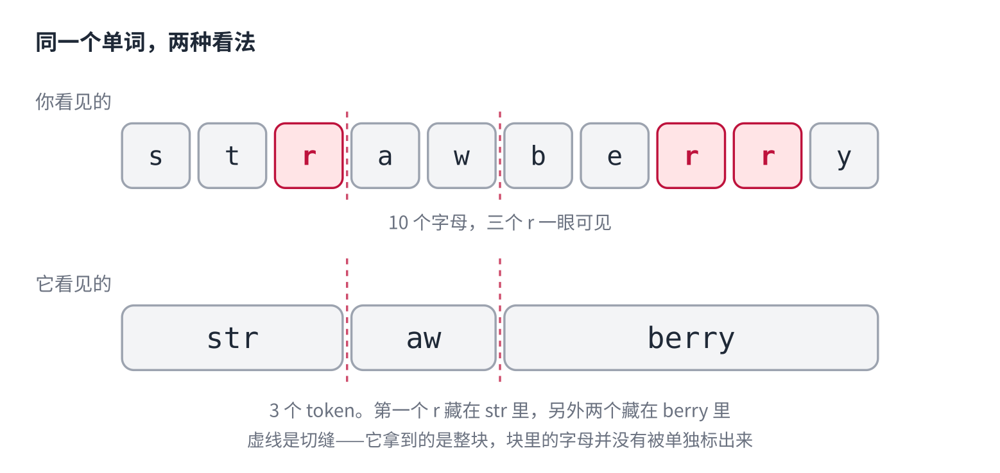
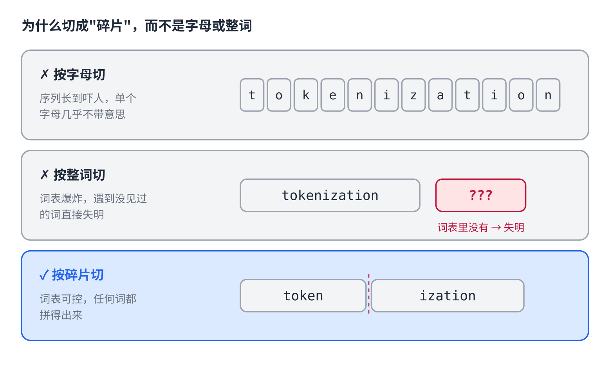
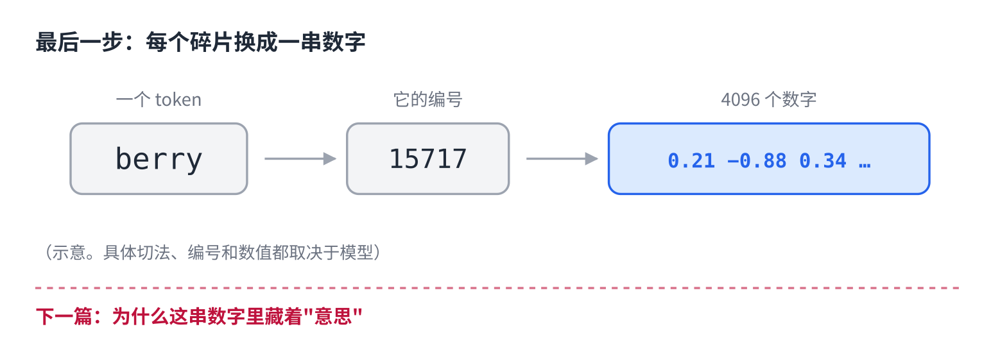

# 它能写代码，却数不清三个 r

> 公众号版 · 大模型系列第一课（上）。对应仓库里的 [01 · Token 与 Embedding](../01-tokens-and-embeddings.md)，这一篇只讲前半段：文字怎么被切碎。面向零基础读者，约 1300 字。

你可以现在就去试一件事。

打开任何一个大模型，问它：单词 **strawberry** 里有几个字母 r？

正确答案是 3。这道题曾经是所有大模型的集体翻车现场——它们几乎清一色地回答 2。

现在你去试，不少模型已经能答对了。但如果你让它把思考过程写出来，你会看到一件很奇怪的事：**它得先把这个单词一个字母一个字母地拆开，摆成 s-t-r-a-w-b-e-r-r-y，然后才能开始数。**

你数的时候需要拆吗？不需要。你一眼看过去，字母就在那儿。

它得费劲绕这么一圈，是因为在它眼里，**根本就没有"字母"这个东西**。

这一篇就讲清楚这件事：你打进去的那行字，进到模型里之后，到底变成了什么。

## 它眼里的字，是一块一块的

先看结论。

你看见的是十个字母。而模型接收到的，是**三个块**：`str`、`aw`、`berry`。

（具体切成几块、从哪切，各家模型不完全一样。但"切成块"这件事是共同的。）

注意这三个块的边界：它们既不是字母，也不是完整的单词，而是卡在中间的**碎片**。三个 r 分散在两块不同的碎片内部——第一个在 `str` 里，另外两个在 `berry` 里。

而模型拿到的是"`berry` 这一整块"。就像你拿到一块印着 berry 的积木，积木上并没有把字母一个个标出来。

要数出 r，它必须先反过来回忆"berry 这块积木是由哪些字母拼的"。这是一道额外的推理题，而不是一次观察。

所以它不是笨。是**它看到的东西和你看到的不一样**。

## 为什么要切得这么怪

一个很自然的疑问：干嘛要切成这种四不像的碎片？要么按字母切，要么按单词切，不都更整齐吗？

这两条路都试过，都不行。

**按字母切。** 词表小得可爱，26 个字母就搞定了。但一句话会被拆成好几十个碎片，序列长得吓人；而且单个字母几乎不携带意思——`c` 本身什么也不是，模型得花很大力气才能把字母重新拼回意义。

**按整词切。** 意思是保住了，但词表会爆炸：英文常用词就几十万，再加上人名、地名、专业术语、每天新造的词，根本列不完。更致命的是，**只要遇到一个词表里没有的词，模型就彻底失明**——它连表示这个词的办法都没有。

**按碎片切**，也就是现在的做法：常见词整块保留，`the` 就是 `the`，不再拆；生僻词拆成几个常见碎片，`tokenization` 拆成 `token` + `ization`。

这样一来，词表被控制在几万到二十万这个量级，同时**任何词都能被表示出来**——再生僻的词，总能用更小的碎片拼出来。这是在"词表大小"和"表达能力"之间找到的平衡点。

这些碎片有个专业名字，叫 **token**。你在新闻里看到的"上下文长度 100 万 token"、"API 按 token 计费"，说的就是这个东西。

## 顺手解释了两件事

想通了"模型是按块读字的"，有几个日常现象就一下说得通了：

**为什么 API 按 token 计费，而不是按字数。** 因为 token 才是模型真正处理的单位。同一个意思的一句话，中文和英文切出来的块数并不一样，所以字数相同，费用可能差不少。

**为什么它偶尔会在生僻词、长数字上犯莫名其妙的错。** 越生僻的东西被切得越碎，模型看到的是一堆陌生碎片的组合，而不是一个熟悉的整体。

## 自己试一下（30 秒）

这一步很值得做，因为它能把"碎片"从一个说法，变成你亲眼见过的东西。

网上有现成的 tokenizer 工具（搜"tokenizer 在线"，OpenAI 官方那个最直观）。把下面这些贴进去，看看各自被切成几块：

- 你的名字，中文和拼音各试一次
- `strawberry`
- 一个长数字，比如 `20260903`
- 一句你平时会问 AI 的话

你会发现切法完全不像你的直觉。

## 还差最关键的一步

到这儿我们知道，文字被切成了 token。

但 token 还是文字，而模型是个只会做数学题的东西——它算不了 `berry`。

所以还要再走一步：**每个 token 会被换成一串数字。**

这一步是整个大模型里最反直觉、也最漂亮的地方。因为换出来的那串数字不是随便编的号，它们之间藏着意思——

`cat` 和 `kitten` 拼写差得很远，换出来的数字却挨得很近。甚至可以拿它们做加减法：**国王 - 男人 + 女人 ≈ 女王。**

这不是任何人设计的规则。是模型自己学出来的。

下一篇讲这个。
