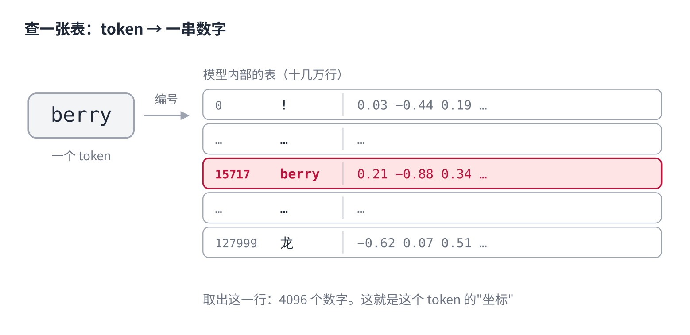
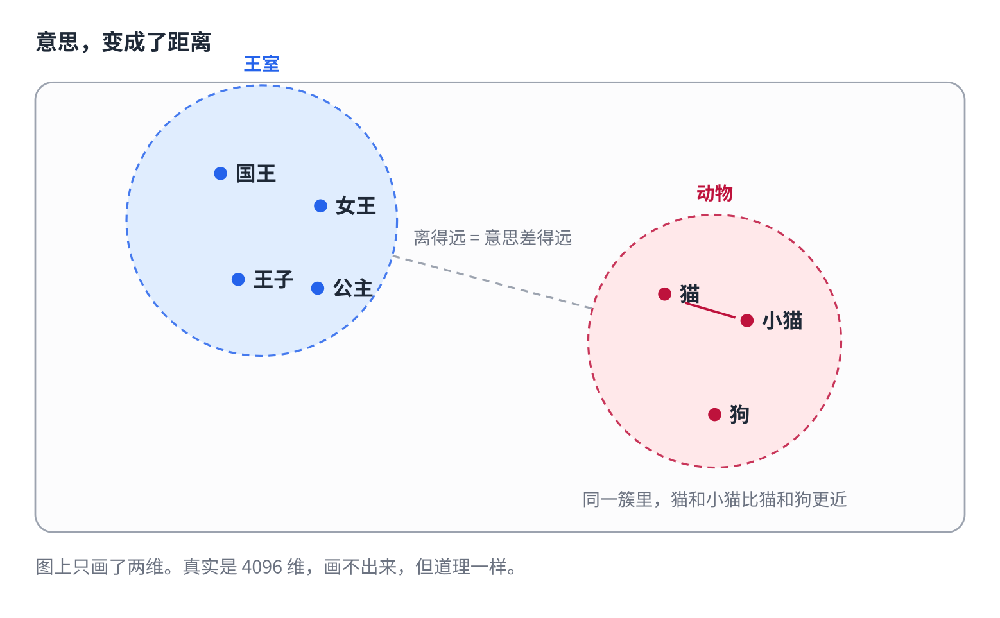
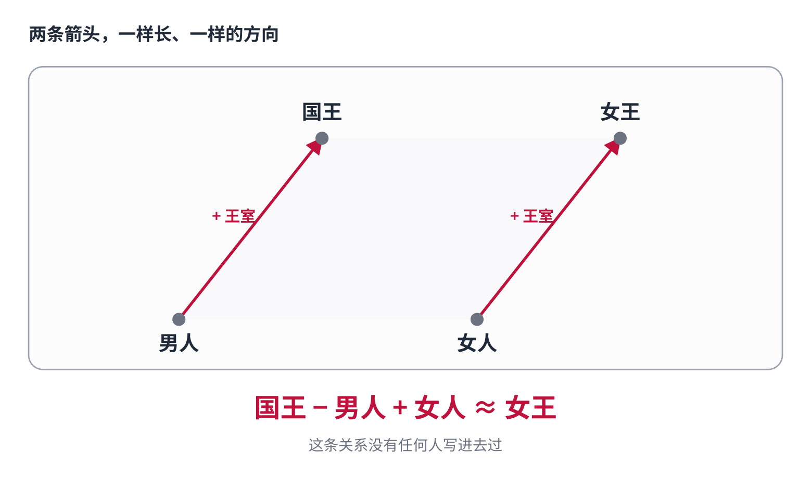

# 第2课｜国王 − 男人 + 女人 = ？

> 公众号版 **第 2 课**。对应仓库 [01 · Token 与 Embedding](../01-tokens-and-embeddings.md) 的后半段：token 怎么变成向量，以及为什么向量里藏着"意思"。面向零基础读者，约 1300 字。

你可以先猜一下答案。

**国王 − 男人 + 女人 = ？**

答案是**女王**。

这不是文字游戏，也不是有人把这条规则写进了程序。是模型自己算出来的——真的在做加减法，而加减的对象是"词"。

上一课我们讲到，你打进去的字会被切成一块块的 token。但 token 还是文字，而模型只会算数——它算不了 `berry`。

这一课就讲那关键的一步：**文字怎么变成数字，以及为什么这些数字里会藏着意思。**

## 第一步：查一张表

模型内部有一张巨大的表。

表有多少行？和词表一样多——十几万行。每一行是一个 token，后面跟着一长串数字。以 Llama 3 为例，每个 token 后面跟 **4096 个数字**。

这一步简单到有点无聊：token 先变成一个编号，编号就是行号，按行号去表里取出那一行，拿到 4096 个数字。

**查表，仅此而已。**

真正有意思的是下一个问题：这张表里的数字，是谁填进去的？

## 关键：这张表没有人写过

模型刚造出来的时候，表里全是随机数。每个词后面跟着一串毫无意义的乱码。

然后开始训练。训练做的事只有一件：**看大量文本，反复预测下一个词，猜错了就把数字往回调一点点。**

调了亿万次之后，一件谁也没规定过的事发生了——

**意思相近的词，数字也变得相近。**

没有人告诉过模型"猫和小猫是近义词"。是它为了把"下一个词"猜得更准，自己发现把这两个词的数字放近一点更划算，因为它们出现的语境实在太像了。

这是训练的副产品，不是设计出来的功能。

## 于是"意思"变成了"位置"

把那 4096 个数字想象成坐标——一个词在一张巨大地图上的位置。

（图上只画了两维。真实是 4096 维，画不出来，但道理一样。）

地图上，"国王、女王、王子"挤在一块儿，"猫、小猫、狗"挤在另一块儿，两块相隔很远。而在同一块里，"猫"和"小猫"又比"猫"和"狗"更近。

**意思，变成了距离。**

这里有个反直觉的地方：`cat` 和 `kitten` 拼写差得很远，位置却很近。因为一个词的位置来自**它出现在什么语境里**，而不是它由哪些字母组成。模型间接看得见拼写（通过上一课那些碎片），但"意思"完全来自这张学出来的表。

## 所以词能做加减法

既然词是坐标，坐标就能加减。

看图里那两条箭头：一条从"男人"指向"国王"，一条从"女人"指向"女王"。**它们几乎一样长、一样的方向。**

因为这两条箭头代表的是同一件事：加上"王室身份"。

于是：国王 减去 男人（把王室里那份男性成分抵消掉），再加上 女人，落点就正好在女王附近。

这条关系没有任何人写进去过。它是模型在"猜下一个词"的过程中，自己长出来的几何结构。

## 说句实在的

这个例子来自 2013 年一个叫 word2vec 的研究，是"意思变成位置"这件事最有名的一次证明。

你没法直接在对话框里验证它——那需要拿到模型内部的表自己算。而且现在大模型的 token 向量，不一定还能这么干净地做加减法。

但**"意思相近 = 位置相近"这条一直成立**，而且你每天都在用它：搜索时的"语义搜索"、AI 助手在你的文档里找相关段落，靠的都是算两个坐标之间的距离。

## 但还有个问题

到这儿看着挺完美：文字切成 token，token 查表变成坐标，坐标里藏着意思。

可是 `the cat sat on the mat` 里有两个 `the`。

它们查的是同一行，拿到的是**完全相同**的数字。

这就带来两个麻烦：

**位置丢了。**"狗咬人"和"人咬狗"用的字一模一样，顺序不同意思天差地别。但查表只认词，不认它排在第几个。

**语境丢了。**"河岸"的 bank 和"银行"的 bank，是同一个词、同一行数字。

所以查表给出的，只是"词典义"——一个脱离上下文的原始坐标。

把它变成"语境义"的，是下一课的主角。

下一课讲这个。

## 关于这个系列

《从零看懂大模型》是一个系列：从文字怎么变成数字，一路讲到模型怎么生成、权重怎么训练出来、大模型怎么被高效服务，再到 RAG、Agent 和记忆系统。每一课都拿顶尖开源项目的真实源码当课本。

这是第 2 课。完整目录见「阅读原文」。
