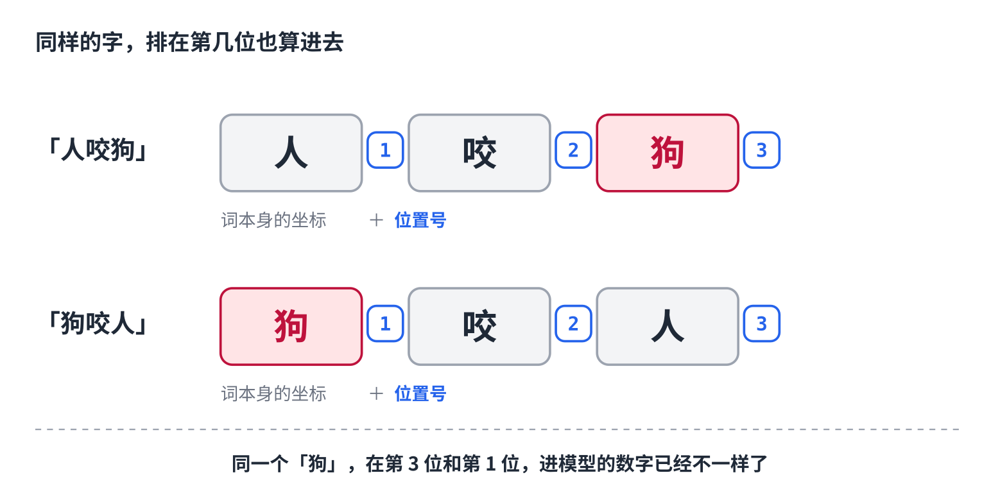
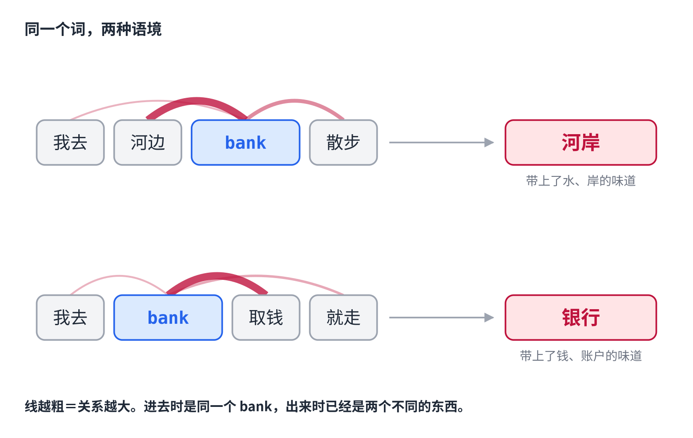
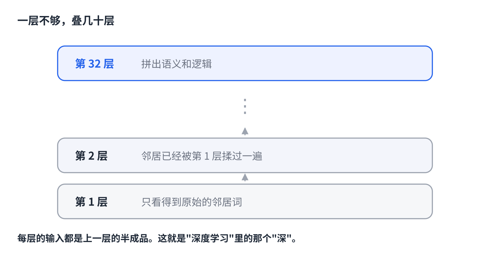

# 人咬狗和狗咬人，AI 怎么分得清

> 公众号版 **第 3 课**（标题不带编号，系列身份由封面眉标和合集承担）。对应仓库 [02 · Attention 与 Transformer](../02-attention-and-transformer.md) 的前半段：位置编码与 attention。面向零基础读者，约 1400 字。

「人咬狗」和「狗咬人」。

同样三个字，顺序一换，意思完全反了。

你一眼就分得出来。但对 AI 来说，这事没那么理所当然——**上一课我们讲到，它把每个词查表变成一串数字，而查表只认这个词是什么，根本不管它排在第几个。**

同一个「狗」字，无论在句首还是句尾，查出来的数字一模一样。

还有个更麻烦的。「我去河边的 bank 散步」和「我去 bank 取钱」，这两个 bank 查的是同一行，拿到的数字也完全相同。可一个是河岸，一个是银行。

**位置丢了，语境也丢了。** 这一课讲模型怎么把这两样补回来。

## 第一步：给每个词带上位置

这一步的思路很直白：既然查表只给了"这个词是什么"，那就再给它加上"它排在第几个"。

具体做法是把词的坐标按位置**转一个角度**——第 1 个字转一点，第 3 个字转得多一些。转过之后，「狗」在第 1 位和在第 3 位，就是两串不同的数字了。

（各家模型的做法不完全一样，但目的是一致的：让位置变成数字的一部分。）

于是「人咬狗」和「狗咬人」，还没开始理解，光是输入就已经不同了。

**位置问题，解决。**

## 第二步：让每个词环顾四周

语境这件事要麻烦得多，而模型的解法也漂亮得多。

每个词都做同一件事：**把整句话扫一遍，判断"谁跟我有关系"，然后按相关程度，把那些词的信息揉进自己。**

看图里的 bank。

在「我去**河边**的 bank 散步」里，它扫一圈，发现「河边」跟自己关系最大——于是把「河边」的信息大量吸收进来。加工完的 bank，已经不是词典里那个中性的 bank 了，它带上了水、岸、散步的味道。

在「我去 bank **取钱**」里，同样一个 bank，吸收的是「取钱」。出来的是另一串完全不同的数字。

**进去的时候一模一样，出来的时候天差地别。**

这一步有个名字，叫 **attention**（注意力）——因为每个词做的事，本质上就是在决定"我该注意谁"。

2017 年那篇提出它的论文，标题就叫《Attention Is All You Need》（注意力就是你需要的全部）。今天你用的每一个大模型，底座都是它。

## 所以"理解"到底是什么

到这儿可以给一个挺实在的回答了。

- **查表**给的是**词典义**——这个词孤零零的意思。
- **位置编码**告诉模型它排在第几。
- **attention** 给的是**语境义**——这个词在这句话里的意思。

模型没有"理解"这个动作。它做的是：让每个词吸收周围的词，直到它的数字足以代表"它在这句话里是什么意思"。

听起来很机械，但**这就是全部**。你觉得它读懂了你的话，靠的就是这个。

## 一层不够，要叠几十层

还有最后一件事。

上面那个"环顾四周"的动作，模型不是只做一次，而是**反复做几十次**。

关键在于每一层的输入都是上一层的半成品：

第 1 层里的 bank，看到的是原始的邻居词。而第 2 层里的 bank，看到的邻居**已经被第 1 层揉过一遍**了——它们各自也带上了自己的语境。

越往上，每个词里浓缩的信息越丰富、越抽象。像一条流水线：浅层的工位认字、认词组，深层的工位在半成品上拼出语义和逻辑。

Llama 3 的 80 亿参数版本叠了 32 层，更大的模型上百层。**"深度学习"里的"深"，就是这个意思。**

## 但它还没说出一个字

到这里，模型已经"读懂"了你那句话——每个词都带上了位置和语境。

可它一个字都还没吐出来。

从"读懂了"到"说出下一个词"，中间还差最后一步。而那一步里藏着一个你天天在调、却未必知道它在干嘛的东西——**为什么同样的问题，AI 每次回答都不太一样。**

下一课讲这个。

## 关于这个系列

《从零看懂大模型》是一个系列：从文字怎么变成数字，一路讲到模型怎么生成、权重怎么训练出来、大模型怎么被高效服务，再到 RAG、Agent 和记忆系统。每一课都拿顶尖开源项目的真实源码当课本。

完整目录见「阅读原文」。
