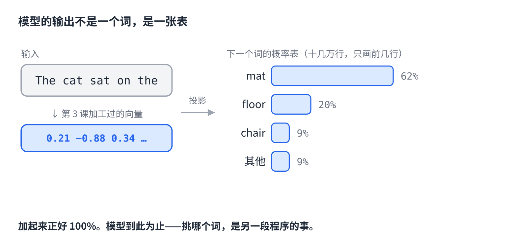
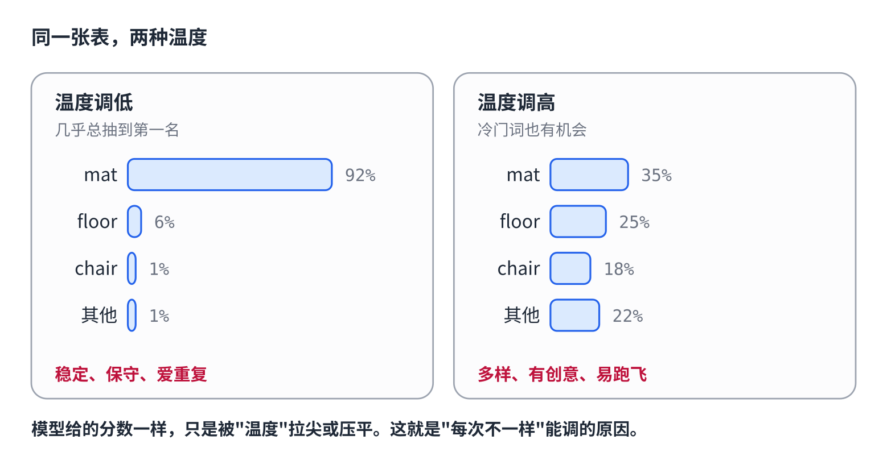
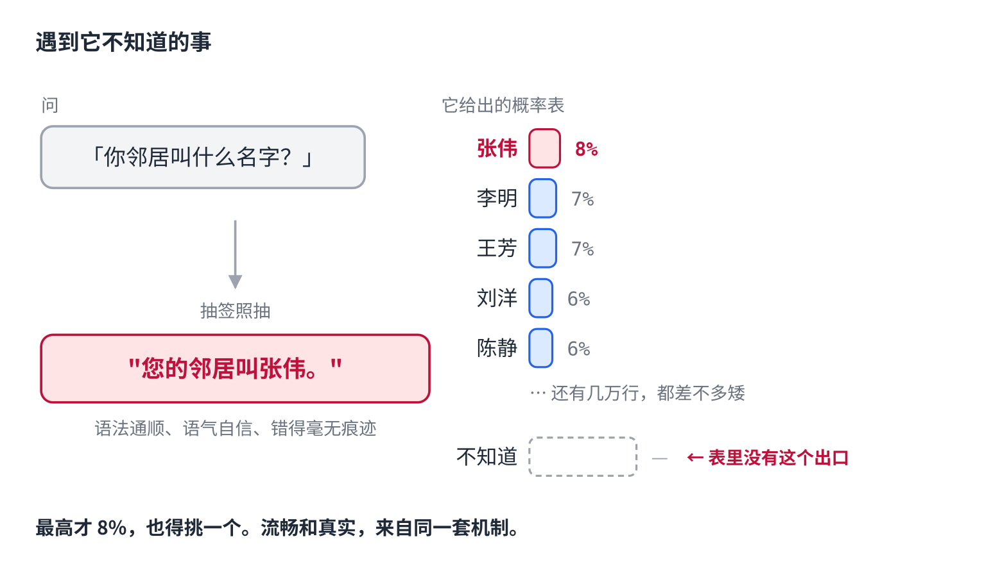

# 第4课｜AI 为什么每次回答都不一样

> 公众号版 **第 4 课**（标题带编号；第 3 课不带，交替测试）。对应仓库 [03 · 生成：从 logits 到文字](../03-generation-logits-to-text.md) 的前半段：lm_head、softmax、采样，并把"幻觉"作为采样机制的直接推论收进来。面向零基础读者，约 1400 字。

你可能注意过一件事。

同一个问题，问 AI 三次，它给你三个不太一样的回答。措辞不同，有时候结构不同，偶尔连结论都不同。

它不是在"重新想"，也不是"记性差"。

**它在掷骰子。**

上一课讲到，一句话进了模型之后，每个词都被反复加工，变成了一个"懂语境"的向量。这一课讲最后一步：**从那个向量，到它吐出来的下一个字，中间发生了什么。**

答案里藏着两件事：为什么每次不一样，以及——为什么它会一本正经地胡说八道。

## 模型的输出不是一个词，是一张表

拿最后一层出来的那个向量，模型做一次投影：把它变成**词表那么长的一串分数**——十几万个数，每个词一个。

然后把这串分数压成概率，加起来正好 100%。

比如「The cat sat on the」后面该接什么，模型给出的可能是：mat 62%、floor 20%、chair 9%，其他加起来 9%。

注意这里：**模型到此为止。** 它交出来的是一张概率表，不是一个词。

哪个词被选中，是**另一段程序**决定的。这个分工很关键，后面会用到。

## 挑词的旋钮

那段程序怎么挑？最简单的办法是永远挑概率最高的——mat。但这样每次结果都一样，而且容易陷入重复。

所以实际做法是**按概率抽签**：62% 的机会抽到 mat，20% 抽到 floor。这就是"每次不一样"的来源。

抽签之前，还有个旋钮可以调，叫**温度**：

- **温度调低**，概率表变尖：高的更高，低的更低，几乎总是抽到第一名。回答稳定、保守，也容易车轱辘话。
- **温度调高**，概率表变平：冷门词也有了机会。回答更多样、更有"创意"，也更容易跑飞。

另外两个旋钮（叫 top-k 和 top-p）做的是同一类事：把长尾里那些荒唐的候选直接剪掉，只在靠谱的几个里抽。

## 一个修正

上一课结尾我说这个旋钮"你天天在调"。严格说不对：**在聊天界面里你调不了它**，是厂商替你设好了。

但它每一次都在起作用。你每收到一个回答，背后都是一次抽签。

## 所以它会一本正经地胡说八道

把上面的机制往前推一步，幻觉就出来了。三件事叠在一起：

**第一，训练目标是"像"，不是"真"。** 模型学的是"这段文字后面通常接什么"。它的世界里只有"像不像"，没有"对不对"。

**第二，概率表里没有一个叫"不知道"的出口。** "我不知道"这几个字要出现在回答里，也得靠它们本身是概率最高的词。表里没有一个专门的按钮叫"停下，我没把握"。

**第三，采样不管把握大小，都得挑一个。** 遇到它真正不知道的事——比如你邻居的名字——概率表会摊得很平，最高的可能才 8%。但抽签照抽。抽出来的那个名字，语法通顺、语气自信，**错得毫无痕迹**。

流畅和真实来自同一套机制。**它编瞎话的时候，用的是和说真话时一模一样的方法。**

所以幻觉不是 bug。它是"预测下一个词"这件事的自然产物。

（后来的训练确实教会了模型更常说"我不确定"，但那是学来的习惯，不是机制上的保险。这个后面讲训练的时候会说。）

## 自己试一下（1 分钟）

两个实验，都不需要任何工具：

- **同一个问题，开三个新对话，各问一次。** 对比三个回答。差异就是抽签的痕迹。
- **问一个它不可能知道的事**——你邻居叫什么、你上周二午饭吃了什么。看它是老实说不知道，还是流畅地编一个。

第二个实验做完，你对"AI 说的话"会多一层警惕。而这层警惕是有根据的。

## 但它一次只吐一个词

到这里，模型挑出了一个词。

然后呢？把这个词拼回句子末尾，**整个模型再跑一遍**，再挑下一个。一次一个词，直到它决定停下。

一句 200 字的回答，就是 200 次这样的循环。

这个"一次一个"的机制，直接决定了另一件你一定遇到过的事——**为什么发给它的长文档，它总是"忘了"前面**。

下一课讲这个。

## 关于这个系列

《从零看懂大模型》是一个系列：从文字怎么变成数字，一路讲到模型怎么生成、权重怎么训练出来、大模型怎么被高效服务，再到 RAG、Agent 和记忆系统。每一课都拿顶尖开源项目的真实源码当课本。

这是第 4 课。完整目录见「阅读原文」。
