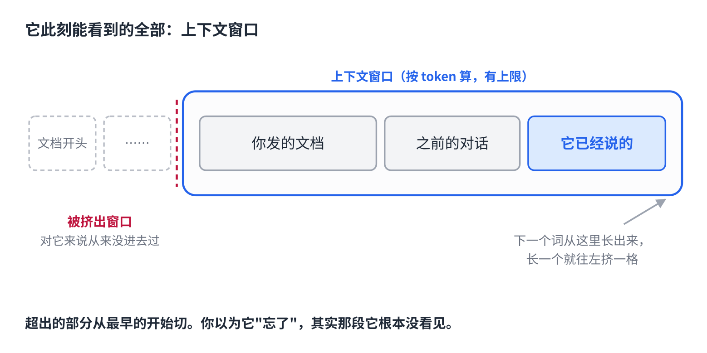
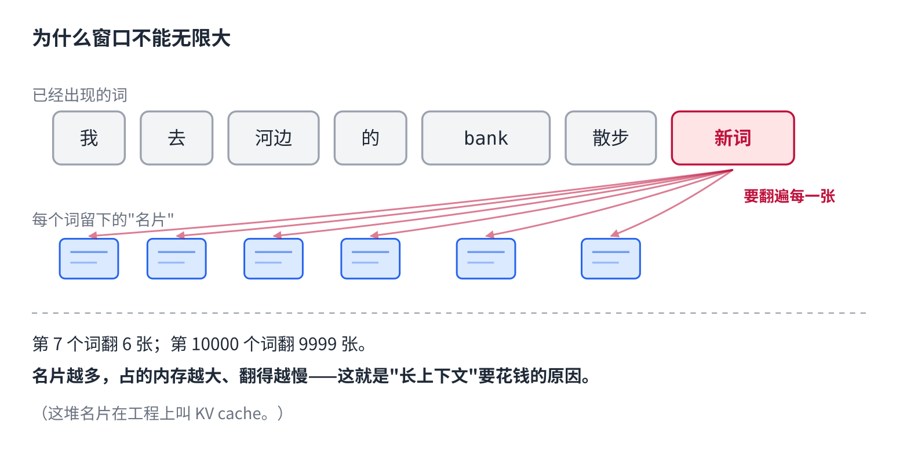
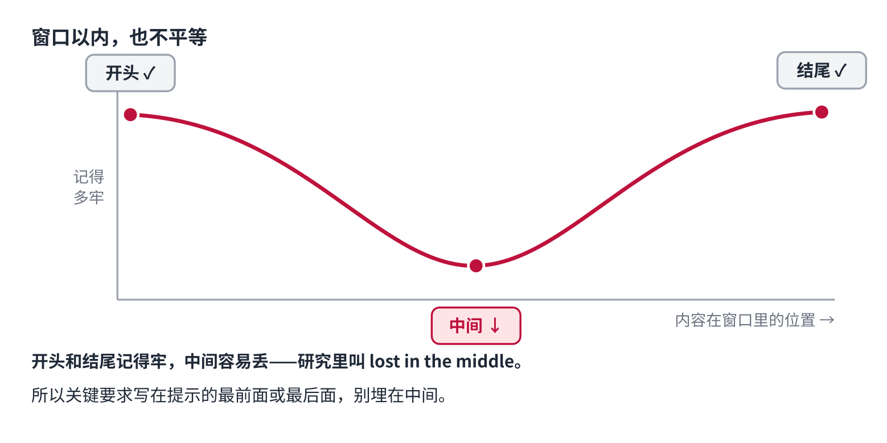

# 发给 AI 的长文档，它为什么总忘了前面

> 公众号版 **第 5 课**（标题不带编号，交替测试）。对应仓库 [03 · 生成](../03-generation-logits-to-text.md) 的后半段：自回归、KV cache、上下文窗口。这一课也是"上下文窗口"这个高频问题在系列里的家。面向零基础读者，约 1400 字。

你大概遇到过这种事。

把一份很长的文档丢给 AI，聊了一会儿，问它开头提到的某个细节。它要么答不上来，要么——更糟——流畅地编一个。

你以为它"忘了"。

**它不是忘了。它根本没看见。**

这一课讲清楚：AI 每一步到底能看到多少东西，为什么有上限，以及这个上限怎么影响你每天的使用。

## 每吐一个词，都要回头看一遍

上一课结尾说到，模型一次只吐一个词：挑出一个，拼回句尾，再跑一遍，再挑下一个。

而第 3 课说过，每个词都要"环顾四周"——看一遍句子里所有的词，判断谁跟自己有关。

把这两件事放在一起：**模型每吐一个新词，都要回头看一遍它此刻能看到的全部内容。** 你发的文档、你们之前的对话、它自己刚说过的话，全在里面。

这一整块东西，有个名字，叫**上下文**。

## 上下文有个上限

这块东西不能无限大。它有个硬上限，叫**上下文窗口**。

上限按什么算？按 token——第 1 课那些碎片。不同模型从几万到上百万 token 不等。

关键在于超出之后会怎样：**超出的部分会被切掉，通常从最早的开始。** 被切掉的内容对模型来说不是"记不清"，而是**从来没进去过**。

所以当你问它文档开头的细节、它答不上来的时候，多半是因为——那一段已经被挤出窗口了。它不是忘了，它此刻真的看不到。

而它编一个答案的原因，上一课讲过：概率表里没有"我没看到"这个出口。

## 为什么不能无限大

一个自然的问题：为什么不把窗口做大点？

回到"环顾四周"。第 3 课说每个词都要看别的词。反过来说，**要被看到，每个词就得把自己的"名片"留下来**——它的关键信息存在一个地方，供后面每一个新词来翻。

于是每多一个词，就多一张名片要存。窗口越长，名片越多，占的内存越大；每吐一个新词要翻的名片也越多，越慢。

这就是窗口有上限的原因：**记住更多，就更贵、更慢。** 这也是为什么"长上下文"是各家模型竞争的一个指标——它真的要花钱。

（这堆名片在工程上叫 KV cache，怎么高效管理它是推理引擎的核心问题之一。先记个名字，后面会讲。）

## 窗口以内，也不是平等的

还有一件事更隐蔽。

就算所有内容都在窗口以内，模型对它们的"注意力"也不均匀。研究发现一个稳定的规律：**开头和结尾记得牢，中间容易丢。** 学界给它起了个名字，叫"lost in the middle"。

原因还是环顾四周那个机制：注意力是有限的，内容越多，每一条分到的就越少，而模型在训练中养成了偏向两头的习惯。

所以同样一份长文档，你问的细节在开头或结尾，它答得准；在中间，就容易漏。

## 这解释了几件你天天遇到的事

**为什么聊久了它会前后矛盾。** 你们的对话本身也在窗口里。聊到几十轮，早期的内容要么被挤出去了，要么落进了"中间"。

**为什么"新开一个对话"经常管用。** 那等于把窗口清空，让它只看当前的问题。

**为什么重要的话要放开头或结尾。** 把关键要求写在提示的最前面或最后面，比埋在中间可靠得多。

**为什么它处理一整本书要用别的办法。** 一本书塞不进窗口，硬塞进去中间也丢。真正的做法是先捞出相关的几页再给它看——这是后面 RAG 那一课的事。

## 自己试一下（2 分钟）

- 贴一篇长文章进去，分别问一个**开头**、一个**中间**、一个**结尾**的细节。看哪个答得最含糊。
- 在一个聊了很久的对话里，问它：**"我最开始的那条消息说了什么？"** 看它是老实说看不到，还是编一个。

第二个实验做完，你会对"新开对话"这个动作有一种新的敬意。

## 到这里，模型怎么"算"讲完了

从第 1 课到现在，一条线走通了：文字切成 token，token 变成数字，每个词环顾四周吸收语境，投成概率表，抽签挑一个，拼回去，再来一遍——在一个有上限的窗口里。

一个大模型从输入到输出，你现在能从头讲到尾了。

但有个问题一直没碰：那张查表用的大表、那些让词"环顾四周"的权重、那几十亿个数字——**它们是从哪来的？**

没有人写过它们。

下一课讲这个。

## 关于这个系列

《从零看懂大模型》是一个系列：从文字怎么变成数字，一路讲到模型怎么生成、权重怎么训练出来、大模型怎么被高效服务，再到 RAG、Agent 和记忆系统。每一课都拿顶尖开源项目的真实源码当课本。

这是第 5 课。完整目录见合集「从零看懂大模型」。
