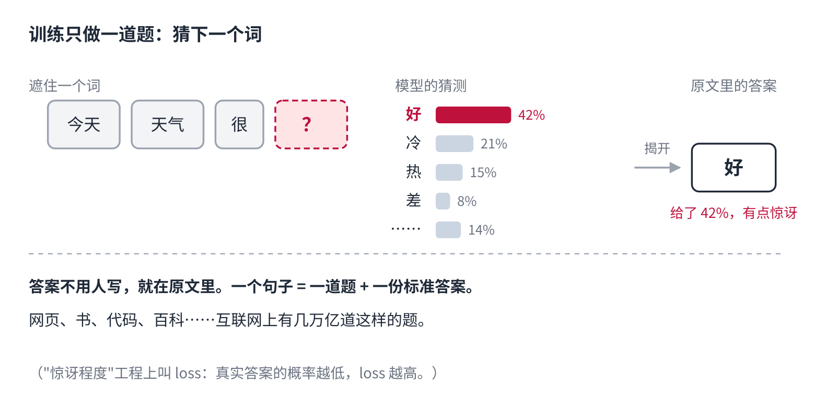
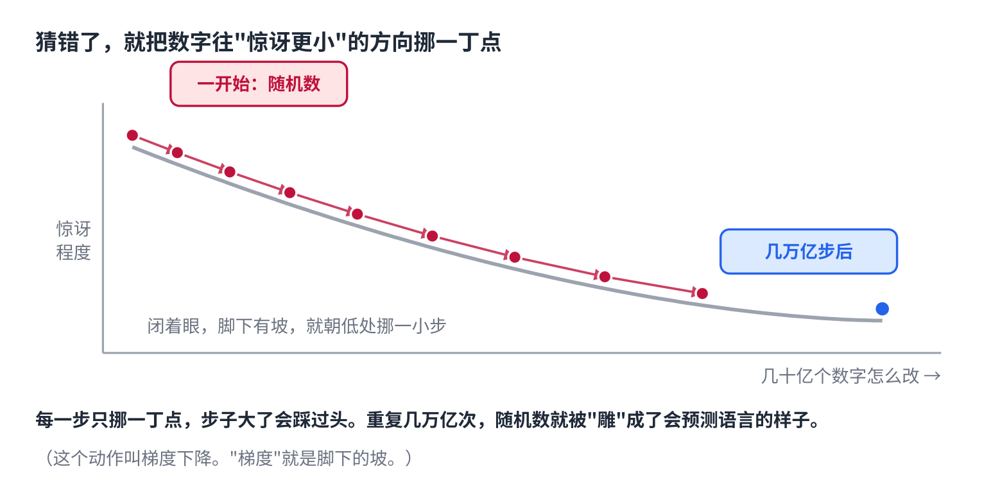
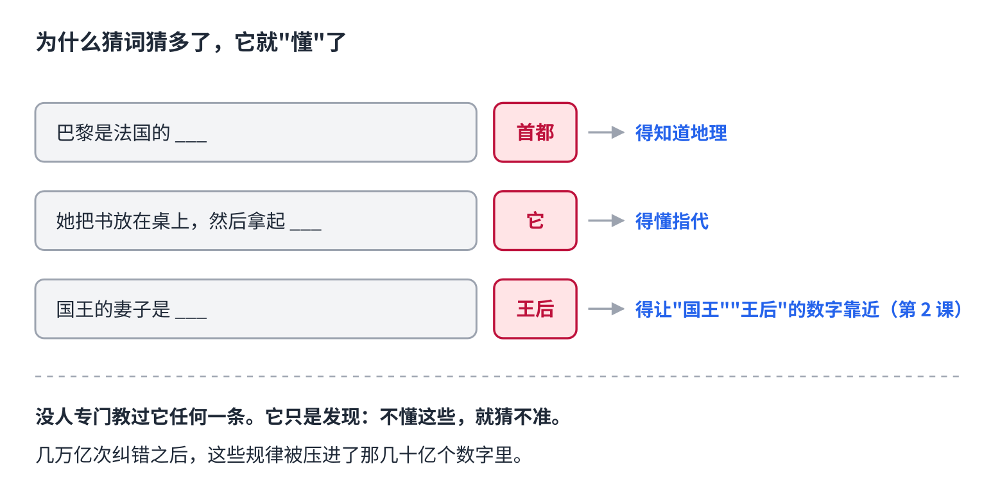
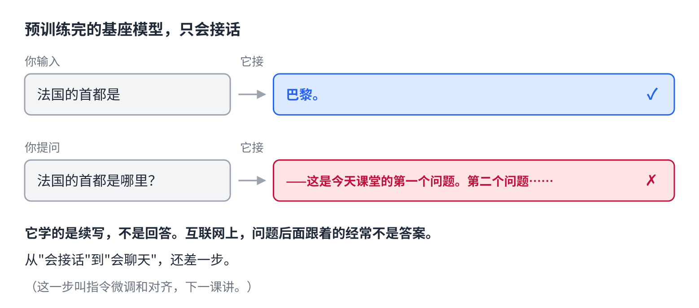

# 成长篇｜没人教它，AI 是怎么学会说话的

> 公众号版 **第 6 课**（发布时标题为「第6课｜」，后用一次修改机会改成「成长篇｜」）。对应仓库 [04 · 训练与微调](../04-training-and-finetuning.md) 的前半段：权重、loss、梯度下降、预训练。面向零基础读者，约 1400 字。

上一课结尾留了个问题。

前五课讲的那一整套——查表、环顾四周、投成概率表——靠的全是模型里那几十亿个数字。它们决定了"苹果"离"香蕉"有多近，决定了"咬"该看向"狗"还是"人"，决定了下一个词是"好"还是"糟"。

**这几十亿个数字，没有一个是人写的。**

那它们是从哪来的？

## 一开始，它是一堆随机数

刚造出来的模型，里面的数字全是随机的。这时候你给它一句"今天天气"，它接出来的是乱码——每个词的概率都差不多，它随便挑。

从这堆随机数，到能写文章能改代码，中间只发生了一件事，而且是同一件事重复了几万亿次。

## 它只做一道题：猜下一个词

这道题你在第 4 课见过：给一段文字，猜下一个词是什么。

训练用的材料是网上的海量文本——网页、书、代码、百科。**没有人给这些文本写答案。答案就在文本里。** 拿一句"今天天气很好"，遮住"好"，让模型猜；猜完揭开，答案是"好"。下一句、下一本书，同样的事。

所以它不需要老师。一个句子本身就是一道题加一份标准答案，互联网上有几万亿个这样的句子。

## 猜错了怎么办：把数字挪一点点

猜完要打分。打分的标准很简单：**真实答案那个词，你给了多大概率？**给得高，说明你不惊讶，扣分少；给得低，说明你很惊讶，扣分多。这个"惊讶程度"，工程上叫 loss。

然后是关键一步：**把几十亿个数字，每一个都朝"能让惊讶变小"的方向挪一丁点。**

哪个方向？想象你在一座山上，闭着眼，脚下能感觉到坡。往低处挪一小步，惊讶就小一点。挪一步，换下一句话，再挪一步。这叫梯度下降，"梯度"就是脚下那个坡。

一次只挪一丁点，是因为步子大了会踩过头。但重复几万亿次以后，那堆随机数就被一点点"雕"成了会预测语言的样子。

## 为什么猜词猜多了，它就"懂"了

这是最反直觉的地方：它只练了猜词，为什么会懂语法、懂事实、懂"国王和皇后是一对"？

因为**要把下一个词猜准，这些东西一个都绕不开**。

- "巴黎是法国的___"，要猜对"首都"，得知道地理。
- "她把书放在桌上，然后拿起___"，要猜对"它"还是"书"，得懂指代。
- "国王的妻子是___"，要猜对"王后"，就得让"国王"和"王后"的数字靠近——这就是第 2 课那道减法题的来历。

模型没有专门学过任何一条。它只是发现：**不懂这些，就猜不准。**几万亿次纠错之后，这些规律被压进了那几十亿个数字里。

## 这一步有多贵

数据是几万亿个 token，大致相当于几千万本书。算力是几千到几万张显卡连续跑几个月。钱是几千万到几亿美元。

所以能从零训练一个大模型的公司，全世界数得过来。这个阶段叫**预训练**，它产出的东西叫**基座模型**。

## 但学完的它，还不会聊天

预训练完的基座模型，是一个顶级的"接话机器"。你输入"法国的首都是"，它接"巴黎"。

但你问它"法国的首都是哪里？"，它很可能接的是"——这是我们今天课堂的第一个问题。第二个问题……"。

因为它学的是**续写**，不是**回答**。互联网上，一个问题后面跟着的经常是另一个问题、一段广告、一堆评论，而不是答案。

从"会接话"到"会聊天"，中间还差一步。**下一课讲这一步。**

## 自己试一下（2 分钟）

- 随手拿一段文字，遮住每句最后一个词，自己猜。你会发现有的词几乎必然（"中华人民___"），有的词全靠对世界的了解（"她最后选了___"）。模型面对的就是这两类题。
- 打开一个 AI，跟它说：**"接下来我给你半句话，你只续写，不要回答问题，不要解释。"** 然后发"法国的首都是哪里？"。看它是接着编题，还是忍不住答了。忍不住答，说明它已经过了下一课要讲的那一步。

## 关于这个系列

《从零看懂大模型》是一个系列：从文字怎么变成数字，一路讲到模型怎么生成、权重怎么训练出来、大模型怎么被高效服务，再到 RAG、Agent 和记忆系统。每一课都拿顶尖开源项目的真实源码当课本。

这是第 6 课。完整目录见「阅读原文」。
