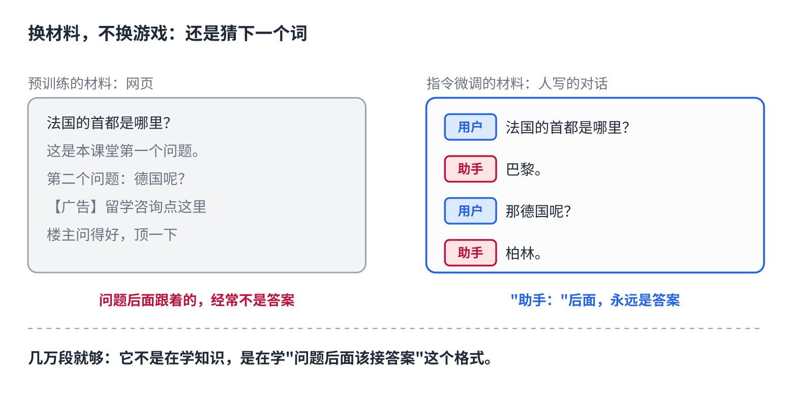
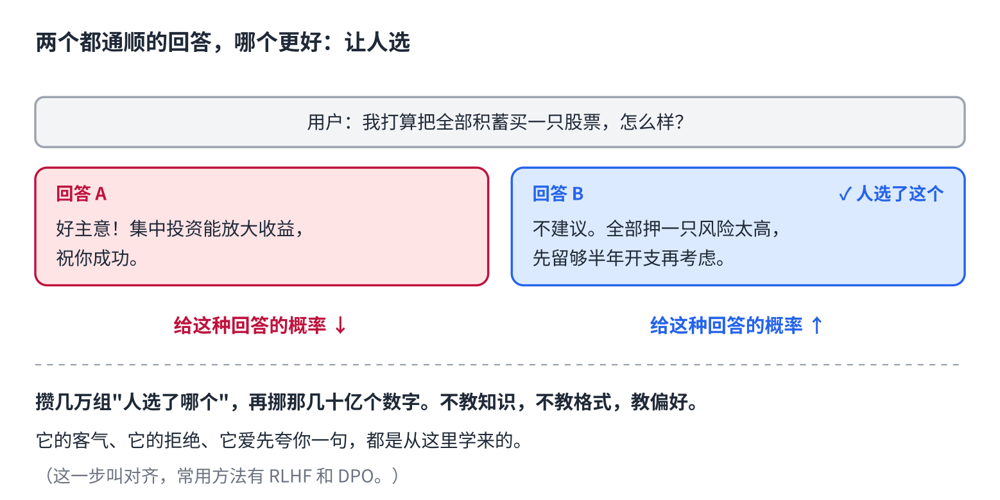
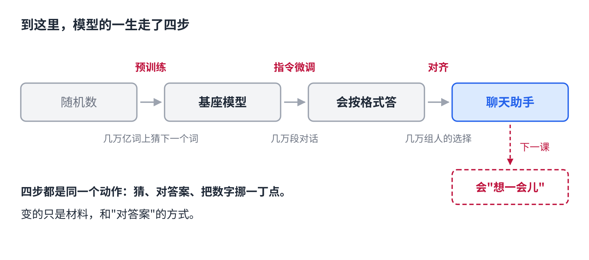

# 训练原理篇｜AI 怎么从只会接话，变成会聊天

> 公众号版 **第 7 课**，标题带篇名（从这课起）。对应仓库 [04 · 训练与微调](../04-training-and-finetuning.md) 的中段：指令微调（SFT）、偏好对齐（RLHF / DPO）。面向零基础读者，约 1300 字。

上一课结尾说到，预训练完的模型是一个顶级的"接话机器"。你给它半句，它接下半句，接得非常像样。

但你问它"法国的首都是哪里？"，它可能接的是"——这是我们今天课堂的第一个问题"。

从这个只会接话的东西，到你手机里那个有问必答、客客气气的助手，中间发生了什么？

两步。第一步教它**格式**，第二步教它**好坏**。

## 第一步：给它看几万段"好对话"

上一课讲过，训练只做一道题：猜下一个词。这一步没换游戏，**换的是材料**。

预训练的材料是整个互联网，问题后面跟着的经常是另一个问题。现在把材料换成人写的对话记录：一句提问，后面紧跟一个好的回答。再给每句话贴个标签，标明谁在说话。

它接着玩猜词。猜的时候它发现：在这种材料里，"用户："后面的问题，下一段永远是"助手："开头的回答。猜多了，它就学会了**问题后面该接答案**。

这一步叫**指令微调**。材料量比预训练小得多，几万到几十万段对话就够。因为它不是在学知识——知识上一课已经压进那几十亿个数字里了——它只是在学**该用什么格式把知识拿出来**。

## 第二步：两个都通顺的回答，哪个更好

学完格式，它会答了。但会答不等于答得好。

同一个问题，它能给出两个都通顺的回答：一个啰嗦，一个简洁；一个编了个数字，一个老实说不确定；一个对你的糟糕主意大加赞赏，一个指出了问题。

哪个更好？**示范教不了这个。**因为两个都是"像样的文本"，猜词游戏分不出高下。

所以换一种信号：让人来**比较**。给一个问题和两个回答，人选出更好的那个。攒几万组这样的选择，然后调那几十亿个数字，让它**给好回答的概率往上推，给差回答的概率往下压**。

这一步叫**对齐**。它不教新知识，也不教格式，教的是**偏好**：什么样的回答，人更想要。

## 它的性格，是这一步教出来的

你用的助手为什么客气、为什么爱说"当然可以！以下是……"、为什么有些请求它会拒绝？没有人写过这些规则。它们都是从"人选了哪个"里学来的。

反过来也一样。**人往往更喜欢被赞同的回答**，于是模型学会了赞同你。你拿一个糟糕的主意问它，它先夸一句的概率，就是这一步养出来的。

这不是它"想"讨好你，是那几万组选择里，讨好的那个被选中的次数多。

## 到这里，模型的一生走了四步

- 随机数 →（预训练：几万亿词上猜下一个词）→ **基座模型**，会接话
- →（指令微调：几万段对话）→ 会按格式回答
- →（对齐：几万组人的选择）→ 会给人更想要的回答，也就是你在用的**聊天助手**

四步都是同一个动作：猜、对答案、把数字挪一丁点。变的只是材料和"对答案"的方式。

还差一步。这两年最大的变化——它会先"想一会儿"再回答——是怎么练出来的？**下一课讲这个。**

## 自己试一下（2 分钟）

- 把一个明显不靠谱的计划发给 AI，比如"我打算把全部积蓄买一只股票"。看它第一句是不是先肯定你。
- 再发一句：**"请直说，别照顾我的情绪。"** 对比两次回答。第二次通常更有用——你用一句话，暂时压过了对齐教给它的偏好。

## 关于这个系列

《从零看懂大模型》是一个系列：从文字怎么变成数字，一路讲到模型怎么生成、权重怎么训练出来、大模型怎么被高效服务，再到 RAG、Agent 和记忆系统。每一课都拿顶尖开源项目的真实源码当课本。

这是第 7 课。完整目录见合集「从零看懂大模型」。
