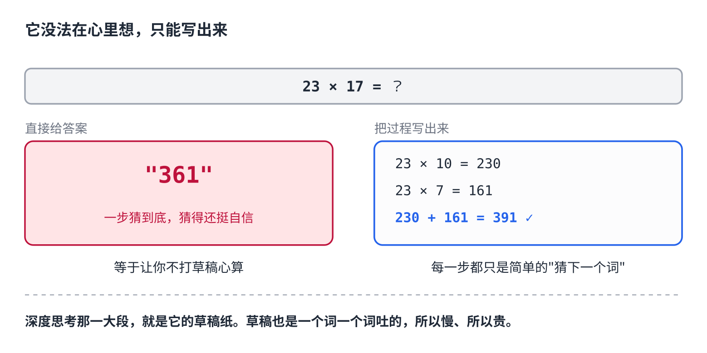
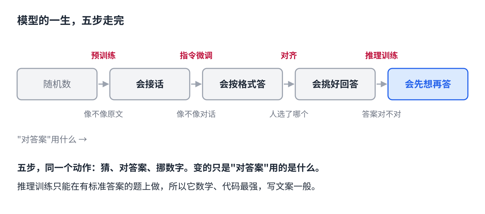

# 训练原理篇｜AI 的深度思考，是怎么练出来的

> 公众号版 **第 8 课**。对应仓库 [04 · 训练与微调](../04-training-and-finetuning.md) 的「推理」一节：思维链、可验证奖励的强化学习（RLVR / GRPO）、涌现。面向零基础读者，约 1300 字。

现在的 AI 大多有个"深度思考"开关。按下去，它不马上回答，先写一大段——拆问题、试算、自己反驳自己——几十秒后才给结论。

这是这两年最大的变化。它在那几十秒里到底在干什么？为什么"想一会儿"就更准？

## 它没法在心里想

第 4 课讲过，模型一次只吐一个词，每个词都是看着前面所有内容算出来的。它没有草稿纸，没有"心里"。

所以一道要好几步的题，让它直接给答案，等于让你不打草稿心算 23 × 17。它会猜一个，猜得还挺自信。

要想多步，只有一个办法：**把想的过程也写出来。**先写"23 × 10 = 230"，再写"23 × 7 = 161"，再写"加起来 391"。每一步都只是一次简单的"猜下一个词"，难题被拆成了一串容易的小题。

这叫思维链。深度思考模式里那一大段，就是它的草稿纸。代价也在这：草稿也是一个词一个词吐出来的，**所以慢，所以贵。**

## 怎么让它想得好

会写草稿不等于草稿写得好。怎么教？

第一反应是上一课的办法：找人写几万份漂亮的解题过程，让它照着学。这能教它**模仿**，但教不出它没见过的解法，而且人的思路未必适合它。

于是换了一种信号，比上一课还省事：**不告诉它怎么想，只告诉它想对了没有。**

拿几十万道有标准答案的题——数学、代码，对错一查便知。让它自己写思考、自己给答案，同一道题写好几遍。对了加分，错了不加。然后还是那个老动作：挪那几十亿个数字，让**答对的那几遍里出现的想法**，以后出现的概率变高。

几十万道题练下来，什么样的想法容易答对，就被压进了数字里。

## 没人教过它，它自己学会了回头看

最有意思的在这。

训练到一半，研究人员发现模型的草稿里开始出现这样的句子："等等，让我重新看一下这一步。"然后它真的回头检查，发现错了，换一条路。

**没有任何人示范过这个。**训练材料里只有题和答案，没有"回头检查"的教程。它只是发现：会回头看的那几遍，答对的次数更多。于是回头看的概率就上去了。

推理模型的"反思""自我纠错"，是这么来的：不是设计出来的，是练出来的。

## 为什么它数学最强，写文案一般

因为只有**有标准答案的题**能这么练。数学题对错一查便知，代码跑一下就知道，这些领域的推理能力涨得最猛。

"帮我写一段更打动人的文案"没有标准答案，加不了分也扣不了分，练不起来。所以在这类问题上开深度思考，你会看到它想了半天，结论跟不想差不多，还慢了一倍。

这就是那个开关该什么时候开的答案：**要算、要推、要查错的题开；聊天、翻译、改文案不开。**

## 模型的一生，五步走完

- 随机数 →（预训练）→ 基座模型，会接话
- →（指令微调）→ 会按格式答
- →（对齐）→ 会给人更想要的回答
- →（推理训练：只告诉它对没对）→ **会先想再答**

五步，同一个动作：猜、对答案、挪数字。变的只是"对答案"用的是什么：像不像原文、人选了哪个、答案对不对。

从第 1 课到这里，一个大模型怎么算、怎么练，你都能从头讲到尾了。下一课换个角度：**你自己想教它点新东西，比如公司的术语、你的写作风格，该用哪种办法？**

## 自己试一下（2 分钟）

- 找一道两位数乘法，比如 47 × 23。第一次跟它说"**直接给答案，不要过程**"，第二次说"**一步步算**"。看哪次对。
- 开着深度思考，问它"帮我把这句话改得更有感染力"。看它的思考过程那一大段，有多少是真的在帮你。

## 关于这个系列

《从零看懂大模型》是一个系列：从文字怎么变成数字，一路讲到模型怎么生成、权重怎么训练出来、大模型怎么被高效服务，再到 RAG、Agent 和记忆系统。每一课都拿顶尖开源项目的真实源码当课本。

这是第 8 课。完整目录见合集「从零看懂大模型」。
