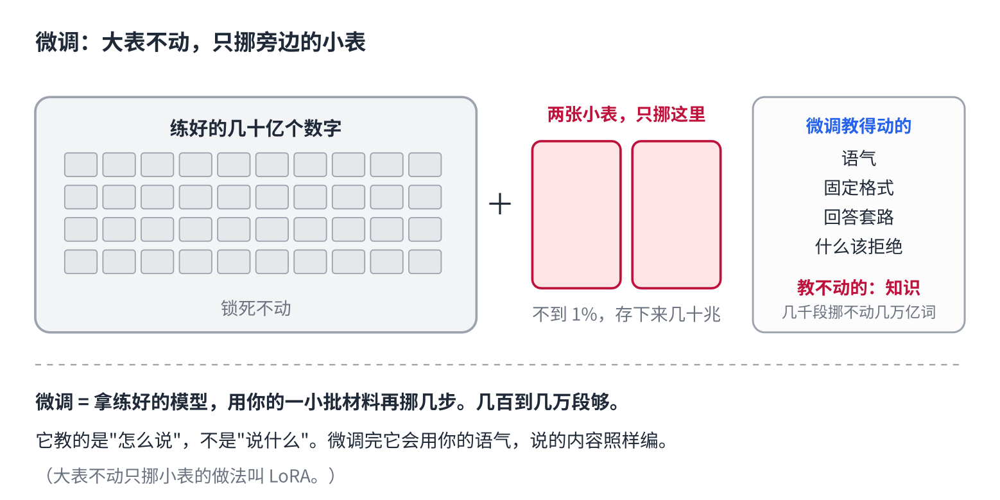
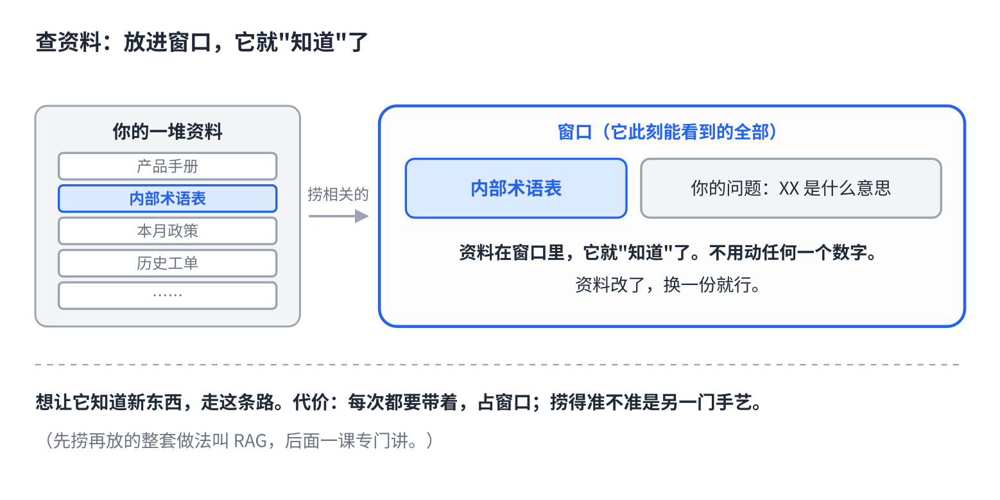
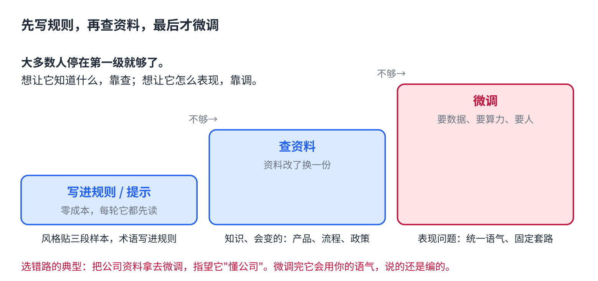

# 教 AI 新本事：微调和查资料，哪个管用

> 公众号版 **第 9 课**。标题不带篇名（篇名放摘要），如当天有可借的新闻钩子可换。对应仓库 [04 · 训练与微调](../04-training-and-finetuning.md) 后半段（微调、LoRA）和 [10 · 微调实战](../10-finetuning-lora-dpo.md) 开头（微调能做什么不能做什么），并预告 RAG。面向零基础读者，约 1300 字。

前三课讲完了一个模型怎么从随机数练成聊天助手。练它的是大公司，花的是几千万美元。

但你可能有个更实际的问题：**我想让它懂我公司的产品、用我们内部的叫法、按我的风格写东西，该怎么办？**

两条路。一条叫微调，一条叫查资料。选错路的人很多，而且错得很贵。

## 第一条路：微调，接着挪数字

第 6 课说训练就是猜、对答案、把几十亿个数字挪一丁点。微调就是**拿一个已经练好的模型，用你自己的一小批材料，再挪几步。**

几十亿个数字全挪一遍太贵，所以实际做法是：大表锁死不动，旁边挂两张小表，只挪小表。这个办法叫 LoRA。小表加起来常常不到原来的 1%，存下来只有几十兆。一个基座可以挂很多张小表，随时换。

材料要多少？几百到几万段就够。

## 但微调教不了知识

这是最常见的误会。很多人想"把公司资料喂给它微调一下，它就懂我们了"。

**不行。**

知识是压在那几十亿个数字里的，是几万亿个词磕出来的。你那几千段材料挪不动它。微调之后它会用你的语气说话，但说的内容还是编的。

微调擅长的是**怎么表现**：语气、格式、固定的回答套路、什么该拒绝。它教的是"怎么说"，不是"说什么"。

## 第二条路：查资料，放进窗口

想让它知道新东西，走另一条路：**提问的时候，把相关资料一起放进窗口。**

第 5 课讲过，窗口里的东西它此刻全能看见。资料在窗口里，它就"知道"了；不用动任何一个数字，资料改了换一份就行。

问题是资料太多塞不下。所以真正的做法是：先从一堆资料里捞出跟这个问题相关的几页，再放进窗口。捞得准不准是另一门手艺，这就是 RAG，后面一课专门讲。

## 怎么选

一句话：**想让它知道什么，靠查；想让它怎么表现，靠调。**

- 公司的产品术语、内部流程、最新的政策 → 这是知识，会变，走查资料。
- 客服统一用一种语气、每次都按固定格式回、某些话题一律不接 → 这是表现，走微调。

再说一句多数教程不说的：**大多数人两条路都用不上。**

想让它用你的风格写？贴三段你写过的东西给它，让它照着来，效果通常已经够。想让它记住内部叫法？把术语表写进上一篇实操讲的那个规则文件，每轮它都先读。这两招都是"放进窗口"，零成本。

顺序是：先把要求写进规则和提示；不够，再查资料；查资料也解决不了的表现问题，才微调。

## 模型练好了，然后呢

到这里，一个模型从随机数到你手里的助手，怎么练、怎么教新本事，都讲完了。

接下来的问题是另一种性质的：练好的这个东西要同时服务几百万人，每个人一问就要几十亿个数字算一遍。**一次回答几毛钱，钱到底花在哪？**下一课。

## 自己试一下（2 分钟）

- 贴三段你自己写的东西给 AI，说"照这个风格写一段 XX"。看像不像。这就是"表现靠例子"，不用微调。
- 问它一个你公司内部的叫法是什么意思。它多半会编。再把术语表贴进去问一遍，对了。这就是"知识靠查"，也不用微调。

## 关于这个系列

《从零看懂大模型》是一个系列：从文字怎么变成数字，一路讲到模型怎么生成、权重怎么训练出来、大模型怎么被高效服务，再到 RAG、Agent 和记忆系统。每一课都拿顶尖开源项目的真实源码当课本。

这是第 9 课。完整目录见合集「从零看懂大模型」。
