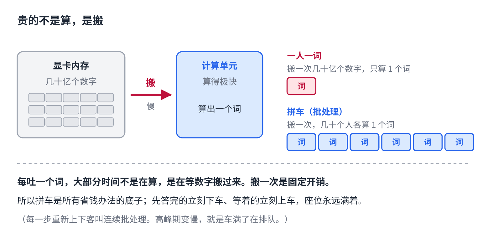
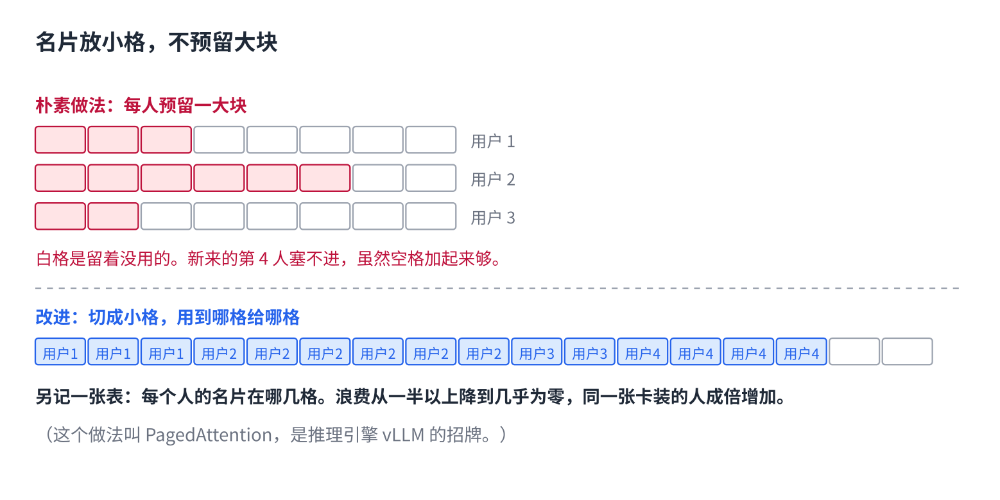
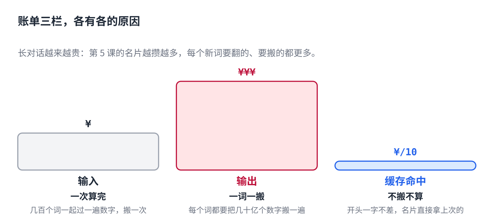

# AI 回答一次几毛钱，钱花在哪

> 公众号版 **第 10 课**（成本篇，篇名放摘要）。对应仓库 [05 · 推理系统](../05-inference-systems.md)：连续批处理、PagedAttention、量化，加上 11 篇里的 prompt caching。面向零基础读者，约 1300 字。

你用的 AI 多半是免费的，或者一个月几十块。但它背后有一张按字数收费的价格表：每一百万个 token，输入几块钱，输出贵好几倍，还有一栏叫"缓存命中"，便宜九成。

一次回答几毛钱，这几毛钱到底花在哪？为什么输出比输入贵？为什么"缓存"能省九成？

答案都在同一件事上。

## 贵的不是算，是搬

第 4、5 课讲过，模型一次吐一个词：把窗口里的东西过一遍那几十亿个数字，挑一个词，拼回去，再来。

关键在"过一遍"。几十亿个数字存在显卡的内存里，每算一次，都要把它们**从内存搬到计算单元**。显卡算得极快，搬得相对慢，所以每吐一个词，大部分时间不是在算，是在等数字搬过来。

于是最浪费的用法就是：**搬一次几十亿个数字，只给一个人算一个词。**

## 第一招：拼车

既然搬一次是固定开销，那就搬一次，给几十个人各算一个词。这叫批处理，是所有省钱办法的底子。

朴素的拼法有个问题：一批人一起上车，先答完的得坐着等最慢那个说完，座位空着。改进是**每一步都重新上下客**：谁答完了立刻下车，等着的立刻上来，座位永远满着。这叫连续批处理，吞吐量能翻几倍。

你在高峰期觉得它变慢，就是车满了在排队。

## 第二招：名片别乱放

第 5 课说每个词都要留一张"名片"供后面的词翻，名片越多占内存越多。几十个人拼车，几十份名片都得放在显卡内存里。

朴素做法是给每个人预留一大块连续空间，按他"最多可能说多长"留。结果大部分人用不完，留白浪费掉；而且零碎的空位凑不出一块整的，明明总空间够却塞不进新人。

改进是把名片切成小格，**谁用到哪格再给哪格**，另外记一张表说明每个人的名片在哪几格。浪费从一半以上降到几乎为零，同一张显卡能同时服务的人数成倍增加。这个做法叫 PagedAttention，是推理引擎 vLLM 的招牌。

## 第三招：开头一样的，名片直接复用

这一招解释了价格表上那栏"缓存命中"。

很多请求的开头是一样的：同一份系统提示、同一份规则文件（实操第 2 篇讲的那个）。开头一样，这段的名片就一样，**不用重算，直接拿上次的**。省下的是搬和算两笔钱，所以便宜九成。

条件是开头要一字不差。所以不变的东西放最前面，会变的（时间、随机 id）放后面。开头改一个字，缓存全部失效，长对话的账单翻几倍。这是把底层机制直接用到省钱上的例子。

## 第四招：数字存小一点

几十亿个数字，每个通常占 2 字节。压成 1 字节甚至半字节，搬得快一半以上，占的内存也少一半以上，代价是精度掉一点点。这叫量化。你看到的"轻量版""手机上能跑"，多半用了这招。

## 为什么输出比输入贵

输入的几百个词是一次性算完的：搬一次数字，几百个词一起过。输出不行，一个词一次，每个词都要搬一遍。搬的次数差几百倍，价格自然差几倍。

到这里价格表能读懂了：**输入便宜，因为一次算完；输出贵，因为一词一搬；缓存命中最便宜，因为不用搬也不用算。**长对话越来越贵，是第 5 课的名片越攒越多。

## 自己试一下（2 分钟）

- 随便找一家 AI 公司的 API 价格页，看那三栏：输入、输出、缓存。对照上面三句话，每一栏为什么是那个价。
- 开一个长对话聊二十轮，感觉一下它是不是越来越慢。那是名片在变多、拼车的座位在变少。

## 模型会算、会练，然后呢

前十课把一个模型怎么算、怎么练、怎么服务讲完了。从下一课开始，讲它怎么被**用起来**：怎么查完资料再回答，怎么记住你，怎么自己动手干活。

第一个问题就是第 9 课留下的：**从一堆资料里捞出相关的几页，是怎么捞的？**

## 关于这个系列

《从零看懂大模型》是一个系列：从文字怎么变成数字，一路讲到模型怎么生成、权重怎么训练出来、大模型怎么被高效服务，再到 RAG、Agent 和记忆系统。每一课都拿顶尖开源项目的真实源码当课本。

这是第 10 课。完整目录见合集「从零看懂大模型」。
