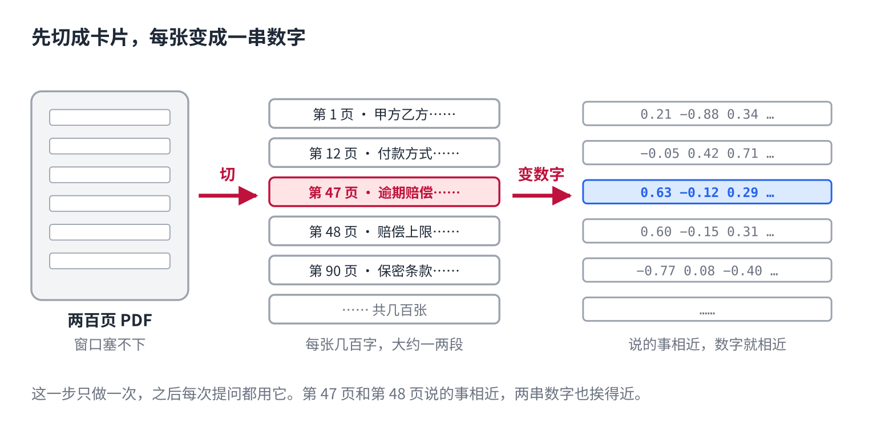
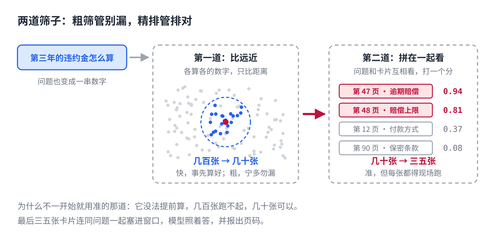
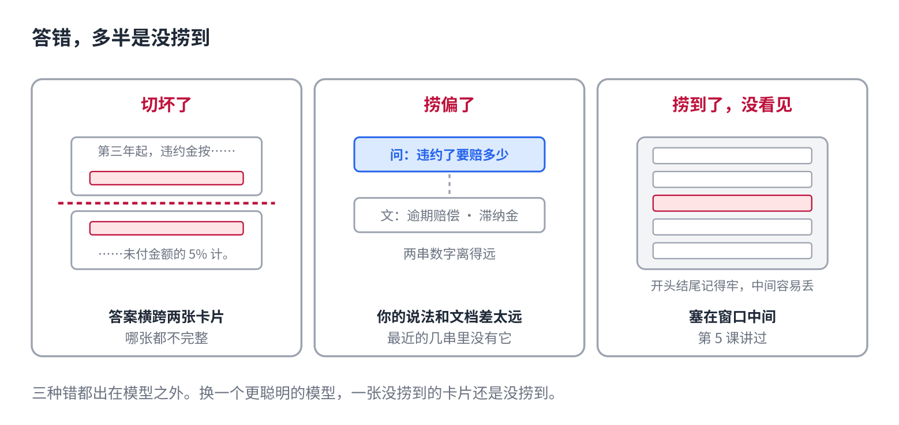

# AI 怎么查完资料再回答

> 公众号版 **第 11 课**（应用篇，篇名放摘要）。对应仓库 [06 · RAG 与 Agent](../06-rag-and-agents.md) 的 RAG 部分：切块、向量检索、重排、塞进窗口，加上"不用向量库也算 RAG"和常见失败原因。面向零基础读者，约 1300 字。

你把一份两百页的 PDF 扔给 AI，问"第三年的违约金怎么算"，它几秒钟就答了，还告诉你在第 47 页。

第 5 课说过，它一次只能看一个窗口，两百页塞不进去。那它是怎么答的？

它没有读完。它**查**了。

## 第一步：先把书切成卡片

你上传文档的那一刻，它背后做的第一件事不是读，是切：把两百页切成几百张"卡片"，每张几百字，大约一两段。

然后每张卡片变成一串数字。第 2 课讲过，一个词在 AI 眼里是一串数字，意思相近的词数字也相近。这一招对一段话同样管用：**一段话也能变成一串数字，说的事相近，数字就相近。**

几百张卡片，几百串数字，存起来。这一步只做一次，之后每次提问都用它。

## 第二步：把问题也变成数字，找最近的

你问"第三年的违约金怎么算"，问题本身也变成一串数字。接下来是在几百串数字里找**离它最近的**几串。

"最近"不是字面上一样。问题里写的是"违约金"，合同里写的是"逾期赔偿"，一个字不重，但两串数字挨得近，照样能捞出来。这是查资料比 Ctrl+F 强的地方。

也是它弱的地方：捞出来的是"说的事相近"的卡片，不保证是"含有答案"的卡片。所以通常一次捞几十张，宁多勿漏。

## 第三步：第二道筛子

几十张卡片不能全塞给模型，窗口有限，而且第 5 课讲过，中间的东西它容易看丢。得再筛一次。

第二道筛子比第一道慢，也准得多。第一道是问题和卡片**各算各的**数字再比远近，两边从没见过面；第二道把问题和某张卡片**拼在一起**送进一个模型，让它俩互相看，就是第 3 课的注意力，然后打一个分：这张卡片答得上这个问题吗。

为什么不一开始就用准的那道？因为它没法提前算。几百张卡片的数字可以事先算好存着，问题来了只比远近，快；第二道每次都得拿问题和每张卡片现场跑一遍，几百张跑不起，几十张可以。所以分两道：**粗筛管别漏，精排管排对。**

## 第四步：塞进窗口，照着答

精排出的三五张卡片，连同你的问题，一起放进窗口。模型此刻能看见这几段，照着答，顺便告诉你出自第几页，那是卡片上带的标签。

这套做法叫 RAG，"先检索，再生成"。名字不重要，记住一件事就够了：**它没有记住你的文档，它每次都现捞。**你上传 PDF、企业知识库问答、AI 联网搜索，全是这一套。联网搜索只是把"捞卡片"换成了"搜网页"，后面一样。

第 9 课说知识不用微调，靠查，说的就是这个。文档改了，换卡片就行，模型一个数字不动。

## 它为什么会答错

知道它是现捞的，就知道它错在哪。答错通常不是模型笨，是**没捞到**：

- **切坏了。** 答案横跨两张卡片，前半张在这、后半张在那，哪张都不完整。
- **捞偏了。** 你问的说法和文档里的说法差太远，最近的几串数字里没有正确那张。
- **捞到了，没看见。** 卡片塞进窗口中间，被忽略了，第 5 课讲过。

有意思的是，这三种错都出在模型之外。换一个更聪明的模型，一张没捞到的卡片还是没捞到。

## 自己试一下（2 分钟）

- 上传一份长文档，问一个具体细节，让它标出处。答对的话，你看到的就是上面四步。
- 再问一个要通读全文才能答的问题，比如"这份文档一共提了几次退款"。它多半答错，因为它只捞了几张卡片，从没读完过整份。

## 它记得你，用的也是这套

这一课讲的是查你上传的文档。换个对象：查**你以前说过的话**。

你跟 AI 聊过几次以后，它开始"记得"你：你的名字、你的口味、上次聊到哪。它是真记住了，还是每次都在捞？记错、记串又是怎么回事？下一课。

## 关于这个系列

《从零看懂大模型》是一个系列：从文字怎么变成数字，一路讲到模型怎么生成、权重怎么训练出来、大模型怎么被高效服务，再到 RAG、Agent 和记忆系统。每一课都拿顶尖开源项目的真实源码当课本。

这是第 11 课。完整目录见合集「从零看懂大模型」。
