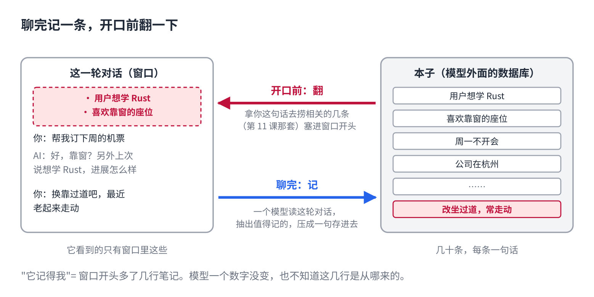
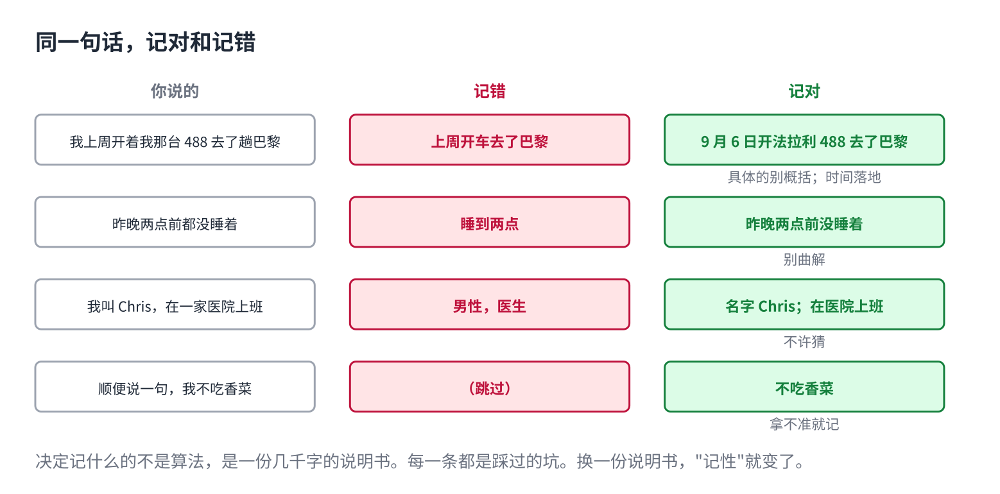
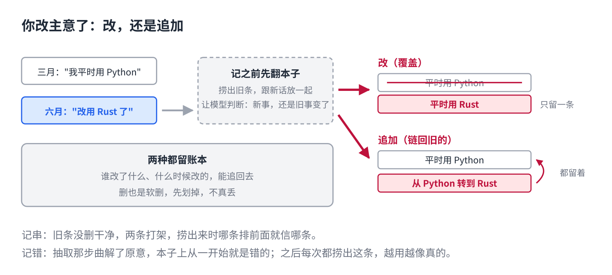

# AI 怎么记住上次聊的

> 公众号版 **第 12 课**（应用篇，篇名放摘要）。对应仓库 [07 · AI 记忆系统](../07-ai-memory-systems.md)：读的一侧是检索、写的一侧是抽取，记什么由一份提示词决定，增改删留账本。面向零基础读者，约 1300 字。

你新开一个对话，它说："上次你说想学 Rust，进展怎么样？"

第 5 课讲过，它每一轮都从头读窗口，读完就忘，新对话更是一张白纸。那这句"上次你说"是哪来的？

它没有记住。它**记了笔记**，这次开口前先翻了一下。

## 它记的不是对话，是笔记

整套机制就两步。

**聊完，记一条。**每轮对话结束，有一个模型把这轮对话读一遍，从里面抽出值得记的话，压成一句："用户想学 Rust""喜欢靠窗的座位"。存进一个本子。本子在模型外面，是一个普通的数据库。

**开口前，翻一下。**你下次说话，先拿你这句话去本子里捞相关的几条，这是上一课讲的查资料，一模一样。捞出来的几条塞进窗口最前面，再让它答。

你看到的"它记得我"，是窗口开头多了三行笔记。模型本身一个数字没变，它也不知道这几行是从哪来的。

## 记什么，写在一份说明书里

难的不是存，是**该记什么**。记全了全是废话，记少了漏掉关键。

决定这件事的不是算法，是一份几千字的说明书，用大白话写的，交给模型照办。看几条：

- **拿不准就记。**漏掉比多记糟，重复的后面能去掉。
- **具体的别概括。**"法拉利 488"不许记成"跑车"，一概括，下次搜不到。
- **别曲解。**"两点前没睡着"不是"睡到两点"。记错比不记还糟。
- **时间落地。**"上周去了巴黎"要换算成日期，半年后"上周"没意义。
- **不许猜。**不能从名字推断性别年龄。每条笔记要有出处。

每一条都是踩过的坑。所以同一个模型，接上两份不同的说明书，"记性"天差地别。记忆的质量，约等于这份说明书的质量。

## 你改主意了，它怎么办

你三月说"我平时用 Python"，六月说"改用 Rust 了"。本子上怎么办？

记之前先翻本子，把相关的旧条捞出来，跟新话放在一起，让模型判断：是新事，还是旧事变了。旧事变了有两种处理，改和追加。**改**是把原来那条覆盖掉，只留一条最新的；**追加**是新写一条"从 Python 转到 Rust"，链回旧的那条。两种各有取舍，但都留账本，谁改了什么、什么时候改的，能追回去。

这也解释了记串和记错。记串，多半是旧条没删干净，两条打架，捞出来时哪条排前面就信哪条。记错，多半是抽取那步曲解了原意，本子上从一开始就是错的。之后每次都捞出这条错的，越用越像真的。

## 它了解你，是本子在

这一课最实用的一句：**记忆是外挂，不在模型里。**

换个产品、换个账号、关掉记忆功能，本子就不在了，它对你一无所知。反过来，你觉得它"太了解我"，其实是本子上那几十条，多数产品可以直接看、直接删。

## 自己试一下（2 分钟）

- 问它："你记得我什么？"它念出来的就是本子上的条目。有的产品在设置里能看到原文，对着念的对不对。
- 告诉它一个偏好，几句话后改口。新开一个对话问它，看它按哪个来。这就是"改还是追加"在你手里的结果。

## 会查、会记，然后呢

到这里，它能查你的文档，能记你说过的话。但这两样都是**读**，它还没有**动过手**。

订闹钟、改文件、跑代码、发邮件，这些它现在都能做。可第 4 课说过，模型只会一个词一个词地吐字。**只会吐字的东西，怎么动手？**下一课。

## 关于这个系列

《从零看懂大模型》是一个系列：从文字怎么变成数字，一路讲到模型怎么生成、权重怎么训练出来、大模型怎么被高效服务，再到 RAG、Agent 和记忆系统。每一课都拿顶尖开源项目的真实源码当课本。

这是第 12 课。完整目录见合集「从零看懂大模型」。
