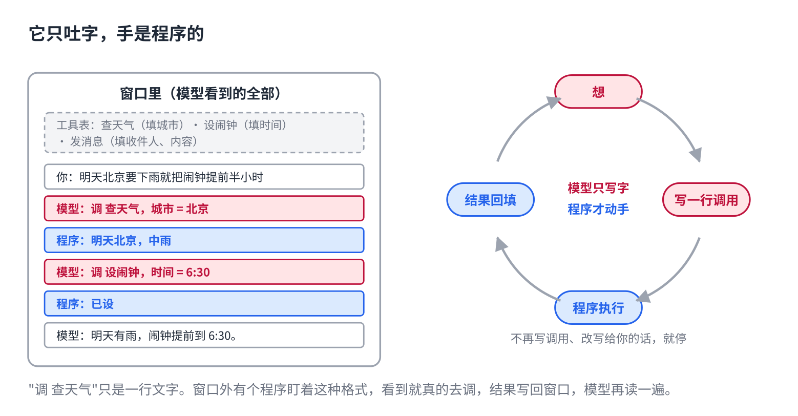
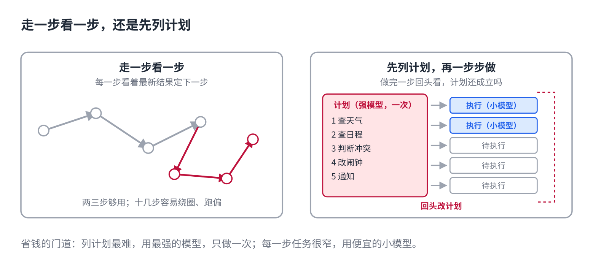
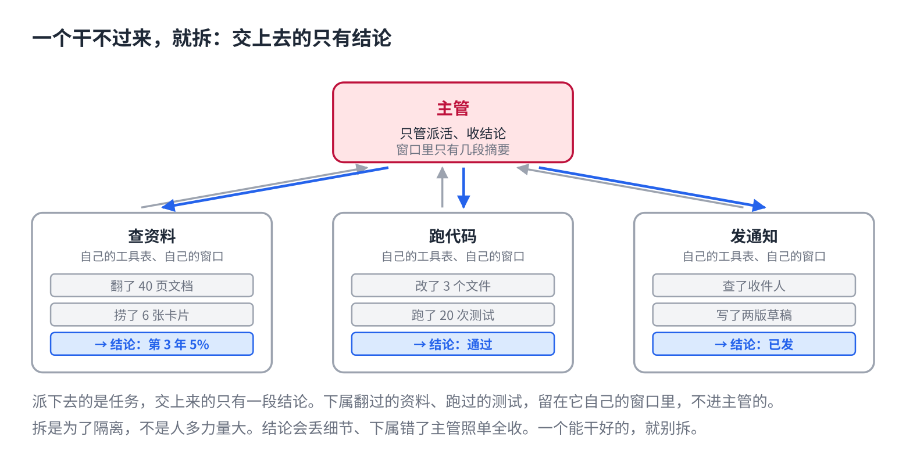

# AI 怎么自己动手干活：Agent 是什么

> 公众号版 **第 13 课**（应用篇，篇名放摘要）。对应仓库 [06 · RAG 与 Agent](../06-rag-and-agents.md) 的 Agent 部分和 [08 · Agent 架构](../08-agent-architectures.md)：工具表、想调看再想的循环、模型只生成文字、先列计划、拆成多个。面向零基础读者，约 1300 字。

你说："查一下明天北京的天气，要下雨就把闹钟提前半小时。"它真的查了，也真的改了闹钟。

第 4 课讲过，模型只会一个词一个词地吐字。它哪来的手？

它没有手。它只是把"要做什么"**写成了一行字**，外面有个程序读到这行字，替它动手。

## 它的手，是一张工具表

先给模型一张表，列出它能用的工具，每个工具三样：名字、干什么、要填什么。比如"查天气：填城市""设闹钟：填时间"。这张表塞进窗口，跟你的话放在一起。

模型读完，吐出一段格式固定的文字："调 查天气，城市 = 北京"。**这只是文字**，跟它平时吐的字没区别。

窗口外面有一个程序在盯着。它看到这段格式，就真的去调天气接口，拿到"明天北京，中雨"，写回窗口。

模型再读一遍窗口，看到中雨，接着吐："调 设闹钟，时间 = 6:30"。程序照做，把"已设"写回去。模型再读一遍，这次不写调用了，写了一句给你的话："明天有雨，闹钟提前到 6:30。"

## 一个循环，四步

整件事是一个循环：**想，写调用，程序执行，结果回填，再想。**什么时候停？它不再写调用、改成写给你的话，就停了。

这里最该记住的一句：**模型永远只生成文字。**连"我要调工具"都是一行文字。它自己碰不到外面的世界，碰的是那个程序。一个能干活的 AI，就是模型加一个循环，加一张工具表，加一个替它执行的程序。这套东西叫 Agent。

知道这个，几件事就说得通了：

- **它说"已经帮你发了"，其实没发。**多半是它写了一行调用，程序那边失败了，或者根本没有这个工具，它按第 4 课的方式编了一个。真发没发，看程序的记录，别信它的话。
- **危险的事前可以拦一下。**删文件、付钱这类工具，程序在执行前停下来问你一句。这是在循环里加一步，模型不知道也不需要知道。
- **上两课讲的查资料、记笔记，也是工具。**要不要查、查什么，现在是模型自己决定的。它在窗口里看到一张表，表里有一项叫"查资料"。

## 走一步看一步，还是先列计划

上面那种是走一步看一步：每一步都看着最新结果决定下一步。简单的事够用，两三步就完了。

事情一长，十几二十步，走一步看一步就容易跑偏、绕圈、重复劳动。做法是**先列计划再动手**：让模型先吐一份分步清单，然后一步一步执行，每做完一步回头看看，计划还成立吗，不成立就改。

顺便有个省钱的门道：列计划最难，用最强的模型，只做一次；执行每一步任务很窄，用便宜的小模型。

## 一个干，还是分几个

工具表一长，几十个工具，模型选工具就开始选错；窗口里塞满每一步的结果，第 5 课讲过，中间的东西它会看丢。

这时候拆：一个当主管，只管派活和收结论；几个下属各管一摊，各自有自己的工具表和窗口。下属翻过的长篇资料、跑过的二十次测试，都留在它自己的窗口里，**交给主管的只有一段结论。**

拆的目的是隔离，不是"人多力量大"。拆了以后结论会丢细节，下属错了主管照单全收，还更慢更难查。所以一个能干好的，就别拆。

## 自己试一下（2 分钟）

- 找一个能"深度研究"或"联网"的助手，让它做一件两步的事，比如"查一下今天的汇率，算 500 美元是多少人民币"。看它的步骤展开：先写了一次查询，拿到结果，再算。那就是循环在跑。
- 问它："你现在有哪些工具？"它念出来的，就是那张表。

## 同一个模型，为什么有的助手更好用

到这里，一个模型怎么被用起来讲完了：查资料、记笔记、动手干活，全是围着模型搭的东西。

问题来了：同一个模型，这套东西搭得好不好，差别有多大？为什么同一个模型接进两个产品，一个好用一个不好用？下一课。

## 关于这个系列

《从零看懂大模型》是一个系列：从文字怎么变成数字，一路讲到模型怎么生成、权重怎么训练出来、大模型怎么被高效服务，再到 RAG、Agent 和记忆系统。每一课都拿顶尖开源项目的真实源码当课本。

这是第 13 课。完整目录见合集「从零看懂大模型」。
