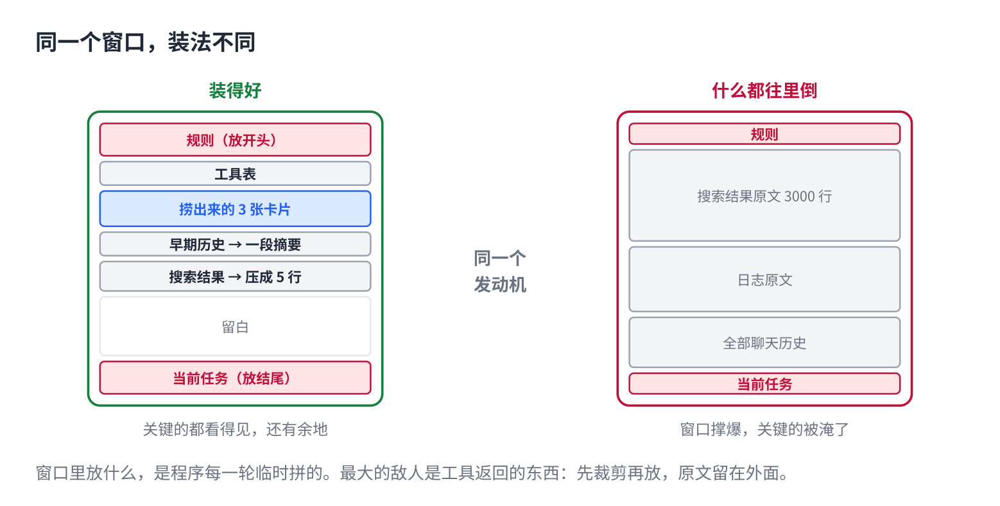
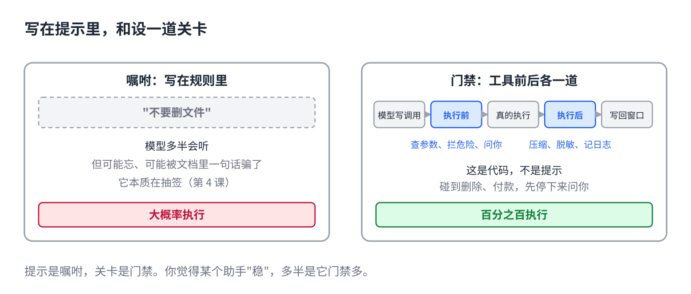
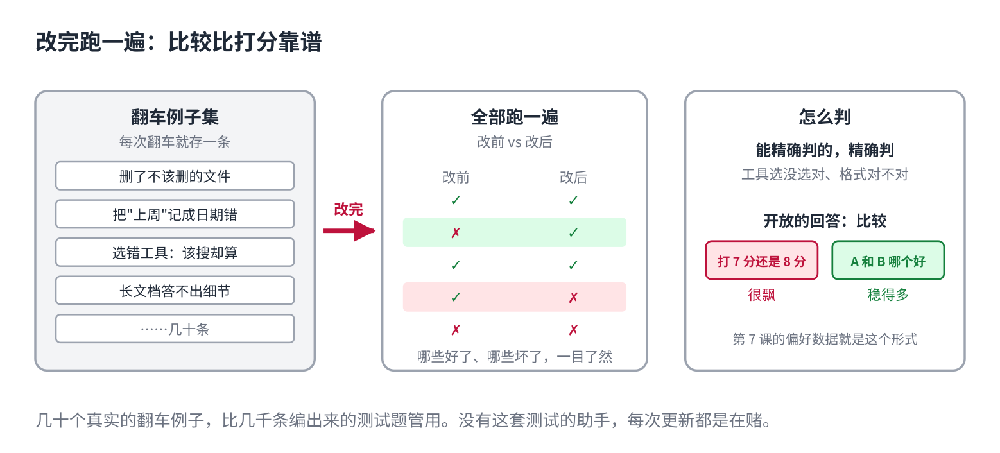

# 同一个 AI 模型，为什么有的助手更好用

> 公众号版 **第 14 课**（应用篇，篇名放摘要）。对应仓库 [11 · 上下文工程与 Agent Harness](../11-context-engineering-and-harness.md)：窗口每轮由程序组装、工具返回是最大的敌人、hooks 是代码不是提示、skills 是用到才装的手册、改了不测等于在赌。面向零基础读者，约 1300 字。

同一个 Claude 模型，在 Claude Code 里能自己修完一个 bug，在某个套壳 App 里连文件都读不全。同一个 GPT，在 ChatGPT 里和在 Cursor 里，手感完全是两个东西。

模型一模一样，差在哪？

差在**外面那辆车**。模型是发动机，前三课讲的查资料、记笔记、工具循环，都是车上的零件。这辆车整个叫 harness，翻译过来大概是"驾驭装置"，这一年 AI 圈说的"harness 工程"就是在造这辆车。同一个发动机装进不同的车，开起来天差地别，所以 Claude Code、Cursor、Codex、Copilot 接的模型差不多，用起来却各有各的脾气。

这一课讲车上最要紧的四样。

## 每一轮，窗口里放什么

第 5 课说它每轮只看窗口。窗口里放什么，不是你决定的，是程序每一轮临时拼的：规则、工具表、捞出来的资料、笔记、聊天历史、工具返回的结果。七八个来源，抢一个有限的窗口。

最大的敌人是工具返回的东西。你说的话几十个字，可它搜一次几千行，读一份日志几万字，其中大半没用。全塞进去，窗口几轮就撑爆；更糟的是**把关键的淹了**，第 5 课讲过，塞得越多每条分到的注意力越少。

好的车先裁剪再放：大段结果压成几行摘要，原文留在外面，需要再取。聊久了，把早期历史压成一段摘要。位置也讲究：开头结尾记得牢，规则放开头，当前任务放结尾，大块资料放中间。

差的车什么都往里倒。发动机一样，但它看到的是一堆垃圾里埋着一句话。

## 该用代码保证的，别指望它自觉

在规则里写"不要删文件"，它多半会听。但多半不是一定：它可能忘，可能被文档里一句话骗了，第 4 课讲过它本质在抽签。

好的车不靠它自觉。工具执行的前后各设一道关卡，是代码，不是提示。执行前：查参数，拦危险命令，碰到删除、付款先停下来问你。执行后：把大段输出压缩、把密码脱敏、记一条日志。

**提示是嘱咐，关卡是门禁。**嘱咐可能忘，门禁百分之百执行。你觉得某个助手"稳"，多半是它门禁多。

## 经验做成文件，用到才装

怎么给仓库提问题、怎么发版本、怎么写周报，这类经验以前锁在一段长提示里，或者锁在某个人脑子里。

现在做成一个文件夹：一句话说明"什么时候用"，正文是一步步怎么做，旁边放模板和脚本。这个文件夹叫 Skill，Claude 和 Claude Code 里的"技能"就是它，你在 ChatGPT 里装的 GPTs、豆包里的智能体，思路是一路的。平时只有那一句话进窗口，当索引；任务对上了，才把全文装进来。

这跟工具的分工是：**工具给手，skill 给手册。**手册里可以写"这一步调哪个工具"。工具这边还有一个统一接口叫 MCP，上一课提过：一个工具做一次，ChatGPT、Claude、Cursor 都能接，装之前看清它要什么权限。

## 改了不测，等于在赌

换了一段提示，加了一个工具，是变好了还是变坏了？感觉不靠谱，同一个问题它每次答的都不一样。

做法跟软件测试一样：**每次翻车的例子存下来**，改完把这批全跑一遍，看哪些好了、哪些坏了。几十个真实的翻车例子，比几千条编出来的测试题管用。

怎么判好坏？能精确判的，比如工具选没选对、格式对不对，就精确判。真正开放的回答，打分很飘，"A 和 B 哪个好"稳得多。第 7 课教它好坏用的偏好数据，就是这个形式：一个拿来训，一个拿来测。

好的助手背后有一套这样的测试，每改一处跑一遍。没有的，每次更新都是在赌。

## 自己试一下（2 分钟）

- 同一个问题，同一个模型，在 ChatGPT 或 Claude 官网问一次，再在某个接了它的第三方 App 里问一次。差别就是那辆车。
- 让 Claude Code 或 Cursor 删一个文件。它停下来问你，那是关卡；直接删了，这辆车没装刹车。

## 模型越大越聪明吗

到这里，从字怎么变成数字，到怎么搭成一个能干活的产品，整条线讲完了。

还剩一个所有人都在问的问题：模型越大越聪明吗？参数、数据、算力三样怎么配？为什么小模型现在也够用了？下一课。

## 关于这个系列

《从零看懂大模型》是一个系列：从文字怎么变成数字，一路讲到模型怎么生成、权重怎么训练出来、大模型怎么被高效服务，再到 RAG、Agent 和记忆系统。每一课都拿顶尖开源项目的真实源码当课本。

这是第 14 课。完整目录见合集「从零看懂大模型」。
