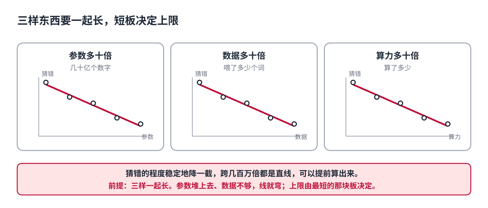
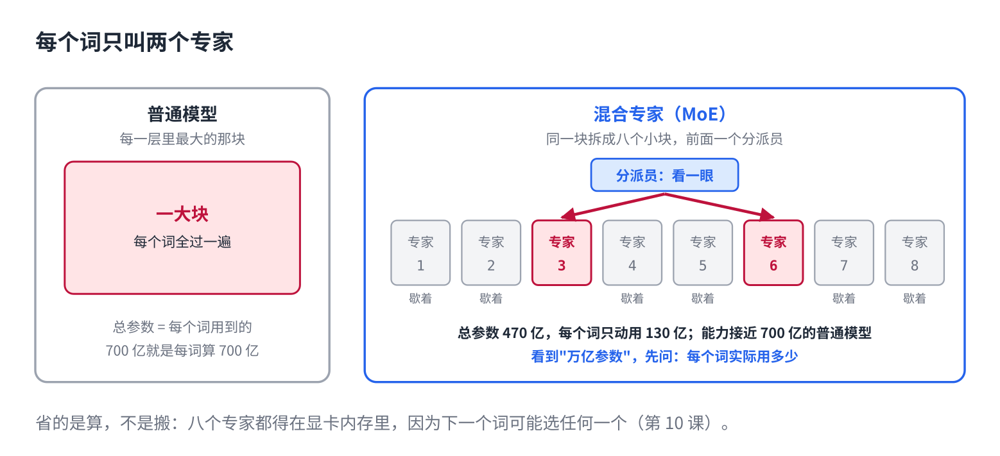

# AI 模型越大越聪明吗

> 公众号版 **第 15 课**（训练原理篇，篇名放摘要）。对应仓库 [13 · 规模与架构](../13-scaling-and-moe.md)：scaling law、Chinchilla 与过度训练、蒸馏、MoE、推理时算力。面向零基础读者，约 1400 字。主线合集收尾课。

三年前，GPT-3 有 1750 亿个参数，是当时的天花板。今天，Qwen 和 Llama 的几十亿参数小模型能装进手机，很多事做得比它还好。DeepSeek-V3 号称 6710 亿参数，价格却只有同级别的几分之一。

那到底是越大越聪明，还是不是？

答案是：**大有用，但"大"已经不是一个数字了。**这一课把它拆成四件事。

## 第一件：三样东西要一起长

第 6 课讲过，模型是靠猜下一个词、猜错就改数字练出来的。研究者做过一件很朴素的事：把模型从小到大训一遍，把数据从少到多喂一遍，记下每种搭配最后猜得多差。

画出来是三条直线：**参数多十倍，猜得稳定地好一截；数据多十倍，也好一截；算力多十倍，还是好一截。**跨了几百万倍都是直线，可以提前算出来。这叫 scaling law，规模定律。

但有个前提：三样得一起长。参数堆上去、数据不够，线就弯了；数据够、模型太小，线也弯。**上限由最短的那块板决定。**

## 第二件：同样的钱，别都花在"大"上

前几年大家读那三条线，读出的结论是"钱主要花在参数上"。于是模型做到两三千亿参数，喂的数据却停在三千亿个词左右，平均每个参数只分到一个词。

2022 年有人重做了实验，结论反过来：**参数和数据要等比例长，每个参数大约配二十个词。**他们用同样的算力，训了一个只有七百亿参数、但喂了一万四千亿个词的模型，几乎每项都赢了自家两千八百亿参数的那个。

参数少四分之三，反而更强，还便宜四倍。第 10 课说过，每吐一个词要把所有参数搬一遍，参数少搬得就少。**这是"越大越聪明"第一次被公开推翻：不是不该大，是在固定的钱下，大过头就是浪费。**

## 第三件：小模型为什么现在够用了

上面那条法则算的是训练的钱。可一个模型训一次，要被用几亿次。把用的钱也算进去，最划算的做法就变成：**模型再小一点，数据再多得多。**

于是这两年的小模型，吃的数据是那条法则的近百倍。一个八十亿参数的模型，按法则该喂一千六百亿个词，实际喂了十五万亿。多花的是训练的钱，换来每次回答都便宜。

还有第二个来源：**跟大模型学。**DeepSeek-R1 发布时附带的那几个小尺寸版本，就是拿 R1 的答案教 Qwen 和 Llama 学出来的。第 6 课的训练是拿真实文本当老师，这一招是拿大模型当老师：让大模型先答一遍，小模型照着它的答案学。大模型的答案比网上的原文干净、一致，同样大小的小模型这么学出来，比只吃原文的强一截。你听到的"蒸馏"就是这个。

合起来：**今天一个八十亿参数的模型，吃了百倍的数据，其中一部分还是更强模型的答案。它赢三年前一个八百亿的，不奇怪。**

## 第四件：大而不贵

顶部的模型确实还在变大，但变大的方式换了。

第 3 课讲过模型是一层一层的。每一层里最占地方的一块，可以拆成八个并排的小块，叫"专家"，前面加一个很小的分派员。每个词进来，分派员看一眼，只交给最合适的两个专家算，另外六个歇着。

这样一来，模型的总参数是八个专家加起来的，很大；但**每个词实际过的只有两个专家**，算起来像一个小模型。Mixtral 总共四百七十亿参数，每个词只动用一百三十亿，能力接近同期七百亿参数的普通模型。DeepSeek-V3 更极端：六千七百亿总参数，每个词只动用三百七十亿，这是它便宜的主要原因。这叫 MoE，混合专家，现在 GPT、Gemini、Qwen 的大号版本多半都是这个结构。

所以你看到"万亿参数"，先问一句：每个词实际用多少。

有一个代价第 10 课能解释：省的是算，不是搬。八个专家都得在显卡内存里，因为下一个词可能选任何一个。它适合服务几百万人的公司，不适合你在一台电脑上跑。

## 还有第四样：回答时多想一会儿

前面三样都是训练时花的。第 8 课的推理模型加了第四个能花算力的地方：**回答时多想**。同一个模型，多想十倍时间，在算数和代码上的准确率也按同样的规律往上走。

于是一个小模型多想一会儿，有些题能追上一个大模型一步到位。训练时的大，和回答时的慢，可以互相换。

## 自己试一下（2 分钟）

- 打开 DeepSeek 或 Qwen 的模型介绍页，看它写的是"总参数"还是"激活参数"。两个数差好几倍的，就是 MoE。
- 同一道算术题，给豆包或 DeepSeek 开着深度思考，给一个不带思考的大模型各答一次。看谁对。

## 十五课到此

从第 1 课它数不清三个 r，到这一课它为什么大而不贵，一个模型怎么认字、理解、生成、练出来、花多少钱、怎么用起来，讲完了。

想知道这些原理怎么落到你每天用的工具上，另一个合集《动手用大模型》十五篇，每篇解决一个具体的烦。

## 关于这个系列

《从零看懂大模型》是一个系列：从文字怎么变成数字，一路讲到模型怎么生成、权重怎么训练出来、大模型怎么被高效服务，再到 RAG、Agent 和记忆系统。每一课都拿顶尖开源项目的真实源码当课本。

这是第 15 课，主线到此完结。完整目录见合集「从零看懂大模型」。
