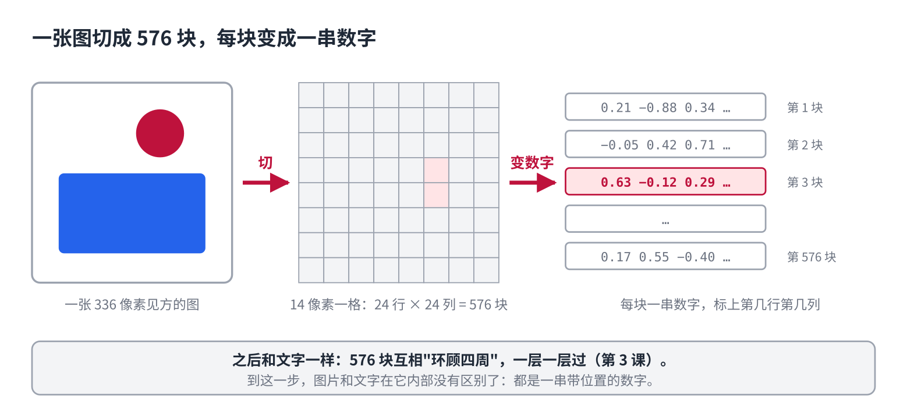
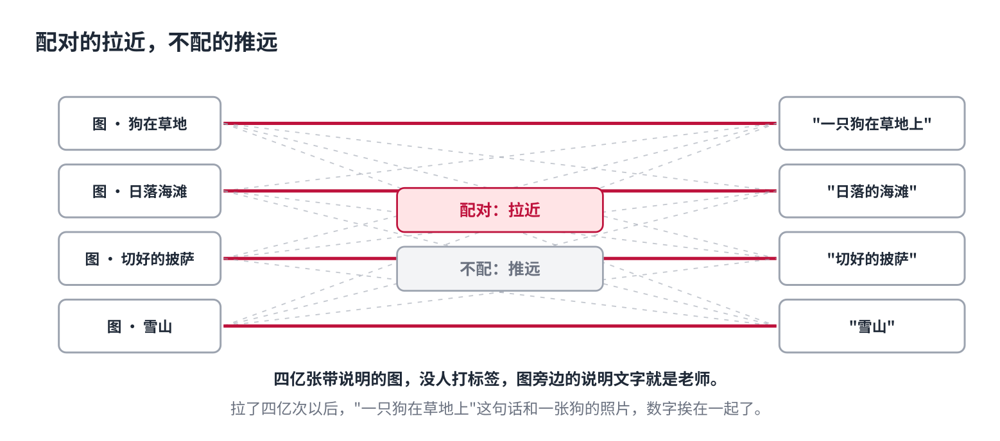
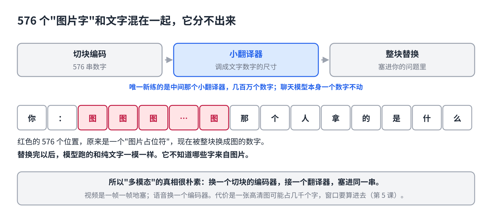

# AI 怎么看懂一张图

> 公众号版 **第 16 课**（认字篇，篇名放摘要）。对应仓库 [14 · 多模态与扩散模型](../14-multimodal-and-diffusion.md) 前三节：ViT 切块、CLIP 对比学习、LLaVA 把图变成 token 塞进序列。面向零基础读者，约 1300 字。主线第二季第一课。

你把一张照片发给 AI，问"图里那个人拿的是什么"，它答对了。

第 1 课说过，它看到的不是字，是一串数字。那它看到的也不是图？

对。**它没有眼睛，它把图也变成了那串数字。**

## 图片切成方块，方块当字

第 1 课讲过，文字进模型前先切成碎片，每个碎片查表变成一串数字。图片没有"字"可切，做法直接得近乎粗暴：**把图切成小方块，每个方块当一个字。**

一张 336 像素见方的图，按 14 像素一格切，得到 24 行 24 列，576 个方块。每个方块里的像素值过一道变换，变成一串数字，再标上"我在第几行第几列"，第 3 课的位置信息。

之后就是第 3 课那套：576 个方块互相"环顾四周"，一层一层过。图里的"上下文"，就是方块和方块之间的关系。

到这一步，图片和文字在它内部**没有区别**了：都是一串带位置的数字。

## 先让图和话住到同一个空间

光会切方块还不够。第 2 课说"国王"和"王后"的数字挨得近，可"狗"这个词的数字和一张狗的照片的数字，离多远没人管过。它们是两套坐标。

2021 年的一个方法把两套坐标对齐了。做法很朴素：从网上抓四亿张带说明文字的图，每次拿一批，比如一百张图配一百句话。**配对的那一对，把两串数字拉近；不配对的九十九对，推远。**没有人打标签，图和它旁边的说明文字就是全部的老师。

拉了四亿次以后，"一只狗在草地上"这句话的数字，和一张狗在草地上的照片的数字，挨在一起了。于是可以用文字搜图、用图搜图，第 11 课的"找最近的"直接能用。

## 塞进聊天模型：它不知道哪些字来自图

上面那个模型只会"比"，不会"聊"。要让聊天模型看图，最省事的办法不是重练，是**把图变成它认识的东西，直接塞进去。**

三步：图过上面那个切方块的模型，得到 576 串数字；过一个很小的"翻译器"，把这些数字调成和文字数字同样的尺寸；然后在你的问题里，图片占位的地方**整块替换成这 576 串数字**。

关键在最后一步：替换完以后，聊天模型跑的和纯文字一模一样。**它不知道哪些字来自图片。**一张图就是 576 个字，你的问题"那个人拿的是什么"和这 576 个字在同一次注意力里互相看，所以它答得出来。

整个改造里唯一新练的是那个小翻译器，几百万个数字，用几十万对图文就练好了。聊天模型本身一开始一个数字都不动。这是它便宜的原因，也是"多模态"这个词的真相：**换一个切块的编码器，接一个翻译器，塞进同一串。**视频是一帧一帧地塞，语音换一个编码器。

## 它为什么会看错

知道图是 576 个方块，几种典型的错就有了解释：

- **数不清图里有几个人。**方块是固定的网格，人可能横跨三个方块，也可能两个人挤在一个方块里。它看到的不是"人"，是方块。
- **读不了小字。**一张大图缩到 336 像素再切，小字早就糊成一块。新一点的模型把大图切成几张小图各自编码，token 数翻几倍，能读了，但更贵。
- **看着图编。**第 4 课的老问题，图没看清的地方，它照样挑最顺的词接下去。

## 自己试一下（2 分钟）

- 发一张有很多人的合影，问它"几个人"。多试两张，看它在什么样的图上数错。
- 发一张带小字的截图，先问它字是什么，再把那块裁大发一遍。第二次准得多，那是方块变大了。

## 它能看图了，能画图吗

看图是把像素变成数字。反过来呢，从一句话，变出一张图？

用的不是同一套。下一课：**AI 怎么画出一张图。**

## 关于这个系列

《从零看懂大模型》是一个系列：从文字怎么变成数字，一路讲到模型怎么生成、权重怎么训练出来、大模型怎么被高效服务，再到 RAG、Agent 和记忆系统。每一课都拿顶尖开源项目的真实源码当课本。

这是第 16 课。完整目录见合集「从零看懂大模型」。
