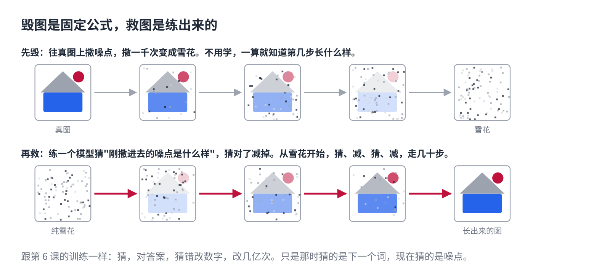
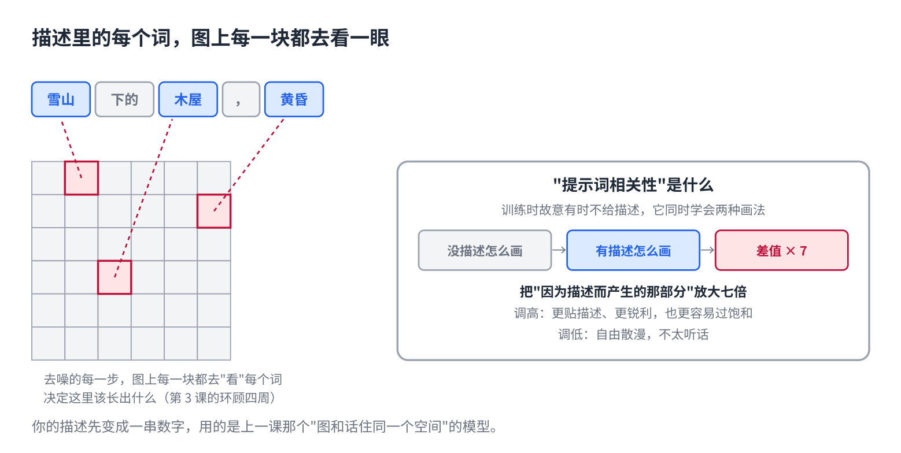
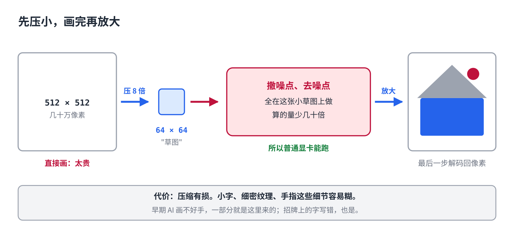

# AI 怎么画出一张图

> 公众号版 **第 17 课**（生成篇，篇名放摘要）。对应仓库 [14 · 多模态与扩散模型](../14-multimodal-and-diffusion.md) 第四、五节：加噪去噪、文字怎么指挥、潜空间。面向零基础读者，约 1300 字。

在即梦、Midjourney 或 ChatGPT 里打一行字"雪山下的木屋，黄昏"，几秒钟后一张图出来了。可灵、Sora 出视频，也是同一套。

第 4 课讲过，聊天模型是一个词一个词往外吐。画图能不能也一个像素一个像素吐？一张普通的图有几十万个像素，一个一个吐太慢；而且像素之间没有"从左到右"的顺序。

所以画图用的是另一套办法，叫**扩散**。Stable Diffusion 名字里那个 Diffusion 就是它，Midjourney、即梦、可灵底下也都是这个。它的思路听起来像反着来的：**先学怎么把一张图毁掉，再学怎么把它救回来。**

## 先毁：往图上撒噪点

拿一张真实的图，往上撒一点随机噪点。再撒一点。撒一千次，图彻底看不出来了，变成一片雪花。

这一步不用学，是固定的公式。撒到第几步是什么样，一算就知道。

## 再救：练一个"去噪的"

现在练一个模型，给它看"撒了 500 步噪点的图"，让它猜：**刚才撒进去的噪点是什么样的？**猜对了，减掉，图就干净一点。

这跟第 6 课的训练一模一样：猜，对答案，猜错了改数字，改几亿次。只是那时猜的是下一个词，现在猜的是噪点。

练好以后画图就是：从一片纯雪花开始，让它猜噪点，减掉一部分，再猜，再减，走几十步，**雪花里慢慢长出一张图。**每一步减多少有讲究，早期要走一千步，现在走二十步就够，所以从几分钟变成了几秒。

## 文字怎么指挥画面

上面那个模型没有文字也能画，只是画出来的是"训练时见过的随便一张"。要按你的描述画，把文字塞进去。

你那行字先变成一串数字，用的正是上一课那个"图和话住同一个空间"的模型。然后在去噪的每一步里，**图上的每一块都去"看"描述里的每一个词**，决定这里该长出什么。这就是第 3 课的"环顾四周"，只是这次是图的方块看文字的词。

还有一个几乎所有画图工具都在用的招。训练时故意有时候不给描述，让它同时学会"有描述怎么画"和"没描述怎么画"。画的时候两种都算一遍，取差值，**把"因为描述而产生的那部分"放大七倍**。图更贴描述、更锐利，也更容易过饱和。你在画图工具里调的那个"提示词相关性"，就是这个倍数。

## 在小图上画，最后再放大

直接在几十万个像素上走几十步，太贵。做法是先练一个压缩器，把图压小 8 倍：512 像素见方的图，变成 64 见方的"草图"。撒噪点、去噪点全在这张草图上做，最后一步再把草图放大回像素。算的量少了几十倍，这是它能在普通显卡上跑的原因。

代价是压缩有损：小字、细密的纹理、手指，这些细节容易糊。早期 AI 画不好手，一部分就是这里来的。

## 看图和画图，为什么是两套

上一课看图，是"切块的编码器加聊天模型"；这一课画图，是"扩散"。因为两件事的产出不一样：看图的产出是文字，交给已经很会写字的聊天模型最省事；画图的产出是像素，逐个吐太慢，像素也没有天然顺序，扩散并行去噪更合适。

这两年有人在试把两套合成一个模型。还没定论。

## 自己试一下（2 分钟）

- 在即梦或 Stable Diffusion 的网页版里，同一句描述，把"提示词相关性"或"引导强度"调到 2 和 15 各画一次。低的自由散漫，高的贴描述但颜色发腻。
- 让它画一张带中文招牌的街景，看字对不对。多半不对，那是压缩器糊掉的细节。新一点的模型专门补了这块，所以字越来越对。

## 第二季

从第 1 课它数不清三个 r，到第 15 课它为什么大而不贵，是文字的一季。第 16、17 课把图接了进来。后面还会有新课，看这个领域先长出什么。

## 关于这个系列

《从零看懂大模型》是一个系列：从文字怎么变成数字，一路讲到模型怎么生成、权重怎么训练出来、大模型怎么被高效服务，再到 RAG、Agent 和记忆系统。每一课都拿顶尖开源项目的真实源码当课本。

这是第 17 课。完整目录见合集「从零看懂大模型」。
