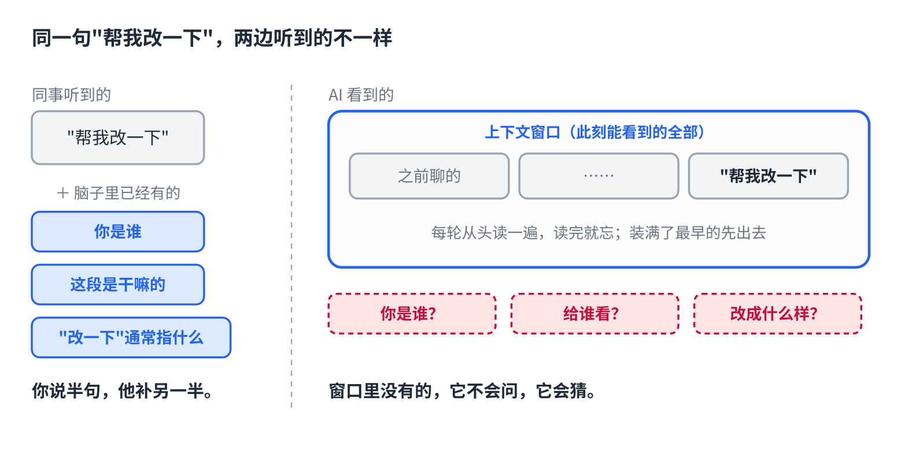

# 跟 AI 说话，为什么不能像跟人说话

> 合集二「动手用大模型」第 1 篇。对话层，任何聊天软件都能试。原理挂主线第 5 课（上下文窗口）。约 1100 字。生成 HTML 用 `--blue`。

你跟同事说"帮我改一下这段"，他改完基本是你要的。

你跟 AI 说同一句话，它要么改得面目全非，要么只换了两个标点，要么回你一段"好的，以下是修改建议"。

同一句话，为什么对人够用，对它不够？

## 差在哪：它没有你以为它有的三样东西



同事听到"帮我改一下"的时候，脑子里已经有三样东西：**你是谁**、**这段是干嘛的**、**"改一下"通常指什么**。你说半句，他补另一半。

AI 一样都没有。它能看到的只有一块东西：**你这轮发的文字，加上这个对话里之前的内容**。每一轮它都把这块从头读一遍，读完就忘，而且这块有上限，聊久了最早的会被挤出去。

所以"帮我改一下"对它来说，是一道信息不全的题。它不会问你，它会猜。猜出来的就是那些面目全非的版本。

（这一块叫上下文窗口，为什么有上限、为什么中间的容易丢，主线第 5 课讲过，文末有链接。）

## 三条写法

**1. 别让它猜。** 改什么、给谁看、改到什么程度，三样说全。"帮我改一下这段"变成"把这段改得更口语，给不懂技术的同事看，不超过 100 字，术语保留"。

**2. 要求放头尾，材料放中间。** 它对开头和结尾记得最牢，中间最容易丢。长材料贴在中间，要求写在最前面，结尾再用一句话重复最要紧的那条。

**3. 每个字都占地方。** 客套话、背景故事、你的心情，它都要读，但都变不成动作。一条消息一件事。聊长了新开一个对话，把要保留的要求原样带过去。

## 直接复制

同一句"帮我改一下"，按上面三条改写：

```
任务：把下面这段改得更口语，读者是不懂技术的同事。
限制：不超过 100 字；专业术语保留原文；只输出改后的文字，不要解释。

【原文】
（贴在这里）

再说一遍：不超过 100 字，只输出改后的文字。
```

把"改得更口语"换成你的任务，"不懂技术的同事"换成你的读者，其他不用动。

## 常见坑

- **把背景当要求。** "我老板明天要看，我很急"，它不知道这句怎么变成动作。写成"先给一版能用的，不用完美"。
- **一条消息塞五件事。** 它会挑最好答的那件做，剩下的糊弄过去。一件一件来。
- **聊到第 20 轮还在同一个对话里改。** 你最开始的要求要么被挤出窗口，要么掉进了中间。新开对话，把要求原样贴过去，比在旧对话里喊"你忘了我说的吗"有用得多。

## 关于这个系列

《动手用大模型》每篇解决一个用 AI 时的具体的烦：讲一条跨工具的原理，配一个能直接抄的模板。这篇的原理见《从零看懂大模型》第 5 课「发给 AI 的长文档，它为什么总忘了前面」。

本篇模板已收进「阅读原文」。
