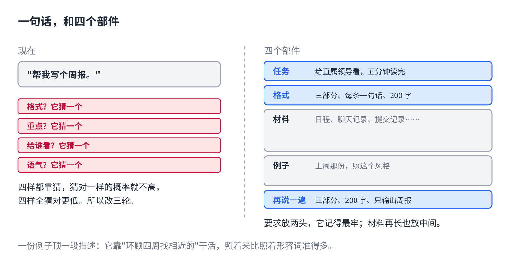

# 让 AI 一次做对：一条要求的四个部件

> 合集二「动手用大模型」规划位第 2 篇（对话层），发布顺序第 3 篇，摘要按发布顺序编号。任何聊天软件都能试。原理挂主线第 3 课（注意力）和第 5 课（上下文窗口）。约 1000 字。生成 HTML 用 `--blue`。

"帮我写个周报。"

它写了。格式不是你们组的，重点不是你做的，语气像给客户的汇报。你改了三轮，比自己写还慢。

不是它不会写周报，是这句话里少了它要的东西。

## 它要的四样东西



上一篇说过，它没有你以为它有的背景，看到什么就照什么做。一条能一次做对的要求，拆开来是四个部件：

**1. 任务。** 做什么，给谁看，做到什么程度。"写周报"是三个字，"给直属领导看的周报，五分钟能读完"才是任务。

**2. 材料。** 它不知道你这周干了什么。把原始材料贴给它：日程、聊天记录、提交记录、随手记的几行。宁多勿少，它会挑。

**3. 格式。** 几段、有没有标题、要不要列表、多少字。你们组有固定模板，就把模板贴上。

**4. 例子。** 贴一份你以前写过、觉得还行的。**一份例子顶一段描述。**它对"照着这个来"的理解，比对"语气要专业但不生硬"准得多，因为它本来就是靠"环顾四周找相近的"来干活的（主线第 3 课）。

## 怎么摆

四个部件不是随便堆。它对开头和结尾记得最牢，中间容易丢（主线第 5 课）。所以：

**任务和格式放开头，材料和例子放中间，结尾用一句话重复最要紧的那条。**材料再长也没关系，它在中间；要求短，在两头。

## 直接复制

"帮我写个周报"扩成四部件版：

```
任务：写一份本周周报，给直属领导看，五分钟能读完。重点是进展和风险，不要流水账。

格式：三个部分——本周进展 / 下周计划 / 需要协调的事。每部分列表，每条一句话，总共不超过 200 字。

【本周材料】
（把日程、聊天记录、提交记录、随手记的东西全贴在这里，不用整理）

【上周周报，照这个风格】
（贴一份你以前写的）

再说一遍：三部分、每条一句话、不超过 200 字，只输出周报本身。
```

把"周报"换成任何东西：会议纪要、产品文案、邮件回复。四个框不变，填的东西换。

## 常见坑

- **用形容词代替例子。**"专业一点""有温度""高级感"，这些词在它那里没有稳定的所指。贴一段你觉得对的，比十个形容词管用。
- **材料整理过头。** 你花半小时把材料整理成要点再给它，等于自己写了一半。原始的贴进去就行，挑重点是它的活。
- **格式说了一半。**"要简洁"不是格式，"每条一句话，不超过 200 字"才是。能用数字的地方用数字。
- **四样都有，但堆成一坨。** 用"任务：""格式：""【材料】"这样的标签隔开，它认得出哪块是哪块。这不是讲究，是它读的时候真的更容易分清谁是谁。

## 关于这个系列

《动手用大模型》每篇解决一个用 AI 时的具体的烦：讲一条跨工具的原理，配一个能直接抄的模板。这篇的原理见《从零看懂大模型》第 3 课「人咬狗和狗咬人，AI 怎么分得清」和第 5 课「发给 AI 的长文档，它为什么总忘了前面」。

模板就在上面那个框里，长按复制。同系列其他篇在合集「动手用大模型」。
