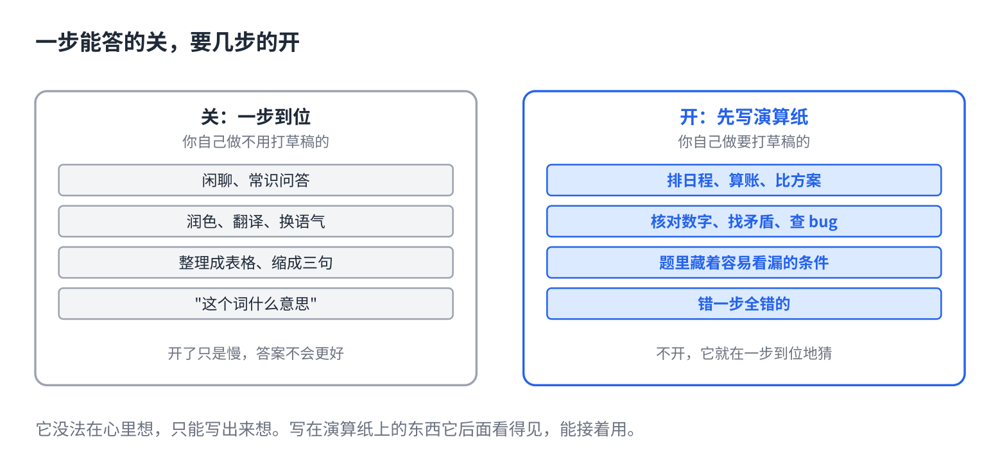

# AI 的深度思考按钮，什么时候该开

> 合集二「动手用大模型」规划位第 3 篇（对话层），发布顺序第 4 篇，摘要按发布顺序编号。任何带"深度思考"开关的聊天软件都能试。原理挂主线第 8 课（推理模型）。约 1000 字。生成 HTML 用 `--blue`。

现在的聊天软件大多有个"深度思考"开关。开着，问个天气也要等二十秒；关着，让它算个账又老出错。

于是很多人要么一直开，要么一直关。两种都在浪费。

## 一句话原因

它没法在心里想，只能写出来想。开关打开，它先写一大段给自己看的草稿，拆问题、试算、自己反驳自己，然后才答。那段草稿是它的"演算纸"，写在演算纸上的东西它后面看得见，能接着用；不写，它就得一步到位地猜（主线第 8 课）。

所以问题只有一个：**这道题一步能答出来吗？**能，演算纸是浪费；不能，没有演算纸它就在猜。

## 该开的三类



- **要几步才能得出答案的。**排日程、算账、比方案、推一个结论。每一步都建立在上一步上，错一步全错。
- **要核对的。**查一段数字加起来对不对、一份合同前后有没有矛盾、一段代码哪里有 bug。核对就是把东西摊开一条条过，那正是演算纸干的事。
- **有陷阱的。**题目里藏着一个容易看漏的条件。它不开思考时会顺着最常见的模式答，开了会先把条件列一遍。

## 别开的三类

- **一眼能答的。**闲聊、常识问答、"这个词什么意思"。开了只是慢，答案不会更好。
- **改文字的。**润色、翻译、换个语气、缩成三句话。这类活靠的是语感，不是推理，开了有时反而改得更生硬。
- **格式转换。**把一段话整理成表格、把列表变成一段话。照着做就行，没什么可想的。

一个判断标准：**你自己做这件事要不要打草稿？**要，就开；不要，就关。

## 直接复制

拿不准的时候，同一个问题开关各跑一次，看两个答案差不差。差，说明这类题以后要开；不差，以后省下这二十秒。

一道拿来试的题，关着答多半错，开着多半对：

```
一个会议室从 9:00 到 12:00 空着。要排三场会：A 需要 1 小时，B 需要 1.5 小时，C 需要 45 分钟。
B 必须在 A 之后开；C 不能是第一场；每场之间留 15 分钟收拾。
问：排得下吗？给出一种排法，或者说明为什么排不下。
```

## 常见坑

- **开了就以为一定对。**演算纸上也会算错。好处是它写出来了，你可以翻，看它哪一步跑偏。答案重要的，看一眼过程。
- **不开，但让它"一步步想"。**这招管用，原理一样，是让它把草稿写在回答里。但不如开关彻底，而且草稿会混在答案里。有开关就用开关。
- **把思考过程当解释。**那段草稿是写给它自己的，有时跳跃、有时自相矛盾然后改口。别拿它当正式的推理报告发给别人。
- **一直开着聊天。**每条消息都等二十秒，还多花钱。日常聊天关掉，碰到要算、要核、要排的再开。

## 关于这个系列

《动手用大模型》每篇解决一个用 AI 时的具体的烦：讲一条跨工具的原理，配一个能直接抄的模板。这篇的原理见《从零看懂大模型》第 8 课「AI 的深度思考，是怎么练出来的」。

模板就在上面那个框里，长按复制。同系列其他篇在合集「动手用大模型」。
