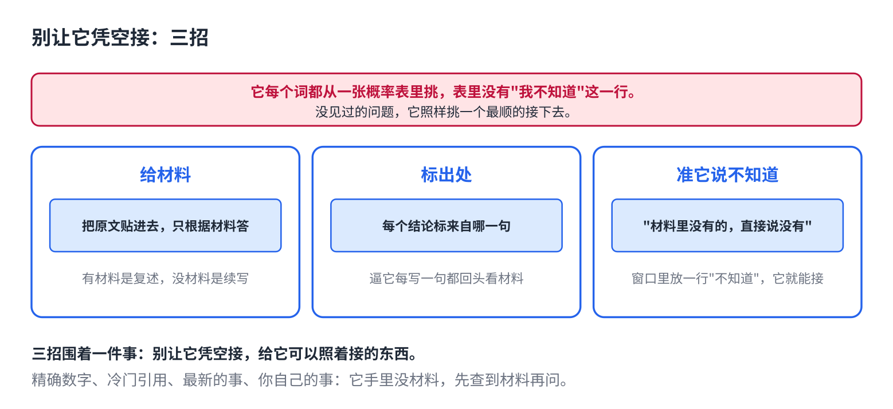

# AI 一本正经地编，三招治它

> 合集二「动手用大模型」规划位第 4 篇（对话层），发布顺序第 5 篇，摘要按发布顺序编号。任何聊天软件都能试。原理挂主线第 4 课（采样与幻觉）。约 1000 字。生成 HTML 用 `--blue`。

你问它某本书的作者，它答了，还给了出版年份。你问它某条法规第几条，它背出来了，连条文都有。

去查，书不存在，条文是拼的。

它不是在骗你。它是**没法不答**。

## 一句话原因

它每吐一个词，都是从一张概率表里挑。表里有几万个词，唯独没有"我不知道"这一行。碰到它没见过的问题，表还是照样给，只是每个词的概率都不高，它照样挑一个最顺的接下去（主线第 4 课）。

顺的话不等于真的话。所以三招都围着一件事：**别让它凭空接，给它可以照着接的东西。**

## 三招



**1. 给材料。**你问的事，把原文贴进去，让它只根据材料答。有材料，它是在"复述"；没材料，它是在"续写"。差别就在这。材料放中间，要求放两头，上上篇讲过。

**2. 要它标出处。**每个结论后面标来自材料哪一句、哪一页。标不出的删掉。这一招的作用不只是方便你核对，是**逼它每写一句都回头看材料**，编的空间就小了。

**3. 准它说不知道。**明确写一句"材料里没有的，直接说没有，不要推测"。概率表里没有"我不知道"，但你可以在窗口里放一个，它就有了可以接的那一行。

## 哪些问题天生不该问它

有些问题，三招用了也不保险，因为它手里就没有材料：

- **精确的数字和日期。**某年 GDP、某个 API 的参数名、某人的生日。
- **冷门的引用。**书名、论文、判例、某人说过的话。越冷门越容易编，因为它见得少。
- **最新的事。**它的知识有截止日期，之后的它不知道，但它不会说不知道。
- **你自己的事。**你公司的数据、你上周的会议。它没见过，只能编。

这四类，要么先自己查到材料再问它，要么让它联网并点开链接核对。

## 直接复制

```
只根据下面的材料回答。每个结论后面用【第 N 段】标出处。
材料里没有的信息，直接写"材料中没有"，不要推测，不要用你自己的知识补。

【材料】
（贴在这里，长的话分段编号）

问题：……

再说一遍：每句都要有出处，没有出处的不要写。
```

## 常见坑

- **让它"确认一下"。**它会确认得更肯定，编得更细。质疑它没用，给它材料才有用。
- **出处也可能是编的。**它可以编一个"第 3 段"。所以出处要能点开核，贴了材料它才没法编。
- **联网了就放心。**联网只是多了材料，它照样可能把两个网页的话拼在一起。看链接，别只看总结。
- **拿它当搜索引擎。**搜索引擎找到什么给什么，找不到给空；它找不到给顺的。这两样东西的空手方式不一样。

## 关于这个系列

《动手用大模型》每篇解决一个用 AI 时的具体的烦：讲一条跨工具的原理，配一个能直接抄的模板。这篇的原理见《从零看懂大模型》第 4 课「AI 为什么每次回答都不一样」。

模板就在上面那个框里，长按复制。同系列其他篇在合集「动手用大模型」。
