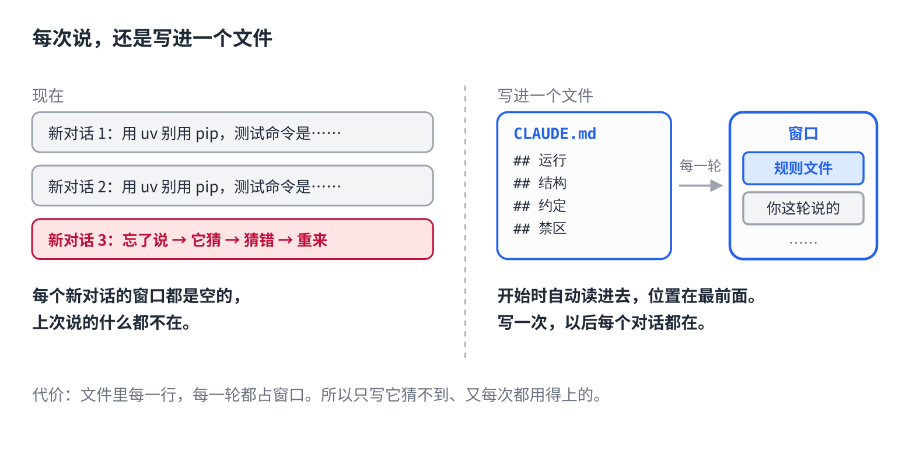

# 每次都要跟 Claude Code 重复的话，写进一个文件

> 合集二「动手用大模型」规划位第 5 篇（规则层第一篇），发布顺序第 2 篇，摘要按发布顺序编号。以 Claude Code 为例，Cursor / Codex 同理。原理挂主线第 5 课，写法来自仓库 12 篇。约 1000 字。生成 HTML 用 `--blue`。

你有没有这种话，每开一个新对话都要说一遍：

"用中文回复。""这个项目用 uv，别用 pip。""测试命令是 `uv run pytest`。""`migrations/` 里的文件别动。"

忘了说，它就猜。猜错了，重来。

## 为什么它记不住

它每一轮只看窗口里的东西，新开的对话窗口是空的，上次说的什么都不在（主线第 5 课）。它不是不听话，是真的没看见。

工具留了一个口子：**一个固定的文件，每一轮开始时自动读进窗口。**Claude Code 里叫 `CLAUDE.md`，Cursor 里叫 `.cursorrules`，通用的叫 `AGENTS.md`，都是同一样东西。写进去的话，你就再也不用说了。



## 三步

**1. 在项目根目录建一个文件。** 以 Claude Code 为例：新建 `CLAUDE.md`；或者在对话里输入 `/init`，它会看一遍项目自动生成一份初稿，你再删改。

**2. 只写四类东西。** 怎么跑（确切的命令）、目录在哪（五到十行）、跟别处不一样的约定、禁区。判断标准一句话：**它自己发现不了、又每次都需要的**，才写。

**3. 个人偏好放个人文件。** "用中文回复""别客套"这类是你的习惯，不是项目的规矩。Claude Code 里放 `~/.claude/CLAUDE.md`，只对你生效。项目文件是全组人共用的，别把自己的口味写进去。

## 直接复制

```
# 项目规则

## 运行
- 安装：`uv sync`；测试：`uv run pytest -q`；起服务：`uv run uvicorn app.main:app`
- 提交前跑 `uv run ruff check .`，红了别提交

## 结构
- `app/` 业务代码，`app/api/` 路由，`app/core/` 领域逻辑
- `tests/` 与 `app/` 同构；`migrations/` 由工具生成，别手改

## 约定
- 包管理只用 uv，不用 pip
- 提交信息格式：`type(scope): 一句话`

## 禁区
- 不改 `migrations/` 里已有文件；不删 `tests/` 里的用例
- 涉及 `.env`、密钥、生产配置的改动先问人
```

把命令、目录、约定换成你项目的。删掉不适用的行，别留空板块。二十来行是正常长度，超过五十行要警惕。

## 常见坑

- **写成教科书。** "Python 用四空格缩进""变量名要清晰"。这些它比你熟，写进去只占地方，还稀释了真正重要的那几行。只写和通用做法**不一样**的。
- **越写越长。** 每出一次问题加一条，半年后两百行，它对每一行的注意力都被摊薄了。每加一条问一句"这是每一轮都需要的吗"，不是就删。
- **写会变的东西。** 当前分支、版本号、正在做的功能。过时的规则比没有规则更糟，它会照着错的做。
- **把"别删文件"当保险。** 写在文件里它多半会照做，但"多半"不是"一定"，聊长了它可能忘。真正要保证的事，得用代码拦，后面 Hook 那篇讲。

## 关于这个系列

《动手用大模型》每篇解决一个用 AI 时的具体的烦：讲一条跨工具的原理，配一个能直接抄的模板。这篇的原理见《从零看懂大模型》第 5 课「发给 AI 的长文档，它为什么总忘了前面」；写法的完整版在仓库第 12 篇。

模板就在上面那个框里，长按复制。同系列其他篇在合集「动手用大模型」。
