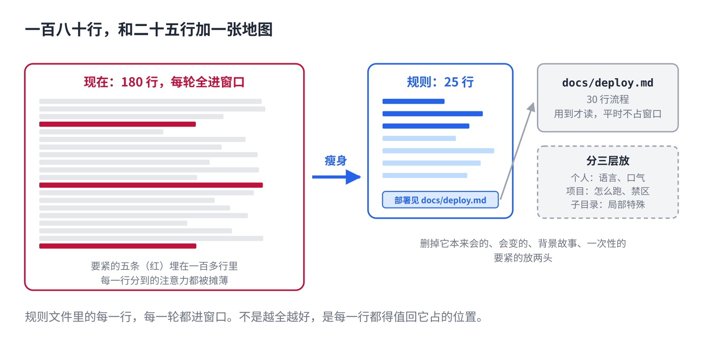

# 给 AI 的规则越写越长，它反而不读了

> 合集二「动手用大模型」规划位第 6 篇（规则层），发布顺序第 6 篇。以 Claude Code 为例，聊天 App 的"自定义指令"同理。原理挂主线第 5 课，写法来自仓库 12 篇。约 1000 字。生成 HTML 用 `--blue`。

第 2 篇让你建了一个规则文件。用了两个月，它长这样：一百八十行，每次它犯错你就加一条。

然后你发现，最早写的那几条它开始不听了。加得越多，越不听。

## 一句话原因

规则文件里的每一行，**每一轮都会进窗口**。窗口有限，塞得越多，每一行分到的注意力越少（主线第 5 课）。一百八十行里真正要紧的五条，被一百七十五条稀释了。而且它对开头和结尾记得牢、中间容易丢，那五条多半正好在中间。

规则不是越全越好。是**每一行都得值回它占的位置**。

## 三个办法



**1. 每加一条，问一句：这是每一轮都需要的吗？**不是，就别加。已经在里面的，按同一个问题过一遍，四类直接删：

- 它本来就会的。"代码要清晰""注意错误处理"，它见过几十亿遍，写了只占地方。
- 会变的。版本号、当前分支、这周在做的功能。过时的规则比没有更糟，它会照着错的做。
- 背景故事。项目历史、为什么当年选了这个框架。它不需要理解，只需要照做。
- 一次性的要求。那是当时那轮对话该说的话，说完就该走。

**2. 分三层放。**你自己的习惯（回复语言、口气）放个人文件，跟着你走；团队约定（怎么跑、目录、禁区）放项目文件，进版本管理；只对某个子目录有效的（特殊的构建、特殊的格式）放那个子目录里。混在一起，每个人每一轮都在读别人的偏好。

**3. 长的细节移出去，留一行指路。**部署流程三十行，别放规则里。单独放一个文件，规则里只写"部署流程见 `docs/deploy.md`"。它用到的时候自己会去读，不用的时候这三十行不占窗口。

## 直接复制

给现有规则文件瘦身，照这个顺序过一遍：

```
第一遍：删。逐行问"这是每一轮都需要的吗"。
  - 通用常识 → 删
  - 版本号、分支名、当前任务 → 删
  - 背景、理由、历史 → 删
  - 只用过一次的要求 → 删

第二遍：搬。
  - "用中文回复"这类个人习惯 → 搬到个人文件
  - 只对某个目录有效的 → 搬到那个目录

第三遍：移。
  - 超过五行的流程说明 → 单独文件，规则里留一行"见 xxx"

目标：二十到四十行。超过五十行，回到第一遍。
```

## 常见坑

- **只加不删。**这是所有规则文件的默认命运。定一个规矩：加一条，就得找一条删，或者说明为什么不能删。
- **把手册整个贴进来。**API 文档、风格指南、几百行。它用到的可能是其中三行，其余每轮白读。移出去，留指路。
- **重要的埋在中间。**最要紧的两三条放最前面，禁区放最后面。中间放不那么要紧的。
- **不知道有没有用。**拿几个它以前做错的任务，带着规则跑一遍、不带跑一遍。没差别，说明这份文件在占窗口却没干活。

## 关于这个系列

《动手用大模型》每篇解决一个用 AI 时的具体的烦：讲一条跨工具的原理，配一个能直接抄的模板。这篇的原理见《从零看懂大模型》第 5 课「发给 AI 的长文档，它为什么总忘了前面」；写法的完整版在仓库第 12 篇。

模板就在上面那个框里，长按复制。同系列其他篇在合集「动手用大模型」。
