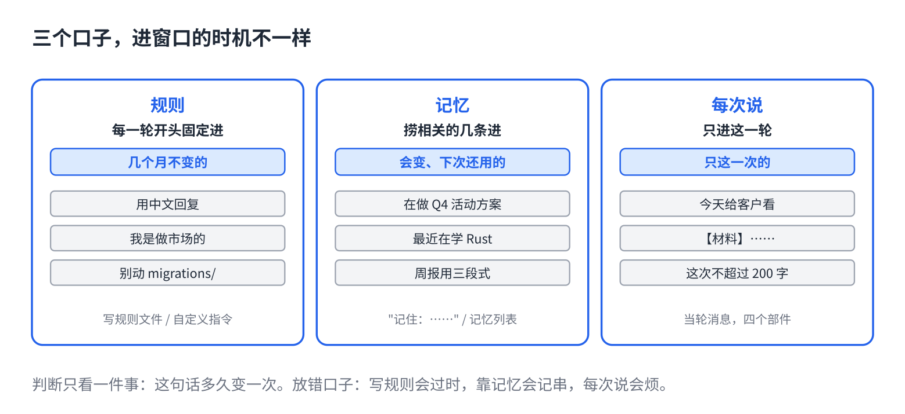

# 让 AI 记住你：规则、记忆、每次说

> 合集二「动手用大模型」规划位第 7 篇（规则层），发布顺序第 7 篇。任何聊天软件都能用，以 Claude Code 和带"记忆"功能的聊天 App 为例。原理挂主线第 5 课、第 12 课，写法来自仓库 07、12 篇。约 1000 字。生成 HTML 用 `--blue`。

有些话你不知道该放哪。

写进规则文件，过两周情况变了，它还照旧的做。开着"记忆"功能，它记了一堆你随口说的，该记的反而没记。每次说，烦。

三个口子，各有各的用处。放错了口子，就是上面三种烦。

## 一句话原因

三个口子进窗口的**时机不一样**：

- **规则**：每一轮开头固定进，一字不差，不管这轮聊什么。
- **记忆**：它先从本子里捞跟这轮相关的几条，只进这几条（主线第 12 课）。
- **每次说**：只进这一轮。

所以判断只看一件事：**这句话多久变一次。**

## 三堆



**几个月不变的，进规则。**回复语言、你的职业、固定的输出格式、永远不碰的禁区。每一轮都需要、每一轮都一样，正好每轮固定进。

**会变、但下次还用得上的，进记忆。**正在做的项目、最近的偏好、上次聊到哪。写进规则会过时，每次说又麻烦。让它记在本子上，下次相关的时候自己捞出来。

**只这一次的，每次说。**这一轮的任务、这一份材料、今天特殊的要求。写进哪都是污染。

## 三步

**1. 把你反复说的话列出来。**打开最近十个对话，看开头你都说了什么。

**2. 按"多久变一次"分三堆。**几个月不变、几周会变、只这一次。

**3. 各归各位。**第一堆写进规则文件或设置里的"自定义指令"（第 2 篇）；第二堆明确告诉它"记住：……"，或者在设置里看记忆列表，手动加；第三堆写进当轮的消息里，用第 3 篇那四个部件。

## 直接复制

分堆的时候对照这张表：

```
进规则（几个月不变）
  用中文回复 / 我是做市场的 / 先结论后理由 / 不要客套话
  项目：用 uv 不用 pip / 测试命令 / 别动 migrations/

进记忆（会变，下次还用）
  我现在在做 Q4 的活动方案
  最近在学 Rust，例子尽量用 Rust
  上次说周报用三段式，领导觉得可以

每次说（只这一次）
  今天这份要给客户看，正式一点
  【材料】……
  这次不超过 200 字
```

## 常见坑

- **记忆功能默认开着，什么都记。**它会把"顺便说一句我不吃香菜"和"我们公司的核心指标是 X"记在一起。定期打开记忆列表，删掉不该记的。记错的一条，之后每次都会被捞出来，越用越像真的。
- **会变的写进规则。**"当前在做登录功能"三周后还在，它就一直以为你在做登录。会变的不进规则。
- **指望它记住上轮说的。**新对话窗口是空的（第 1 篇）。没进规则、没进记忆的，它就是不知道。
- **记忆记错了去跟它吵。**吵没用，那条还在本子上。去设置里删掉或改掉那条。
- **三堆混着写在一条消息里。**它分不清哪句是长期的哪句是临时的。分开放，各归各位。

## 关于这个系列

《动手用大模型》每篇解决一个用 AI 时的具体的烦：讲一条跨工具的原理，配一个能直接抄的模板。这篇的原理见《从零看懂大模型》第 5 课「发给 AI 的长文档，它为什么总忘了前面」和第 12 课「AI 怎么记住上次聊的」。

模板就在上面那个框里，长按复制。同系列其他篇在合集「动手用大模型」。
