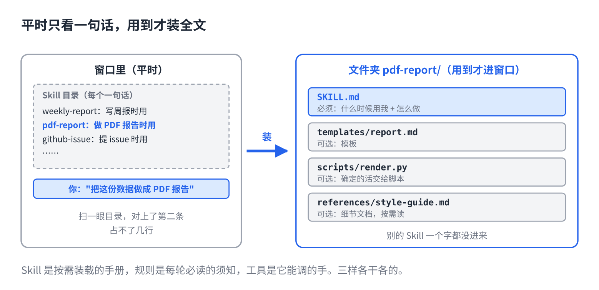

# AI 的 Skill 到底是什么：一个文件夹

> 合集二「动手用大模型」规划位第 8 篇（Skill 层第一篇），发布顺序第 8 篇。以 Claude Code 为例。原理挂主线第 5 课、第 14 课，写法来自仓库 11、12 篇。约 1000 字。生成 HTML 用 `--blue`。

到处都在说 Skill。有人说是"高级提示词"，有人说是"插件"，有人说是"给 AI 装技能"。

都不算错，也都没说到点上。Skill 就是**一个文件夹**。里面一个说明文件，写着"什么时候用我"和"怎么做"；旁边可以放模板、脚本、参考资料。

## 它解决的是什么烦

你有一件事经常让 AI 做：写周报、出 PDF 报告、给仓库提问题。每次都要把"怎么做"说一遍，说得还不一样，结果也不一样。

第 2 篇教你写进规则文件。但规则文件每一轮都进窗口（第 6 篇），你不能把十件事的做法全塞进去，那就是十份手册每轮都读。

Skill 的办法是：**平时只让它看到一句话，用到的时候才装全文。**

## 它怎么被用起来



每个 Skill 的说明文件开头有一句话，说"什么时候用我"。所有 Skill 的这一句合在一起，是一张目录，平时只有这张目录在窗口里，占不了几行。

你说"把这份数据做成 PDF 报告"。它扫一眼目录，看到有一条写着"用户要把数据做成 PDF 报告时用我"，对上了，这才把那个文件夹里的说明全文装进窗口，照着做。别的 Skill 一个字都没进来。

所以一句话结论：**Skill 是按需装载的手册，规则是每轮必读的须知。**主线第 14 课说的"经验做成文件，用到才装"，就是它。

## 三样东西别混

| | 是什么 | 举例 |
|---|---|---|
| 规则文件 | 每一轮都读的须知 | 用什么命令跑测试、哪些目录别动 |
| Skill | 用到才装的手册 | 怎么出一份 PDF 报告，分几步、用什么模板 |
| 工具 | 它能调的手 | 读文件、跑命令、查天气 |

手册里可以写"这一步调哪个工具"。规则里可以写"碰到 X 类任务看 Y 手册"。三样各干各的。

## 直接复制

一个最小的 Skill，就是一个文件夹加一个文件。以 Claude Code 为例，放在项目里的 `.claude/skills/` 下面，或者个人目录的 `~/.claude/skills/` 下面：

```
weekly-report/
└── SKILL.md

SKILL.md 的内容：
---
name: weekly-report
description: 用户要写周报、周总结、给领导的本周汇报时使用。不用于日报和月报。
---

## 步骤
1. 让用户贴本周的原始材料（日程、聊天记录、提交记录），不要让用户先整理。
2. 按 templates 里的三段式写：本周进展 / 下周计划 / 需要协调的事。
3. 每条一句话，总共不超过 200 字。

## 完成标准
- 领导五分钟能读完
- 每条都能对应到材料里的某一件事
```

建好以后，下次说"写周报"，它自己会去装这份手册。你什么都不用再说。

## 常见坑

- **把 Skill 当提示词库堆。**二十个 Skill 互相重叠，它选不准。一个 Skill 一件事，重叠的合并。
- **把该进规则的写进 Skill。**"用中文回复"是每轮都需要的，写进 Skill 只有用到那个 Skill 时才生效。
- **把背景知识写进去。**这个领域是什么、为什么这么做，它不需要。只写步骤和标准。
- **建了不知道有没有被用。**问它"你刚才用了哪个 Skill"，或者看它的操作记录。下一篇讲怎么让它被用上。

## 关于这个系列

《动手用大模型》每篇解决一个用 AI 时的具体的烦：讲一条跨工具的原理，配一个能直接抄的模板。这篇的原理见《从零看懂大模型》第 5 课「发给 AI 的长文档，它为什么总忘了前面」和第 14 课「同一个 AI 模型，为什么有的助手更好用」；写法的完整版在仓库第 12 篇。

模板就在上面那个框里，长按复制。同系列其他篇在合集「动手用大模型」。
