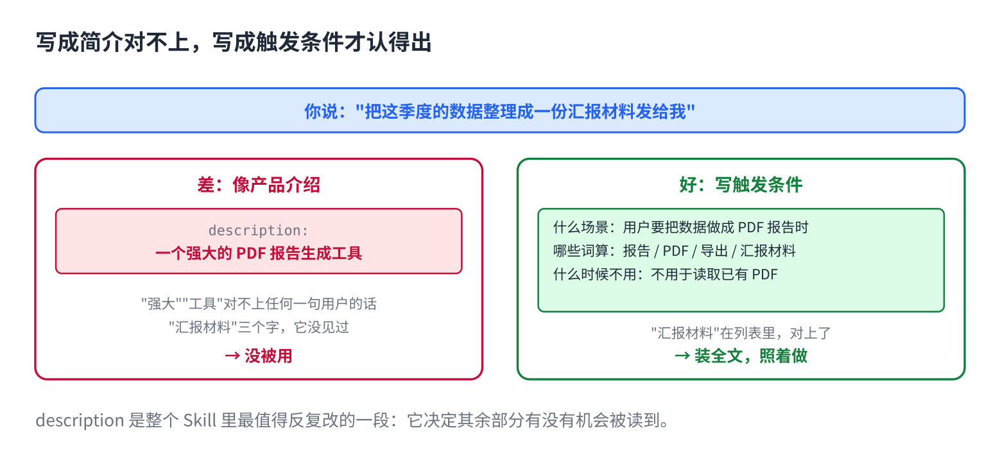

# 给 AI 写第一个 Skill：简介决定会不会被用

> 合集二「动手用大模型」规划位第 9 篇（Skill 层），发布顺序第 9 篇。以 Claude Code 为例。原理挂主线第 5 课，写法来自仓库 12 篇。约 1000 字。生成 HTML 用 `--blue`。

上一篇建了一个 Skill。你用了一周，发现两种情况：该用的时候它没用，不该用的时候它用了。

手册写得再好，没被翻开等于没写。翻不翻开，只看一句话：开头那句 description。

## 一句话原因

上一篇说过，平时窗口里只有所有 Skill 的 description 列表。它拿你的话跟这张列表比，对上了才装全文。所以 description 不是"这个 Skill 是什么"的简介，是**触发条件**：出现什么任务、什么词、什么文件时该用我。

写成简介，它对不上；写成触发条件，它才认得出来。

## description 怎么写



三个部件：

**1. 什么场景用。**写用户会怎么说，不写这个 Skill 多厉害。"用户要把数据做成 PDF 报告时使用"，不是"一个强大的报告生成工具"。

**2. 哪些词算。**用户不会每次都说标准词。把同义的都列上："报告""PDF""导出""汇报材料"都算。

**3. 什么时候不用。**"不用于读取或解析已有 PDF"。这半句和前面一样重要，它防止错触发。错触发比漏触发常见，因为人写的时候总想写宽一点。

## 正文怎么写

正文是给**已经决定用这个 Skill** 的它看的，所以只写怎么做，四块：

- **步骤**：按顺序，每步一个动作。
- **判断标准**：什么情况走哪条路，什么算做完。
- **输出格式**：产物长什么样，叫什么名字，放哪。
- **检查清单**：交付前核对什么。

不写的：这个领域的背景知识（它会）、为什么这么设计（它不需要）、客套话。

## 直接复制

一份写全的 Skill，可以照着改：

```
---
name: pdf-report
description: 当用户要把数据、表格或分析结果做成 PDF 报告时使用；提到"报告""PDF""导出""汇报材料"都算。不用于读取或解析已有 PDF。
---

## 步骤
1. 确认三件事：报告给谁看、要几页、有没有指定模板。缺一项就问，不要猜。
2. 用 templates/report.md 起草，章节顺序：结论 → 数据 → 方法 → 附录。
3. 数字一律来自用户给的文件，不补、不估。找不到的写"缺数据"。
4. 运行 scripts/render.py 生成 PDF。不要手写 PDF。

## 完成标准
- 第一页能在 30 秒内看懂结论
- 每个图表有标题和数据来源
- 文件名：{主题}-{日期}.pdf

## 交付前核对
- [ ] 数字和源文件一致
- [ ] 没有"待补充"占位
- [ ] 配色符合 references/style-guide.md
```

第 4 步的脚本和最后那份规范文件，下一篇讲为什么要单独放。

## 常见坑

- **description 写成产品介绍。**"强大""智能""一站式"，这些词对不上任何一句用户的话。写用户会说的话。
- **写得太宽。**"处理文档相关任务"会把一半的任务都吸进来。宽了就加"不用于"。
- **正文写成教程。**从"什么是 PDF"讲起。它会，删掉，只留步骤。
- **步骤里藏着判断。**"适当调整格式"不是步骤。什么情况调成什么样，写清楚，或者写"问用户"。
- **改了 description 不测。**准备五个该触发的说法、五个不该触发的，各试一遍。第 11 篇专门讲怎么测。

## 关于这个系列

《动手用大模型》每篇解决一个用 AI 时的具体的烦：讲一条跨工具的原理，配一个能直接抄的模板。这篇的原理见《从零看懂大模型》第 5 课「发给 AI 的长文档，它为什么总忘了前面」；写法的完整版在仓库第 12 篇。

模板就在上面那个框里，长按复制。同系列其他篇在合集「动手用大模型」。
