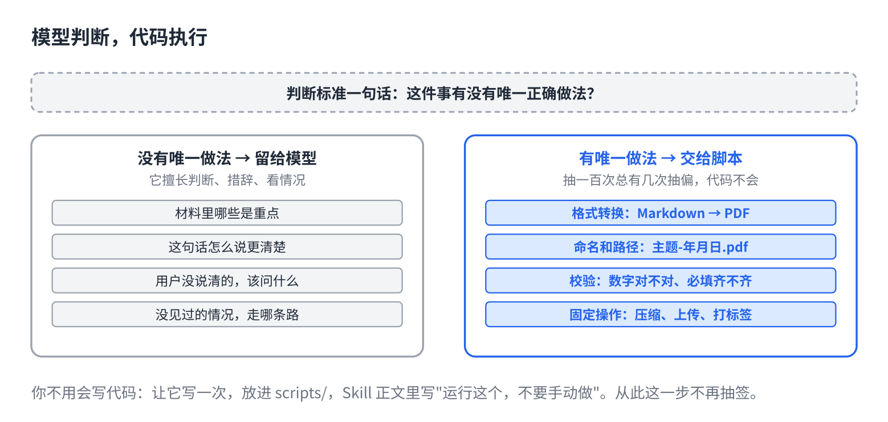

# 能确定的事，别让 AI 猜

> 合集二「动手用大模型」规划位第 10 篇（Skill 层），发布顺序第 10 篇。以 Claude Code 为例。原理挂主线第 4 课、第 14 课，写法来自仓库 11、12 篇。约 1000 字。生成 HTML 用 `--blue`。读者不写代码：脚本让 AI 自己写。

你让它出一份报告，十次里有八次文件名格式不一样，两次日期算错，偶尔图表配色跟上次不同。

每一次它都"差不多对"。可"差不多"这三个字，正是它擅长的，也正是你不需要的。

## 一句话原因

它每个词都是从概率表里抽的（主线第 4 课）。这让它擅长判断、擅长措辞、擅长"看情况"；但凡是**每次都该一模一样**的事，抽签就是错误的工具。抽一百次，总有几次抽偏。

所以分工只有一条：**模型判断，代码执行。**该由代码保证的，不交给它自觉（主线第 14 课）。

## 哪些事该交给代码



判断标准一句话：这件事**有没有唯一正确做法**。有，交给脚本；没有，留给模型。

交给脚本的：

- **格式转换。**Markdown 变 PDF、表格变图、编码转换。
- **命名和路径。**文件叫什么、放哪、日期怎么写。
- **校验。**数字加起来对不对、必填项齐不齐、链接通不通。
- **重复的固定操作。**压缩、上传、打标签、发通知。

留给模型的：

- 材料里哪些是重点。
- 这句话怎么说更清楚。
- 用户没说清的地方，该问什么。
- 碰到没见过的情况，走哪条路。

## 怎么做：让它自己写脚本

你不用会写代码。**让它写，你放进 Skill 的文件夹里，正文里写一句"运行这个"。**

三步：

**1. 说清楚要固定的是什么。**"文件名格式是 主题-年月日.pdf，日期用今天，主题从第一行标题取。"

**2. 让它写成脚本。**"把上面这条写成一个脚本，放到 scripts/ 下面，我以后每次都跑它。"它写完你跑一次看结果对不对。

**3. Skill 正文里改成调用。**原来写"按规范命名文件"，改成"运行 scripts/name.py 命名文件，不要手动命名"。

从此这一步不再抽签。

## 长材料同样搬出去

配色规范、写作风格指南、术语表，几十上百行。塞进 Skill 正文，每次装 Skill 都全进窗口。放到 references/ 里，正文写一行"配色见 references/style-guide.md"。它需要时自己去读，不需要时不占窗口。第 6 篇对规则文件说的那招，Skill 里一样用。

## 直接复制

改 Skill 正文时对照这张表：

```
原来写的（让它猜）          改成（让代码做）
"按规范命名文件"        →  "运行 scripts/name.py 命名，不要手动命名"
"生成 PDF"              →  "运行 scripts/render.py，不要手写 PDF"
"检查数字是否一致"      →  "运行 scripts/check.py，输出有差异才报给用户"
"注意配色规范"          →  "配色见 references/style-guide.md"
"大约每周五发"          →  （这是会变的，不进 Skill，见第 7 篇）

留给模型的，保持原样：
"判断哪几条是本周重点"  "用户没给日期就问，不要猜"
```

## 常见坑

- **把判断也写成脚本。**"重点"没有唯一答案，硬写成规则只会僵。有唯一做法的才交给代码。
- **脚本写好了，正文没改。**它照样按老话"手动命名"。正文要明确写"运行 X，不要手动做"。
- **让它每次现写脚本。**现写一次抽一次签。写一次，存起来，以后只运行。
- **参考资料塞正文。**几十行规范每次装 Skill 都全进来。搬到 references/，留一行指路。

## 关于这个系列

《动手用大模型》每篇解决一个用 AI 时的具体的烦：讲一条跨工具的原理，配一个能直接抄的模板。这篇的原理见《从零看懂大模型》第 4 课「AI 为什么每次回答都不一样」和第 14 课「同一个 AI 模型，为什么有的助手更好用」；写法的完整版在仓库第 12 篇。

模板就在上面那个框里，长按复制。同系列其他篇在合集「动手用大模型」。
