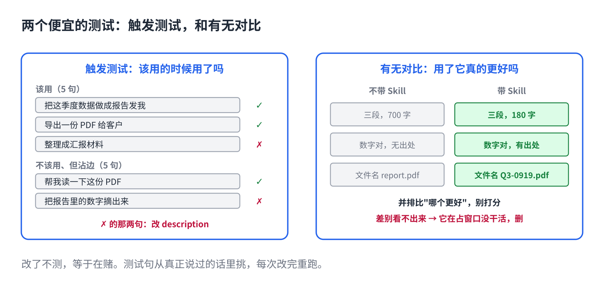

# 给 AI 写的 Skill，怎么知道好不好

> 合集二「动手用大模型」规划位第 11 篇（Skill 层最后一篇），发布顺序第 11 篇。以 Claude Code 为例。原理挂主线第 4 课、第 14 课，写法来自仓库 11、12 篇。约 1000 字。生成 HTML 用 `--blue`。

Skill 写完了，改了三版 description，正文加了两条检查项。然后呢？

多数人的做法是：用几次，感觉还行，就放着。感觉不靠谱。它每次答的都不一样（主线第 4 课），你偶然看到的那两次，可能正好是好的两次。

**改了不测，等于在赌。**主线第 14 课说的这句话，对你自己写的 Skill 一样成立。

## 两个便宜的测试



**1. 触发测试：它会不会在该用的时候用。**

准备十句话：五句是该触发这个 Skill 的说法，五句是不该触发的、但沾边的说法。一句一句说给它，看它有没有装这个 Skill。

关键是那五句"不该触发的"要沾边。写 PDF 报告的 Skill，不该触发的例子是"帮我读一下这份 PDF""把报告里的数字摘出来"。不沾边的（"今天天气怎么样"）测不出东西。

错触发比漏触发常见，因为人写 description 时总想写宽一点。

**2. 有无对比：用了它，结果真的更好吗。**

拿三五个真实任务，带着 Skill 跑一遍，不带跑一遍，把结果并排比。

差别明显，Skill 在干活。差别看不出来，说明它在占窗口却没干活，删掉或者重写。这一步经常让人发现：自己精心写的那份手册，模型不用它也能做到八成。

## 怎么比：比较，别打分

两个结果放一起，问自己"哪个更好"，一致性很高。给一个结果打 7 分还是 8 分，今天和明天都不一样。所以一律成对比：带 Skill 的 vs 不带的，改前的 vs 改后的。

能精确判的就精确判：文件名对不对、格式合不合、数字一不一致。这些不用比，对就是对。

## 直接复制

一份最小的测试单，每次改 Skill 后过一遍：

```
Skill：pdf-report        日期：

触发测试（该用 5 句）                装了？
  把这季度数据做成报告发我            [ ]
  导出一份 PDF 给客户                 [ ]
  ……

触发测试（不该用 5 句，要沾边）      没装？
  帮我读一下这份 PDF                  [ ]
  把报告里的数字摘出来                [ ]
  ……

有无对比（3 个真实任务）           带 Skill 更好？
  任务 1：                            [ ]
  任务 2：                            [ ]
  任务 3：                            [ ]

结论：保留 / 改 description / 改正文 / 删
```

把它存成文件放在 Skill 文件夹里，下次改完直接拿出来跑。

## 常见坑

- **用合成的例子测。**自己编十个理想句子，全过。真实用户不那么说话。测试句从你和同事真正说过的话里挑。
- **只测触发不测效果。**触发了但没帮上忙，等于白装。两个测试都要。
- **一次通过就不再测。**description 改一个词，触发范围就变。每次改，重跑。
- **测出问题只加规则。**触发错了就往 description 里加"不用于"，效果差了就往正文里加条目。加了要再测，加多了回到第 6 篇的问题。
- **十个 Skill 一起测。**一个一个来。互相重叠的 Skill 会互相抢，先合并再测。

## 关于这个系列

《动手用大模型》每篇解决一个用 AI 时的具体的烦：讲一条跨工具的原理，配一个能直接抄的模板。这篇的原理见《从零看懂大模型》第 4 课「AI 为什么每次回答都不一样」和第 14 课「同一个 AI 模型，为什么有的助手更好用」；写法的完整版在仓库第 12 篇。

模板就在上面那个框里，长按复制。同系列其他篇在合集「动手用大模型」。
