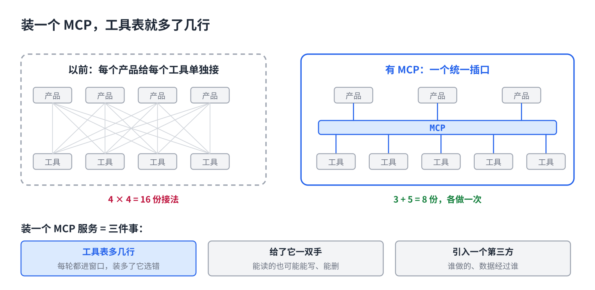

# 给 AI 装手：MCP 是什么、怎么选

> 合集二「动手用大模型」规划位第 12 篇（外接层第一篇），发布顺序第 12 篇。以 Claude Code 为例，聊天 App 的"连接器"同理。原理挂主线第 13 课、第 14 课，写法来自仓库 08、11 篇。约 1000 字。生成 HTML 用 `--blue`。

你想让 AI 直接读你的日历、查公司数据库、往 GitHub 上提问题。到处看到一个词：MCP。装了三个，一个没跑通，一个把权限要了个遍。

MCP 到底是什么？一句话：**给 AI 装手的统一插口。**

## 一句话原因

主线第 13 课讲过，它没有手。它只是在窗口里看到一张工具表，写一行"调这个工具"，外面的程序替它执行。

问题是工具表从哪来。以前每个 AI 产品要给每个工具单独写一份接法，一百个工具乘十个产品就是一千份。MCP 把插口统一了：**工具方按同一个格式做一次，所有支持 MCP 的产品都能接。**一个 MCP 服务，就是一包做好的工具，带名字、说明、要填什么参数，正好就是那张工具表的来源。

它火不是因为技术难，是因为省掉了一千份接法。

## 装一个，等于做了三件事



装一个 MCP 服务，你实际上做了三件事，每件都值得看一眼：

**1. 工具表多了几行。**这几行每一轮都进窗口（第 6 篇讲的那个账）。装十个 MCP，工具表几十行，它选工具就开始选错。

**2. 给了它一双手。**这双手能做的事，它就真的会去做。能读日历的，也可能改日历；能查数据库的，看它有没有写权限。

**3. 引入了一个第三方。**这个服务是谁写的、跑在哪、你的数据经不经过别人的服务器。装之前看清楚。

## 怎么选

三个问题，按顺序问：

- **这件事我真的会反复让 AI 做吗？**只做一次的，复制粘贴比装 MCP 快。
- **它要什么权限？**只读还是能写、能删。能不给写权限就不给。碰到"需要你的全部账户权限"，想一想它为什么需要。
- **谁做的？**官方出的、大项目出的优先。来路不明的，等于把家门钥匙给了陌生人。

## 直接复制

装之前过一遍：

```
MCP 名称：
做什么：
我会反复用吗：  是 / 否（否 → 别装）
权限：          只读 / 可写 / 可删
  能否只给只读：是 / 否
数据经过谁的服务器：本机 / 官方 / 第三方（第三方 → 想清楚）
来源：          官方 / 知名项目 / 个人（个人 → 先看代码或评价）
装完检查：      问它"你现在有哪些工具"，看多了哪几行

每季度过一遍：三个月没用过的，卸掉。
```

## 常见坑

- **能装的都装。**工具表几十行，每轮都进窗口，它反而选错工具、变慢、变贵。只装用得上的。
- **权限一路点同意。**给了删除权限，它某一轮判断失误就真删。第 13 篇讲怎么在危险操作前加一道门。
- **装完不验。**问它"你现在有哪些工具"，看新工具在不在表里。不在，就是没接上。
- **拿 MCP 当 Skill。**MCP 给的是手（能调什么），Skill 给的是手册（怎么做事）。装了 GitHub 的 MCP，它有了提 issue 的手，但"先查重、按模板写"还得靠 Skill 教。

## 关于这个系列

《动手用大模型》每篇解决一个用 AI 时的具体的烦：讲一条跨工具的原理，配一个能直接抄的模板。这篇的原理见《从零看懂大模型》第 13 课「AI 怎么自己动手干活：Agent 是什么」和第 14 课「同一个 AI 模型，为什么有的助手更好用」。

模板就在上面那个框里，长按复制。同系列其他篇在合集「动手用大模型」。
