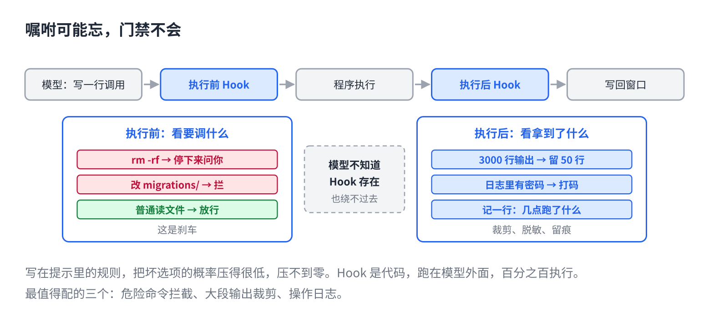

# 写在提示里 AI 可能忘，写成 Hook 就不会

> 合集二「动手用大模型」规划位第 13 篇（外接层），发布顺序第 13 篇。以 Claude Code 为例。原理挂主线第 4 课、第 14 课，写法来自仓库 11 篇。约 1000 字。生成 HTML 用 `--blue`。读者不写代码：hook 让 AI 自己写。

规则文件里写了"不要删 migrations 里的文件"。写了三个月，它一直很听话。

然后有一天，它删了。

不是它变坏了。是"多半会听"从来就不等于"一定会听"。

## 一句话原因

它每个词都是抽签抽出来的（主线第 4 课）。写在提示里的规则，能把"删文件"那个选项的概率压得很低，压不到零。聊得久了、规则被挤到窗口中间、或者文档里恰好有一句话把它带偏了，那个很低的概率就发生一次。

主线第 14 课那句话：**提示是嘱咐，Hook 是门禁。**嘱咐可能忘，门禁百分之百执行。

## Hook 是什么



它每次要调工具，程序会在**执行前**和**执行后**各停一下。Hook 就是你放在这两个停顿点上的一小段代码。

**执行前的 Hook**看它要调什么、参数是什么，可以放行、拦下、或者停下来问你。"要删 migrations 里的文件？拦。""要跑 rm -rf？先问我。"

**执行后的 Hook**看它拿到了什么，可以改一改再给它。"命令输出三千行？只留最后五十行。""日志里有密码？打码。""记一条：几点几分它跑了什么。"

关键是：**Hook 是代码，跑在模型外面。**它不知道 Hook 存在，也绕不过去。

## 最值得配的三个

不用配很多。三个就能挡住大部分事故：

**1. 危险命令拦截。**删除、强推、改生产配置、付款。碰到就停下来问你一句。这是刹车。

**2. 大段输出裁剪。**命令跑完几千行，全塞进窗口就是第 6 篇讲的淹没。执行后的 Hook 把它压到几十行，原文存到文件里，需要再看。

**3. 操作日志。**它每调一次工具记一行：时间、工具、参数。出了问题能追到哪一步。第 15 篇讲怎么用这份日志。

## 怎么做：让它自己写

你不用会写代码。跟它说清楚要拦什么，让它写，你看一眼再装上。

```
帮我配三个 Hook：
1. 执行前：如果要运行的命令包含 rm -rf、git push --force，
   或者要修改 migrations/ 目录下的文件，停下来问我确认。
2. 执行后：如果工具输出超过 100 行，只保留最后 50 行，
   完整输出存到 .logs/ 目录，告诉我文件名。
3. 执行后：把每次工具调用的时间、工具名、参数追加到 .logs/tools.log。
写好以后告诉我放在哪、怎么验证它生效了。
```

装完验一次：故意让它删一个 migrations 里的文件，看它是不是被拦下来问你。被拦了，门禁在。

## 常见坑

- **把 Hook 当规则的替代。**规则管"怎么做得好"，Hook 管"什么绝对不能发生"。两样都要，只是别拿规则当保险。
- **Hook 写得太宽。**什么都拦，它每一步都来问你，等于没有 AI。只拦真正不可逆的事。
- **配了不验。**故意触发一次，看它拦不拦。没拦，等于没配。
- **裁剪后原文丢了。**执行后的裁剪要把原文存下来，它有时真的需要回去看第 800 行。

## 关于这个系列

《动手用大模型》每篇解决一个用 AI 时的具体的烦：讲一条跨工具的原理，配一个能直接抄的模板。这篇的原理见《从零看懂大模型》第 4 课「AI 为什么每次回答都不一样」和第 14 课「同一个 AI 模型，为什么有的助手更好用」。

模板就在上面那个框里，长按复制。同系列其他篇在合集「动手用大模型」。
