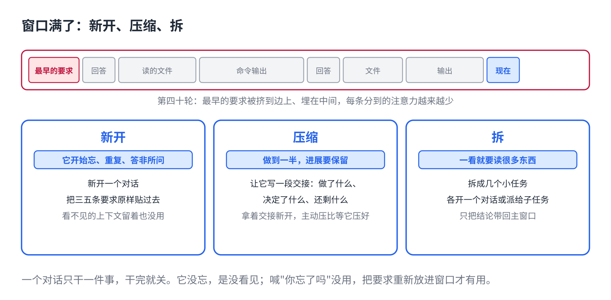

# AI 聊久了变笨：新开、压缩、拆任务

> 合集二「动手用大模型」规划位第 14 篇（外接层），发布顺序第 14 篇。任何聊天软件和编程助手都能用，以 Claude Code 为例。原理挂主线第 5 课、第 14 课，写法来自仓库 11 篇。约 1000 字。生成 HTML 用 `--blue`。

一个对话聊到第四十轮，它开始忘你最早说的要求、重复问过的问题、改一个地方带坏另一个地方。你喊"你忘了我一开始说的吗"，它道歉，然后继续忘。

不是它累了。是窗口满了。

## 一句话原因

它每一轮从头读整个窗口（主线第 5 课）。聊了四十轮，窗口里塞着：你的每句话、它的每次回答、它每次读的文件、每条命令的输出。最早的要求要么被挤出窗口，要么埋在中间被看丢。

而且窗口越满，每一条分到的注意力越少（主线第 14 课）。它不是变笨了，是看东西的效率被摊薄了。

## 三个动作



**1. 新开。**最干脆。任务换了、或者它开始明显犯糊涂，就新开一个对话，把要保留的三五条要求原样贴过去（第 1 篇）。很多人舍不得新开，觉得"上下文都在这里"。可上下文如果它已经看不见，留着也没用。

**2. 压缩。**任务没做完，不想断。让它把到目前为止的进展写成一段摘要：做了什么、决定了什么、还剩什么。然后用这段摘要新开，或者用工具自带的压缩功能。工具自动压缩的时机往往晚了，主动压比等它压好。

**3. 拆。**任务本身就大：读五十个文件、跑二十次测试、查十份资料。别在一个窗口里全做。拆成几个小任务，每个开一个新对话或者派给一个子任务，只把结论带回来（主线第 13 课）。翻过的资料、跑过的日志留在那个窗口里，不进主窗口。

## 什么时候做哪个

- 它开始忘、重复、答非所问 → **新开**。
- 做到一半，进展要保留 → **压缩**再新开。
- 还没开始，一看任务就知道要读很多东西 → 先**拆**。

一个经验：**一个对话只干一件事。**干完就关。

## 直接复制

压缩用的那段话，任务做到一半时发给它：

```
先别继续。把到现在为止的情况写成一段交接，我要拿到新对话里用：
1. 任务目标（一句话）
2. 已经完成的（列表，每条一句）
3. 已经做出的决定和原因（列表）
4. 还没做的（列表，按顺序）
5. 要注意的坑（如果有）
不超过 300 字。只输出交接内容。
```

复制它的回答，新开对话，第一条消息贴上去，加一句"接着做第 4 部分的第一项"。

## 常见坑

- **舍不得新开。**"聊了这么久，新开又要重新说。"重新说三句话，比在一个它已经看不清的窗口里纠缠十轮便宜。
- **压缩等工具自动来。**自动压缩通常在窗口快满时才触发，那时候它已经糊涂了一阵。看到苗头就主动压。
- **让它在主窗口里读大文件。**一份几千行的日志读进来，后面每一轮都带着它。让它先摘要，或者拆给子任务。
- **把"你忘了吗"当解决办法。**它没忘，是没看见。喊没用，把要求重新放进窗口才有用。

## 关于这个系列

《动手用大模型》每篇解决一个用 AI 时的具体的烦：讲一条跨工具的原理，配一个能直接抄的模板。这篇的原理见《从零看懂大模型》第 5 课「发给 AI 的长文档，它为什么总忘了前面」和第 14 课「同一个 AI 模型，为什么有的助手更好用」。

模板就在上面那个框里，长按复制。同系列其他篇在合集「动手用大模型」。
