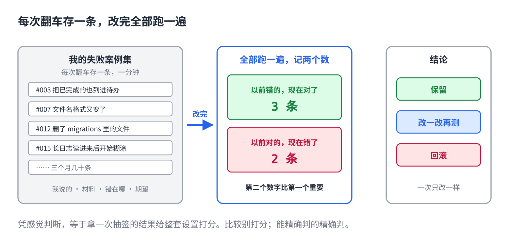

# 给 AI 改了一堆设置，到底有没有变好

> 合集二「动手用大模型」规划位第 15 篇（外接层，全系列最后一篇），发布顺序第 15 篇。任何工具都能用。原理挂主线第 4 课、第 14 课，写法来自仓库 11 篇。约 1000 字。生成 HTML 用 `--blue`。

这个系列到这里，你手里有了：规则文件、几个 Skill、两三个 MCP、三个 Hook。每一样装的时候都觉得有用。

那么，加起来，它到底比三个月前好用了多少？

多数人答不上来。因为一直在改，从来没量过。

## 一句话原因

它每次答的都不一样（主线第 4 课）。你改了一条规则，跑了一次，觉得好了，可能只是这一次抽签抽得好。凭感觉判断，等于拿一次抽签的结果给整套设置打分。

主线第 14 课那句：**改了不测，等于在赌。**第 11 篇对 Skill 说过这话，这一篇把它扩到你的全部设置。

## 自建一个失败案例集



不用造几百条测试题。**每次它翻车，你就存一条。**

存什么：当时你说的原话、你给的材料、它做错的地方、你期望的正确结果。四样，一条一分钟。

存在哪：一个文件夹，一条一个文件，或者一个表格。第 13 篇那份操作日志，是找回"当时说了什么"最方便的地方。

三个月下来，几十条。这几十条是**你自己的**失败模式，比任何通用测试题都准。

## 改完，全部跑一遍

每次改设置，加规则、改 Skill、装 MCP、配 Hook，把案例集全部跑一遍：

- 以前错的，现在对了几条。
- 以前对的，现在错了几条。

第二个数字比第一个重要。改设置最常见的后果，不是没变好，是**这里好了那里坏了**，而你只看了这里。

## 比较，别打分

判断"好了还是坏了"，别给回答打分。7 分和 8 分，今天和明天你自己都打不一样。两个结果并排放，问"哪个更好"，一致性高得多。

能精确判的就精确判：有没有触发该触发的 Skill、有没有被 Hook 拦下、文件名对不对、数字一不一致。这些不用比，对就是对。

## 直接复制

一条案例的格式，存成文件：

```
## 案例 #012 · 2026-09-19
我说的：把上周的会议纪要整理成三条待办发给团队
给的材料：会议纪要.md
它做错的：发了五条，其中两条是已经完成的事
期望：三条，只含未完成的
状态：未修复 / 已修复（改了 xxx）

改设置后跑一遍的记录：
日期     改了什么          修好几条  弄坏几条  结论
09-19    规则加"只列未完成"   1         0        保留
09-26    装了日历 MCP        0         2        回滚
```

## 常见坑

- **造合成题。**自己编出来的题，全是自己想得到的错法。真实翻车的才是它真正的短板。
- **只看修好的，不看弄坏的。**每次改都要两个数字。
- **改三样再测。**测出坏了，不知道是哪样坏的。一次改一样。
- **测一次就信。**它每次不一样。重要的案例跑两三遍，看稳不稳。
- **案例集越攒越大不清理。**修好的案例留着当回归，但已经过时的（工具换了、需求变了）删掉，不然跑一遍要半天，就不跑了。

## 系列到此

十五篇讲完了一件事：**这些东西的读者是模型，不是人。**它每轮从头读、读完就忘、窗口有限、开头结尾记得牢、能用代码保证的别靠它自觉。规则、Skill、MCP、Hook，全是这五条推出来的。

想知道这五条从哪来，去读另一个合集《从零看懂大模型》。

## 关于这个系列

《动手用大模型》每篇解决一个用 AI 时的具体的烦：讲一条跨工具的原理，配一个能直接抄的模板。这篇的原理见《从零看懂大模型》第 4 课「AI 为什么每次回答都不一样」和第 14 课「同一个 AI 模型，为什么有的助手更好用」。

模板就在上面那个框里，长按复制。全部十五篇在合集「动手用大模型」。
